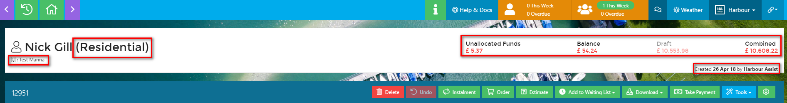
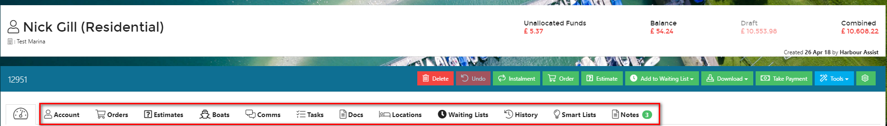

# Accounts #

## Explaining Account Types ##

Account records in Harbour Assist represent people, businesses or organisations that you *currently, might* or *did* do business with or have a relationship with.  Account records are each assigned an **Account Type** via a dropdown.

?> NB. an Account record can only have a single Account Type and this will be the *primary* use of the Account. 

**Account Types** would typically include *Leisure, Residential, Visitor, Commercial, Boat Yard*, but can be specifically set and modified to suit each business using the Harbour Assist system.

If you need any new Account Types adding please contact us by raising a help ticket from within Harbour Assist 

## Viewing an Account ##

Once you have found your account you can see at a glance the main detail of the account in the account header box at the top of the screen.  This shows which site the account is for, the account type, gives an overview of the account balance, highlighting if any money is owed and shows who created the account and when.

You can navigate around the account using the tabs to find order details, boat details, communications with the customer, tasks that have been set relating to the account, documents relating to the account and details of any waiting list the account is on.

