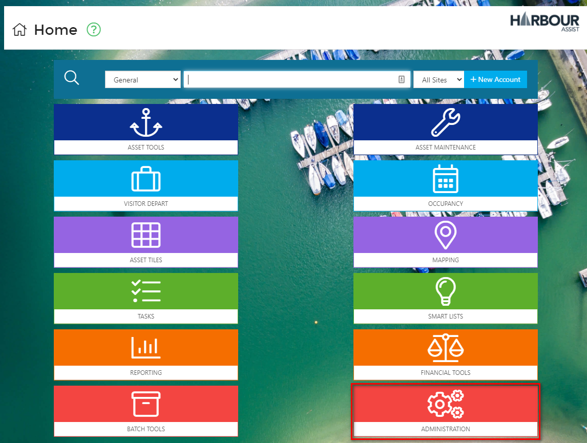
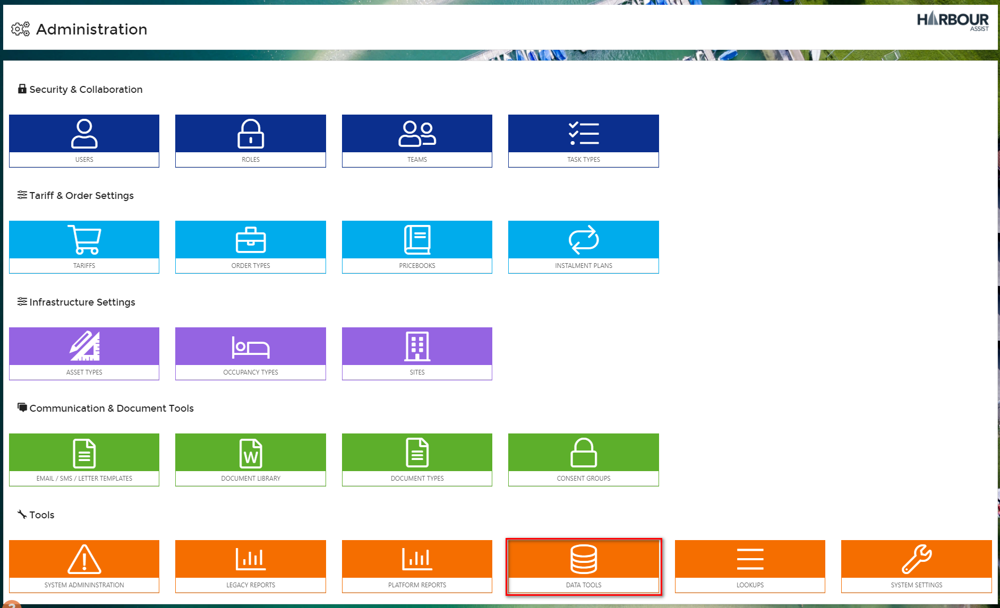
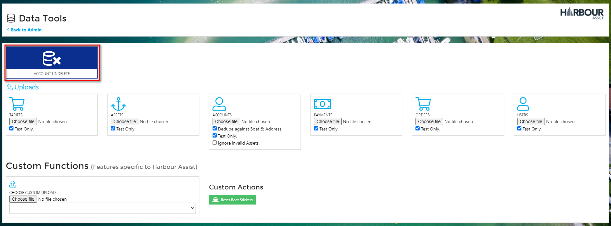
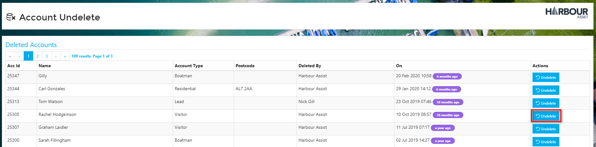
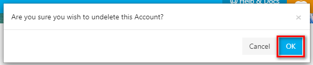

# Account Undelete

Even though the ability to delete an Account is Permissions based (and normally limited to Users with high level Permissions), there may still be instances where Accounts are deleted in error.  To mitigate this there is, hidden in the depths of Administration, an Account Undelete function.

?> Access to Account Undelete is also Permission based and the Permission required is **AdministrationDataTools**. For more documentation about Roles & Permissions click [here](Administration/UsersRoles?id=roles-and-permissions.md).

To Undelete an Account, from the *Home* screen select *Administration*.

Then right at the bottom of the page select *Data Tools*.

Click on the Account Undelete button to view all deleted Accounts.

The Accounts will display in date order with the most recently deleted at the top.  Find the Account that needs to be restored and click on *Undelete*.

Confirm by clicking *OK*.

This will restore the Account in its entirety and you will be able to find it by searching in the usual way from the *Home* page.