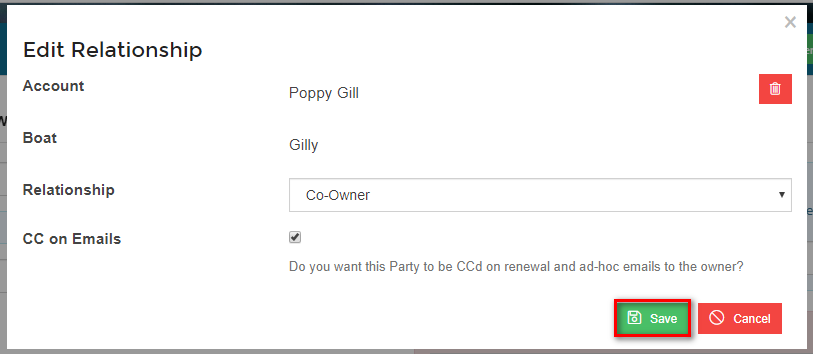
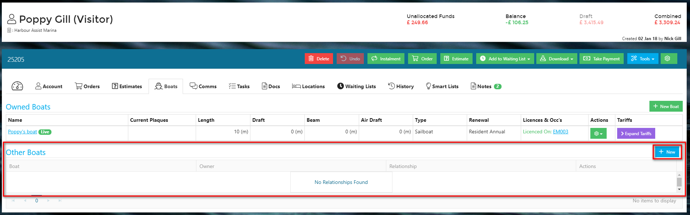
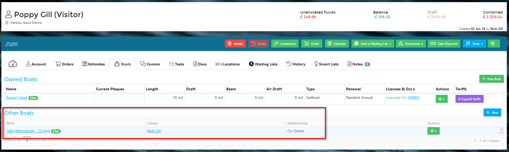

# Boat Relationships

A boat can have a relationship with more than one Account.  This means that a co-owner or skipper etc can be 'connected' with a boat so that purchases of fuel for example can be invoiced to the correct Account without the boat being duplicated in the system and anyone with a relationship to the boat can be cc'd on correspondence.  

Boat Relationships can be added to two ways:-

## Adding a Boat Relationship via the Boat

From within the Boat Details page, under *Other Parties* click on New.

Search for the Account that is to have the relationship, select the relationship type from the drop down list and complete the CC on Emails box if applicable.  The click *Save*.

In the Boats tab the Relationship information will now show.

## Adding a Boat Relationship via the relationship Account

From the Account that is to have a Relationship with the Boat, select the *Boats* tab.

In the *Other Boats* section select *New*.

Search for the Boat that the Account is to have the relationship with, select the relationship type from the drop down list and complete the CC on Emails box if applicable.  The click *Save*.

The Boat will now appear in the *Other Boats* section of the Boats tab.

