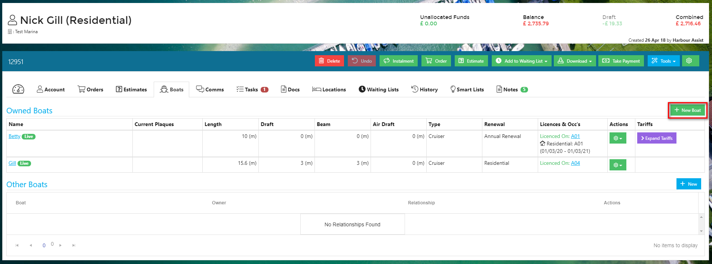
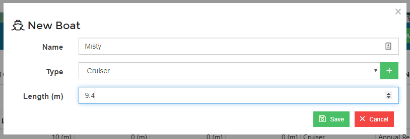
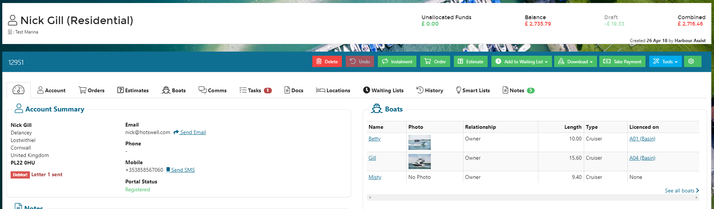

# Creating a Boat

Accounts in Harbour Assist can have multiple boats.  

To add a new boat to an existing account, click on the *Boats* tab.

Click *New Boat*.

Complete the basic boat details and click *Save*.

Now you can complete as much additional information as you have in the Boat Details page.

The boat will now show on the *Boats* tab and on the *Dashboard* page.

