# Orders #

## Explaining Order Types ##

**Order Types** are a description of the goods or services that are being provided and purchased.

Once an Account is created with an *Account Type* (see below for more information) an Order can be raised.   Multiple orders with different **Order Types** can be raised for an Account.

?> More documentation on Accounts can be found [here](AccountsOrdersPayments/Accounts)

Each Order is assigned a single **Order Type**, and the **Order Type** will determine:-

- The *Tariffs* available for composing the Order (see Tariffs and Pricebooks)
- The Invoice/Receipt template format
- Custom Order-level data capture.

?> More documentation on Tariffs and Pricebooks can be found [here](AccountsOrdersPayments/TariffsPricebooks)

**Order Types** are bespoke to each business using the Harbour Assist system and can be set up using the **Administration** tile from the **Home** page.  See below for more information on setting **Order Types**. 

?> More documentation on Order Types can be found [here](Administration/OrderTypes)

## Viewing an Accounts Orders Tab

The *Orders* tab on an Account is where you will find all the accounts financial transactions.

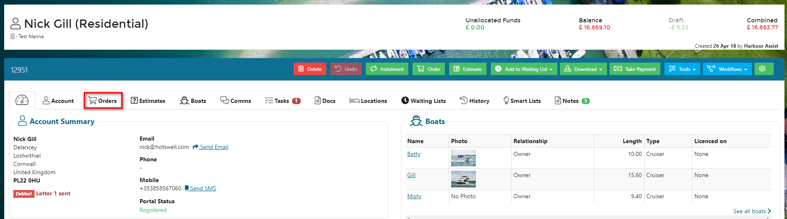

The information contained within the Orders tab can be displayed in 2 different views; the Classic View or the History View, and it is personal preference which view you use.  When viewing the Orders tab Harbour Assist will remember the view that you last used and use that one by default.

You can select the different views by using the buttons on the right of the screen - the button of the currently selected view will display in a darker blue.

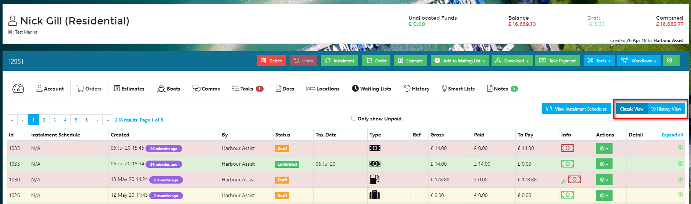

### Classic View

This view will display transactions with Orders showing in the top part of the screen and Payments, credits & refunds showing in the bottom part of the screen.  Each section of the screen is paginated if there are a large number of transactions.

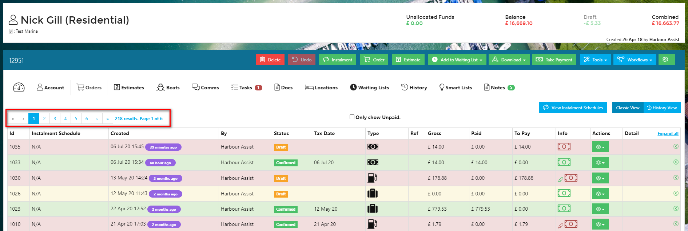

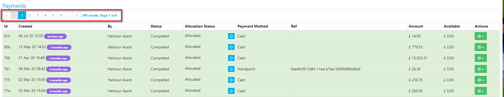

### History View

The History View displays all transactions in date order with the most recent at the top.  Again, it is paginated on accounts where there are a large number of transactions.  This view has the added features of:-

- **Balance** - this gives you a running balance after each transaction,
- **Filter** - the ability to filter the screen to only show certain transactions,
- **Download to Excel** - download the accounts transactions to Excel so that you can analyse the data in more detail.

?> NB: Draft orders and credit notes will not be included in the Balance figures; a dash will be displayed if the transaction is not included.

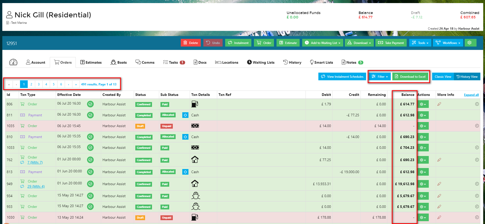

## Raising an Order

To raise a new order, click on the **Order** button in the main toolbar on an Account.

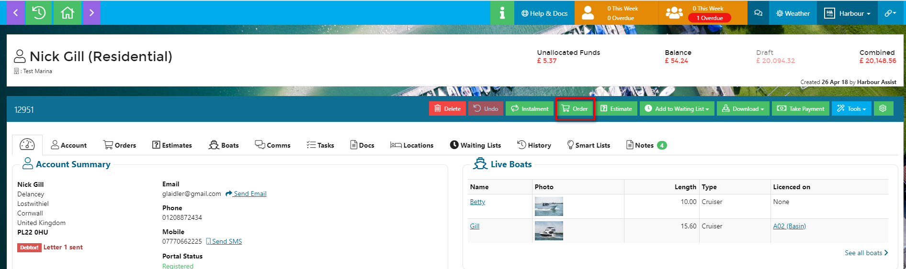

Alternatively, if you don't need to review the Account prior to raising an order, you can use the 'Quick Order' button that appears when you search for an Account.

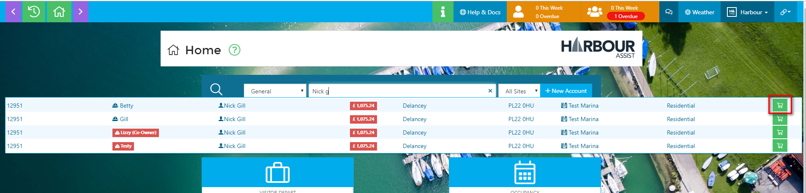

When you select **Order** you then need to select the **Order Type** - a list of **Order Types** and descriptions are shown and you select the relevant one by clicking on the tile.

?> NB: If you are a multi-site operator this is also where you can select which site the order needs to be raised for (this overrides the Site the Account is associated with).

?> More information about Cross-site Orders can be found [here](AccountsOrdersPayments/Orders?id=cross-site-orders-multi-site-operators-only.md)

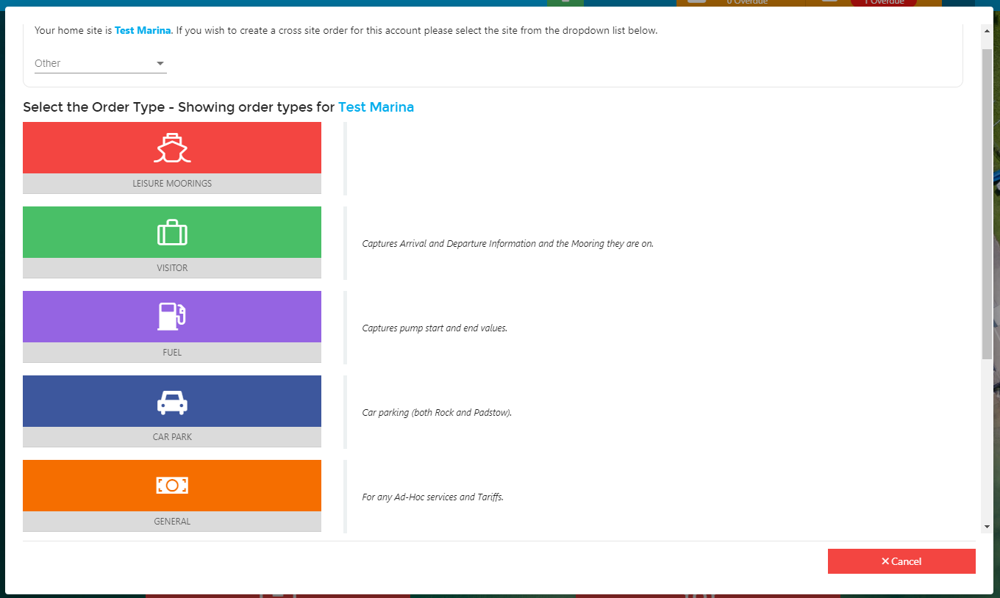

You will then be taken back to the **Orders** screen.  In the example we are raising an Order for a Residential mooring contract.  You can now select the contract period by choosing a start and end date (this will create the occupancy), attach the contract to an Asset and select the boat that the contract is for (if the Account has more than 1 boat on it).

At the top of the screen you can see details about the order.  At this stage the order is still in draft status (see **Order Status** below).

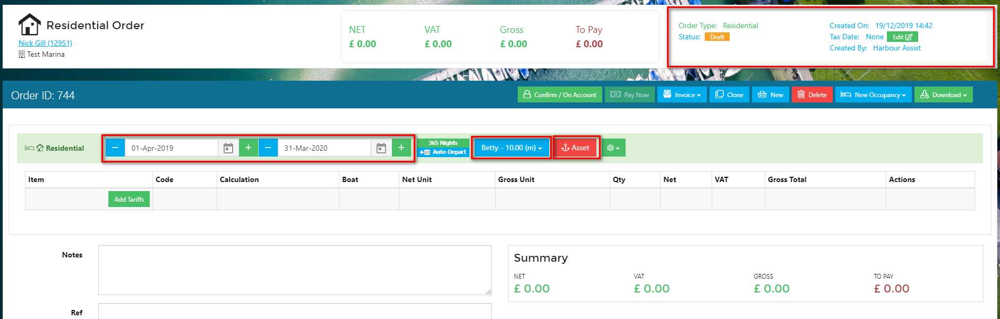

You now need to select the Tariffs that make up the Order - this will determine the price

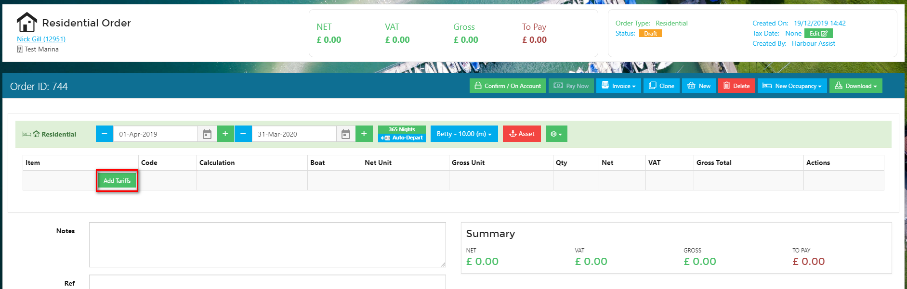

The Tariff Selection page will show all Tariffs available for this Order Type.  You can remove this filter to view all tariffs or you can narrow this down by selecting the category of Tariffs (green tiles) that you wish to choose from.

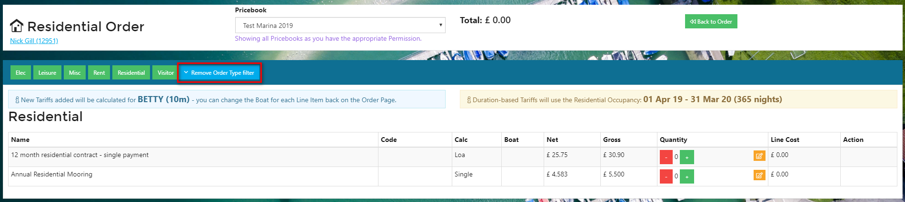

Select the Tariff which you wish to charge by clicking on the *Quantity* button - if your Tariff has been set up as a Length Overall Tariff (this is noted in the *Calc* column) the price will automatically be calculated using the price per metre and the length of the boat.

Once you are happy the correct price is being charged, select *Back to Order* at the top of the page.

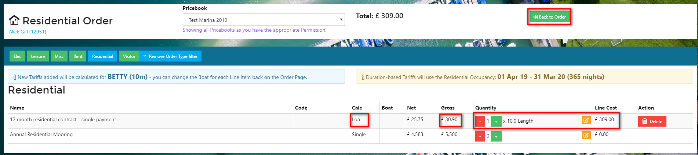

Your **Order** is now created in Draft status.

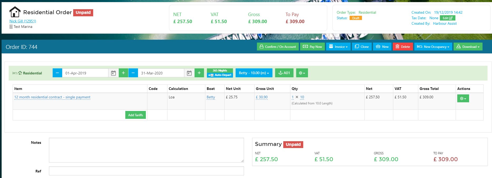

By clicking on the blue *Invoice* button you can download to print, email or SMS the order to the customer.

?> More information about sending an order by SMS (Quick Pay) can be found [here](AccountsOrdersPayments/CustomerPortal?id=quick-pay.md)

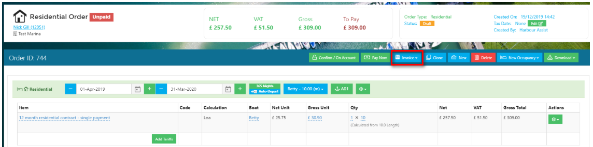

## Cross-site Orders (Multi-site operators only)

For multi-site operators it is inevitable that at some time a customer from one site will visit and potentially make purchases at another site.

To deal with this, you can choose which Site the order should be associated with and all revenue from the order will be attributed to the chosen Site.

When creating an order, if the Account is associated with different site to your own default site, at the top of the Order Types screen you will have the option to select which site you want to use.

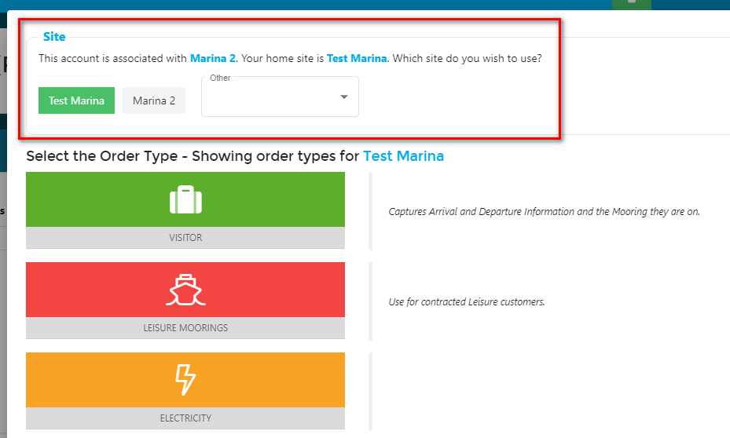

When you select the site that the order needs to be associated with, only the Order Types that are available for use at that site will show.

Select the relevant Order Type to create the Order.

On the draft Order that it clearly says that a cross-site order has been created.

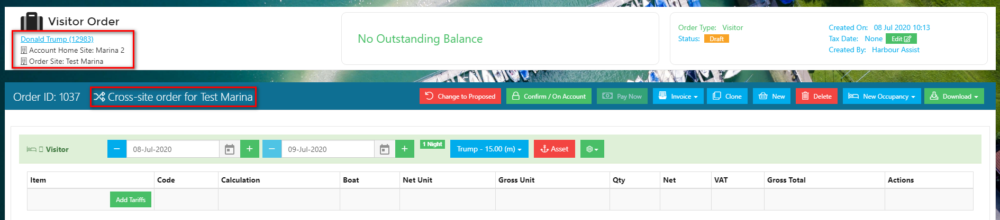

You can now continue to create the Order in the usual way.

When you add the tariffs to the Order, the tariffs displayed will be for the Site that the order is associated with.

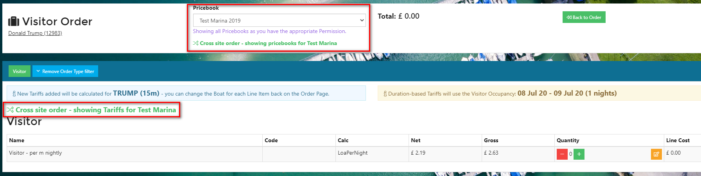

### Reporting on Cross-site Orders

In the Reporting section, there is a Report that shows all Cross-site Orders.  From the *Home* screen click on *Reporting*.

Then select the Cross-Site Orders report.  The report has various filters that you can apply including setting a date range.

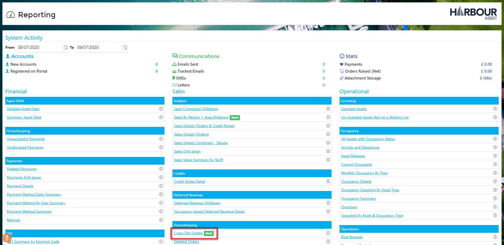

## Order Status ##

**Proposed:** An order shows in a *Proposed* status when created through a *Batch Run*.  This is the first stage of Batch Renewals and the order is fully editable at this stage.  A Proposed order will not show on the Customer Portal. More information on this can be found in the **Renewals** section.

?> More documentation on Renewal Batches can be found [here](Renewals/BatchRuns)

**Draft:** An order which is still editable, the 'Tax Point' has not been set, so line items can be added, removed, costs overridden etc. In this state, the Order will NOT appear on any accounting package export, but WILL affect the Account Balance and show on the Customer Portal.  It can therefore be paid via the Portal by the customer.

**Confirmed:** This Status means that the order is locked and cannot be edited. An Order can be put into a Confirmed Status manually, or automatically goes to this state if any Payment is allocated against the Order. An unpaid Confirmed order will show on the Customer Portal.

## Cloning an Order

Harbour Assist provides the ability to clone an order; this could be particularly useful if you have a customer who buys the same service on a regular basis.  When an order is cloned, the cloned order is created in a Draft status, so you still have the option to make changes and amendments.

?> NB: Beware if you are cloning an order that has an occupancy - all elements relating to the order including occupancy records will be cloned. This may make the Account look they are making multiple concurrent visits.

An order can be cloned by either clicking on the *Actions* button on the relevant order line and then *Clone*,

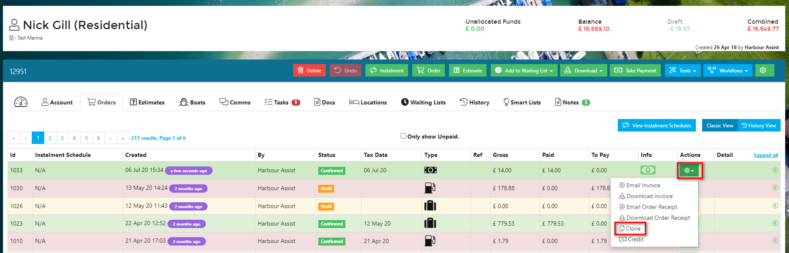

or, 

Using the *Clone* button from within the order you wish to clone.

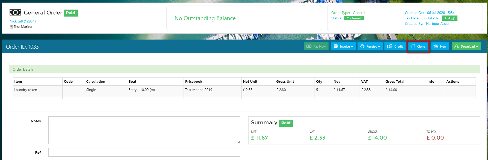

You will be asked to confirm you wish to clone the order - select Yes if you wish to continue.

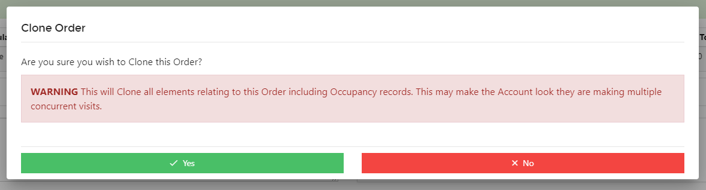

When you select Yes, you will be taken into the new draft order.  You can now make any amendments required.