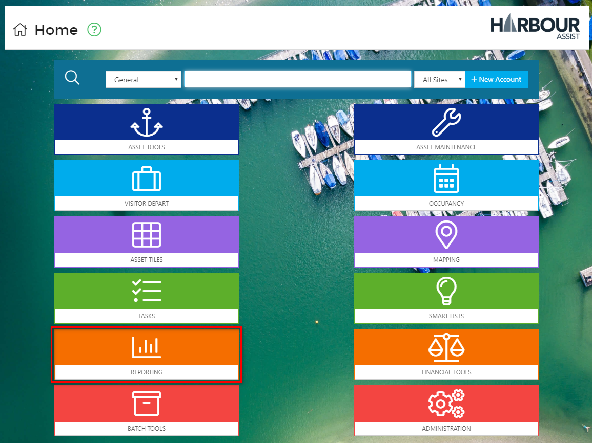
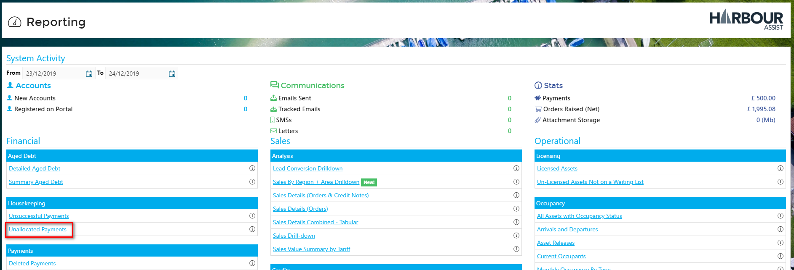
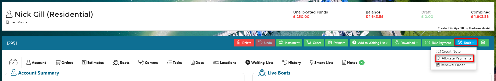
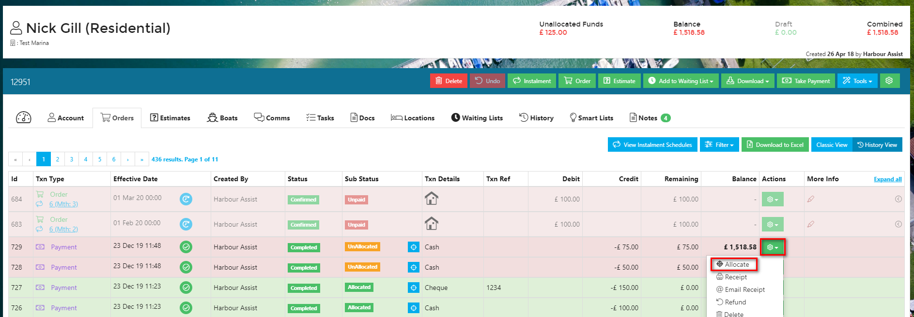
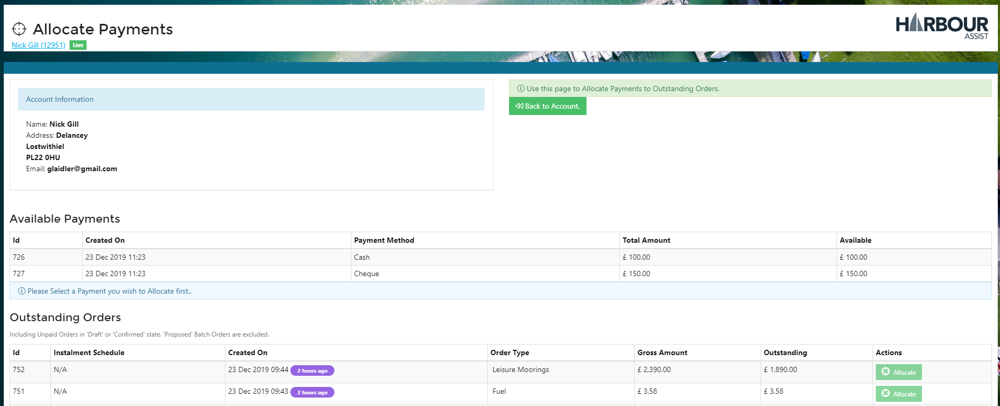
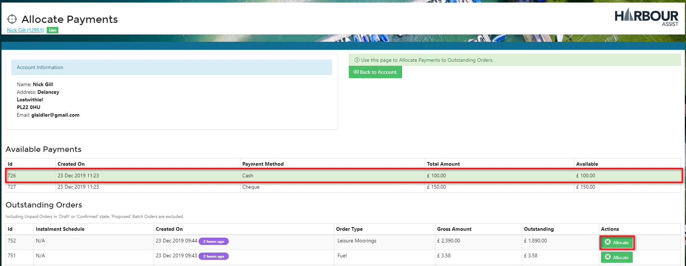
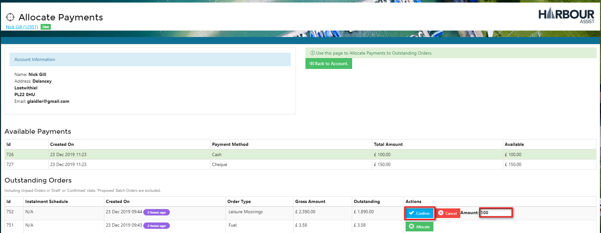
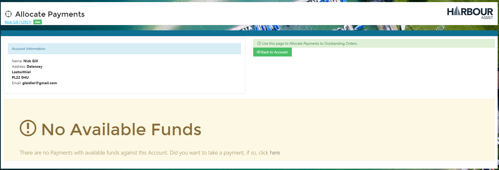

# Payment Allocation #

Payments need to be correctly allocated in Harbour Assist for a number of reasons:-

- To identify any missing or incomplete payments,
- To ensure that debt reporting and aging is accurate,
- To ensure that the information shown on the customers' online portal is correct and in line with their expectations.

Payments should be fully allocated to an invoice wherever possible at the time of taking the payment (see below), however there may be occasions when this is not possible and it is left on the account as an unnallocated payment.

?> More documentation [here](AccountsOrdersPayments/Payments)

The *Reporting* section of Harbour Assist has an *Unallocated Payments* report so that these are easily identifiable.

## To Allocate an Unallocated Payment ##

There are 2 ways to allocate an unallocated payment.

- The *Tools* button which is found on in the top Toolbar on an Account, or
- The *Actions* button on *Orders* page.

### Using the Tools Button

Click on the *Tools* button in the top Toolbar of an Account, and then *Allocate Payments*.

### Using the Actions Button

Click on the *Actions* button of any unallocated payment (unallocated are shaded in red), and then *Allocate*.

Either route will take you to the same *Allocate Payments* screen which will display all unallocated payments and all unpaid orders.

Select a payment by clicking anywhere on the payment line. This will highlight the payment in green.  Then click *Allocate* on Order you want to allocate the payment to. 

If you want to allocate the whole of the payment to this order you can now just confirm your selection, however if you only want to allocate some of the payment to this order, you can change the allocation amount.  The remaining amount will be left available to allocate to another order.

Repeat this until all the payments are allocated.  You will then be notified there are no more available funds to allocate.

