# Payments #

Harbour Assist has the facility for customers to be able to access their Account on-line and make payments, However, customers can only make full payment of an invoice on-line, they cannot part pay an invoice.

## Taking a Payment ##

There are 3 ways to record and take a payment in Harbour Assist:-

- The *Take Payment* button - This is normally used when the payment is for more than 1 order, or a payment is being taken on account ie. a deposit where no order is in place.

- The *Actions* button on *Orders* page - This is used when the payment is for a particular Order.

- From within the Order itself - This is used when the payment is for a particular Order and is most commonly used if the payment is being taken at the same time at the Order is being created.

### Take Payment button

This can be found in the Toolbar at the top of an Account.

If you access the *New Payment* screen from the *Take Payment* route, the *Amount* will default to the total outstanding amount of draft and confirmed orders on the Account.

?> NB: It will not include any *Future Orders* that have been created as part of an Instalment Plan for example.  You can click on the toggle button to show future orders.

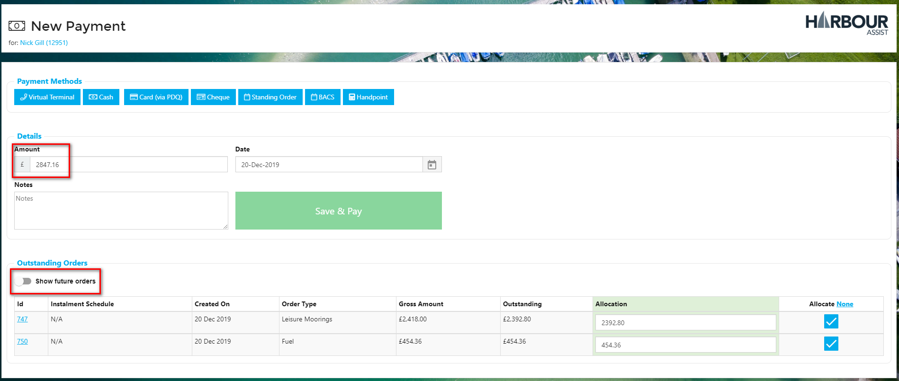

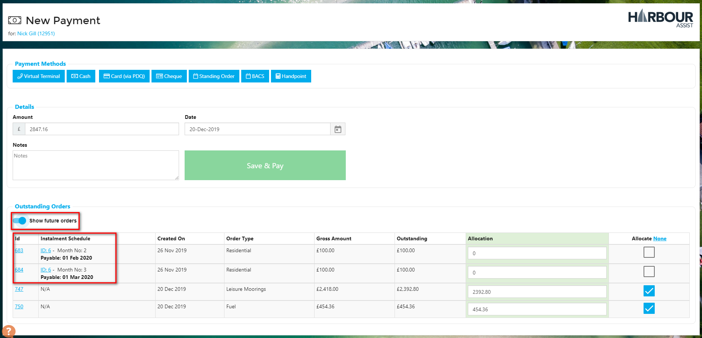

### Using the Actions Button on the Orders Screen or Pay Now from within an Order

If you access the *New Payment* screen from either of these routes the *Amount* will default to the amount owing on that particular Order.

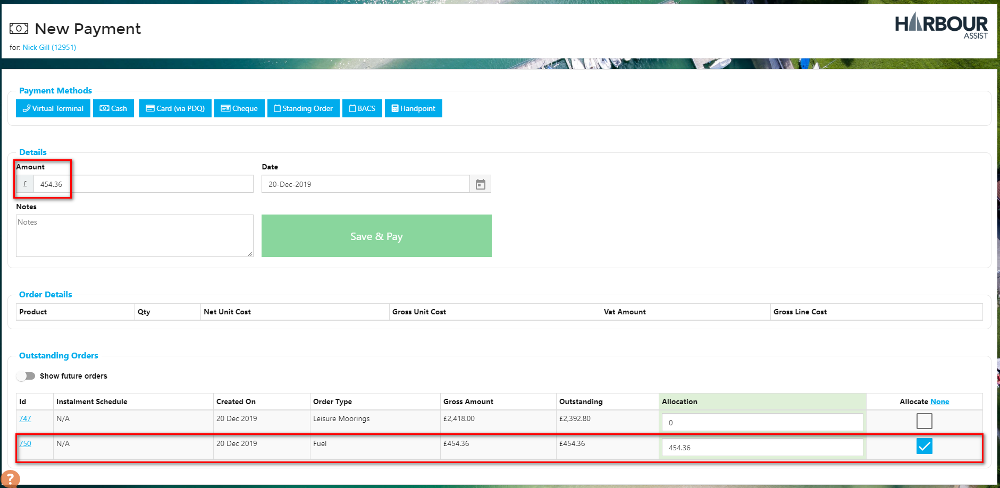

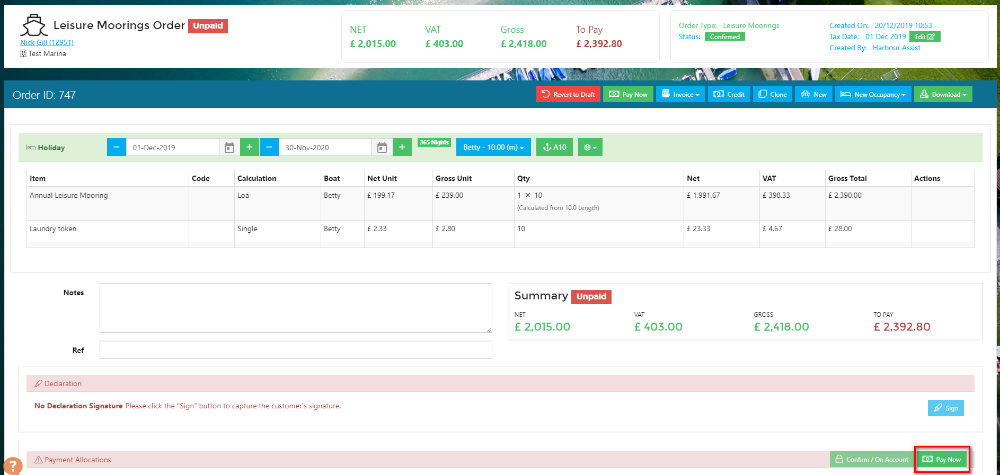

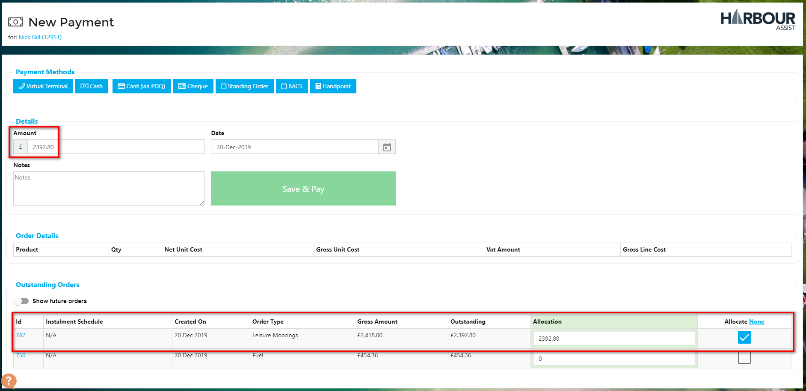

You still have the option to include other orders and to show future orders.

Whichever route you have used, once you are at the New Payment screen and the amount to be paid is showing, you follow the same process to take the payment.

First click on the appropriate payment method on the blue tiles at the top of the screen.  

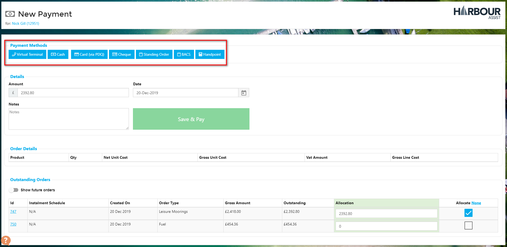

Depending on the payment method you may be prompted to enter a code, reference or cheque number etc. 

Complete this and then click *Save & Pay*.

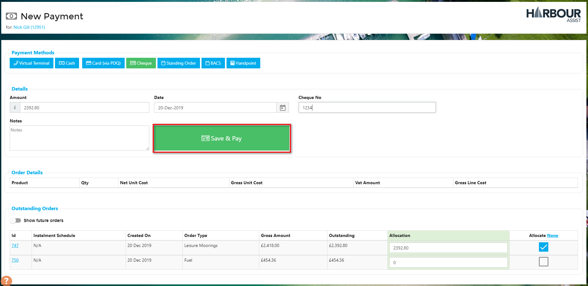

Now you have the option to either print or email a receipt to the customer.  There are 2 types of receipt - a Payment Receipt and an Order Receipt.  A Payment Receipt is a more generalised receipt, the Order Receipt gives more details of the Order that has been paid.  If a payment has been taken for more than 1 Order an Order Receipt will show for each individual Order (so in this case you may be better to use the Payment Receipt).  

## Taking a Part Payment on an Order

There may be times it is agreed a customer can part pay an order.  Part payments cannot be made by the customer using their on-line portal.

Access the *New Payment* screen by any of the 3 routes discribed above, then manually enter the amount that is being paid in to the *Amount* cell - you will need to overtype the auto populated amount.

The check the *Allocate* box for the order that the part payment is to be allocated against.  If it is for more than 1 order, check the *Allocate* box and enter the Allocation Amount into the *Allocation* cell for each order.

Select the *Payment Method*, then click *Save & Pay*.

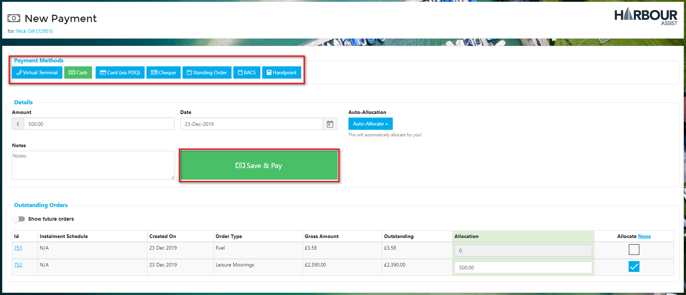

As the amount paid isn't paying an Order in full, the only receipt option is the Payment Receipt.  This can be printed or emailed to the customer.

Clicking on *Back to Account* will take you to the *Orders* overview for the Account.  Here you will see the part payment against the Order.

## Taking a Payment on an Account without an Order

Payments can be taken without an Order being raised - a deposit, for example, that will then be allocated to an Order at a later date.

To take a payment that is not associated with an order, use the *Take Payments* button.

Select the payment method, enter the amount being paid and then select *Save & Pay*.

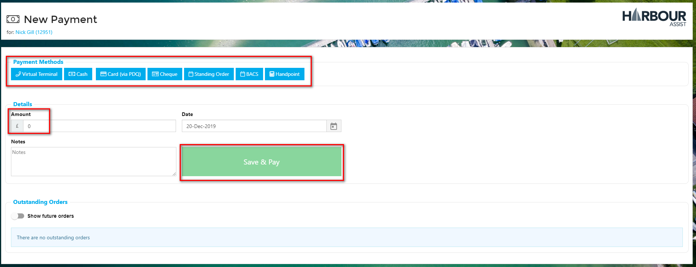

As the amount paid isn't allocated to any Orders, the only receipt option is the Payment Receipt.  This can be printed or emailed to the customer.

The Account will show as being in credit by the amount paid, and the payment will be unallocated. 

## Using the Virtual Terminal (phone payments)

Using the Virtual Terminal to take card payments over the phone eliminates need for dual keying into a PDQ machine and then into Harbour Assist, thus minimising the risk of mistakes. 

?> NB:  The Virtual Terminal is only available when Paysafe is used as the payment provider.

Using the normal routes to take a payment, when at the New Payment screen, click *Virtual Terminal*.

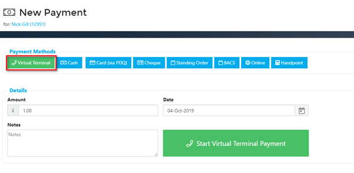

Once you have ensured the payment amount and the order allocation is correct click on *Start Virtual Terminal Payment*. This will open the Virtual Terminal.

?> NB: The minimum amount payable by VT is £1.00.

Now you can enter the card details. 

The ‘Name on Card’ will default to the customers name as it appears on their Harbour Assist account – this can be changed if their name appears differently on their card.

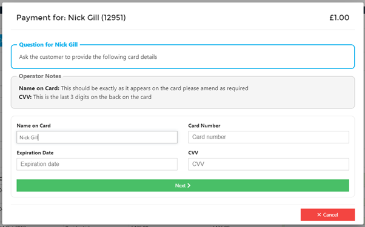

Once you have entered the card details click *Next*.

Now you need to enter the address that the card is registered to – again, this will default to the address as it appears on the customers Harbour Assist account – this can be changed if necessary.

?> NB: Changing an address here will not update their Harbour Assist account address.

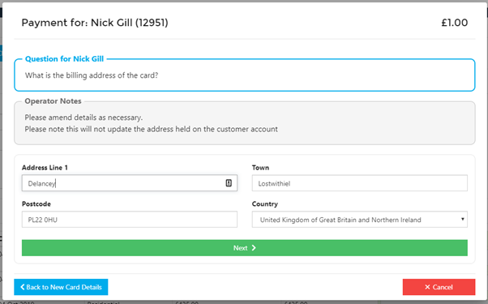

When the address has been entered click *Next*.

Customer can store their cards to make future payments quicker and easier (very similar to when you store a card on Amazon). Cards are stored within Paysafes Vaulted Card Storage and not within Harbour Assist, so they are 100% secure and the details cannot be accessed by Harbour Assist Users.

Ask the customer if they would like to store their card, then select *Yes* or *No* as appropriate.

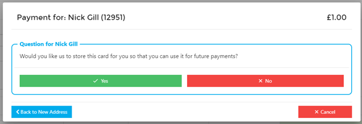

Finally, confirm with the customer the amount you are about to take a payment for and click on *Yes* to confirm or *No* to cancel the transaction.

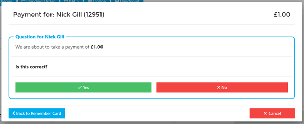

If you clicked Yes to confirm the transaction, you will be taken to the normal Payment Confirmation page where you can email or print a receipt for the customer.

### Stored Cards

Customer can store their cards to make future payments quicker and easier (very similar to when you store a card on Amazon). Cards are stored within Paysafes Vaulted Card Storage and not within Harbour Assist, so they are 100% secure and the details cannot be accessed by Harbour Assist Users.

If a customer has already stored a card (either when they made a previous phone payment or they stored it themselves in their customer Portal), you will see the following options when taking a Virtual Terminal payment.

Select *Virtual Terminal* and then *Start Virtual Terminal Payment*.

Ask the customer if he would like to use one of his stored cards by quoting the *Ending in* number. If he does wish to use a stored card click on *Select Card*. If a new card is to be used click on *+ Add New Card* (this will revert you to take the card details in the normal way).

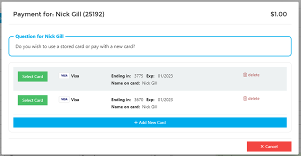

If you have clicked on Select Card, the registered address for that card will display – check with the customer that this is still the correct address.

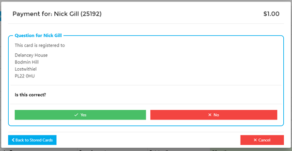

If the address is correct click *Yes*. 

Now ask the customer for the 3 digits from the back of his card (even though the card is stored, this is still required as a security measure). Enter the 3 digits and then click on *Next*.

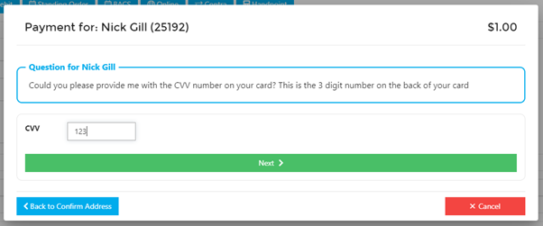

Confirm with the customer the amount you are about to take and the card ending in number.

If the customer agrees click on *Yes*.

You will be taken to the normal Payment Confirmation page where you can email or print a receipt for the customer.

### **Updating a Stored Card Billing Address**

If the billing address for the card the customer wishes to use needs updating, click on *No* at the checking stage.

You now have the option to edit the current billing address or add a new address.

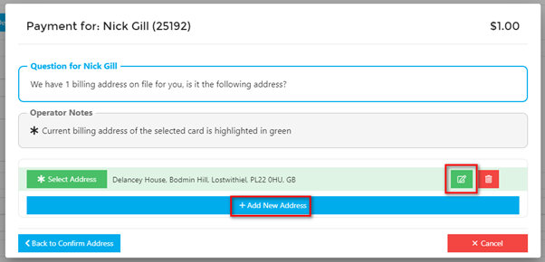

When the address has been updated or a new one added, click *Save/Update Address*.

Then follow the process of entering the 3 digits from the card and take the payment as shown above.

## Card Payments using Handpoint

Handpoint is the integrated soltution to taking Cardholder Present card payments in Harbour Assist. 

- It can be used instead of PDQ machines in the office for Cardholder Present transactions.
- It can be used on the water for Chip and Pin and Contactless Payments.
- Anyone using HA can use it, no external logins need to be managed.
- All transactions are reconciled in Harbour Assist automatically.

?> NB:  Handpoint is only available when Paysafe is used as the payment provider.

### Taking a Payment using Handpoint

Ensure the card reader is switched on.

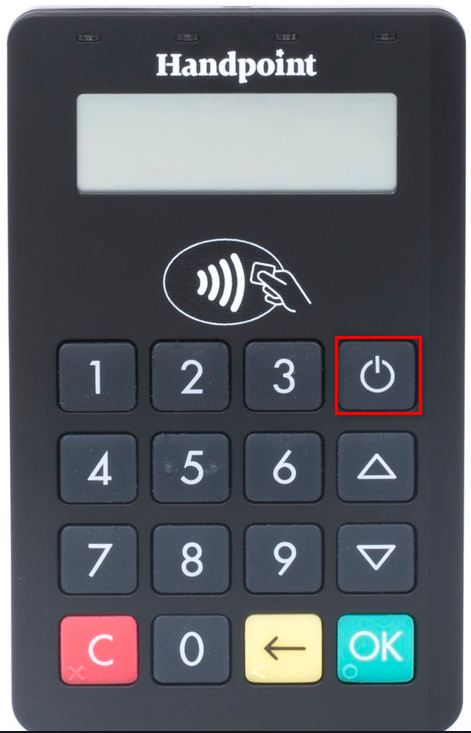

On the New Payment screen select the *Handpoint* payment method, check the amount and then click on *Save & Pay*.

On the pop-up window select *Reopen Handpoint*.

The application will open.

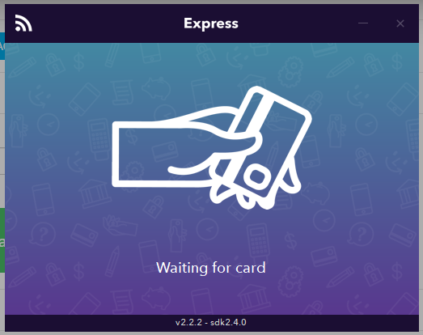

The transaction amount will appear on the card reader; please follow the instructions on the device.

If you are using an iPad to take the payment, at the end of the transaction the screen shown below will appear; to go back to Harbour Assist, click on the Safari button in the top left hand corner of the screen.

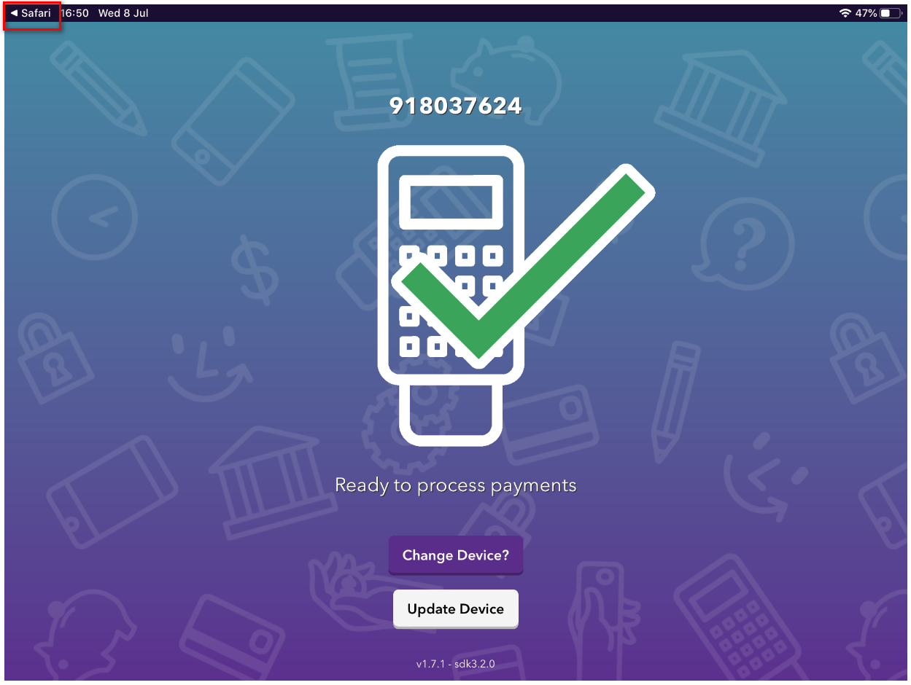

The Payment Confirmation page will display and you can either print or email the receipt to the customer.

