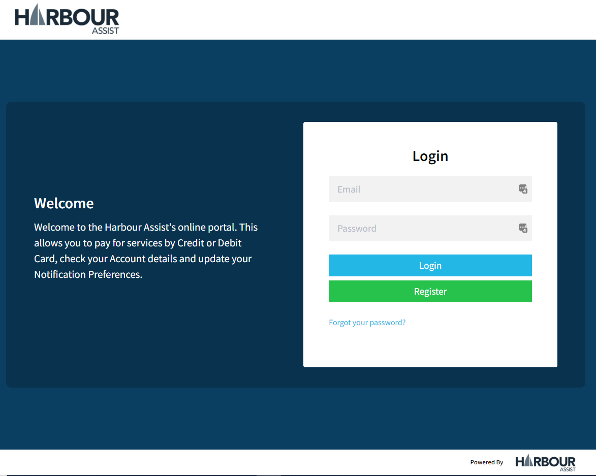
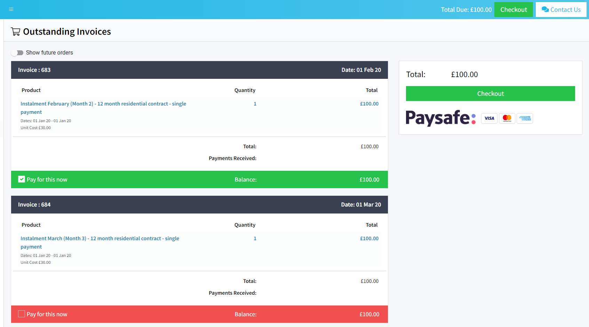
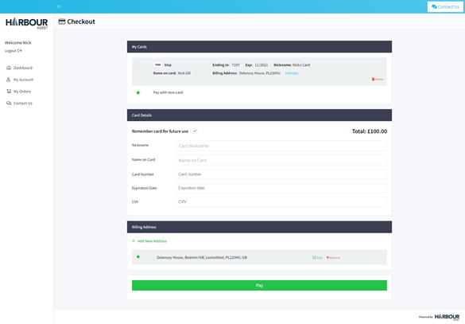
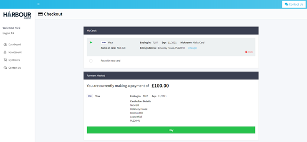

# Customer Portal

## Overview

Harbour Assist provides an online Customer Portal which gives your customers the ability to view their account details and pay their invoices online at any time with no input from you.

You can see whether a customer has registered on the portal at a glance on the *Account Dashboard* page.

If they have not registered, their Registration Code will show.

Using the *Account* tab you can view more detail:-

- You can click to view their Portal
- You can view their login attempts.

## A Guide to the Portal

The screen shots below will help you aid your customers to navigate around the Portal and the payment options.

?> NB. The Harbour Assist logo and references throughout this document are replaced with your own Logo and company name in your live Portal.

### Welcome to the Portal

This is the Welcome screen. The Welcome message can be configured to any wording you wish.  Just let us know if you want to change this message.

If the customer is already registered on the Portal they can log in using their email address and password.

If the customer needs to register on the Portal they should click Register.

?> NB. The email address used for logging in MUST match the Account email address.

### Registering on the Portal

The customer can register using the Registration Code that is shown on their invoice. This code is also shown on the Account Dashboard and Account page if you ever need to find it.

They can now complete their registration by creating a Password in line with the guidance shown. 

### Customer Dashboard

Once logged in the customer is taken to their Dashboard. 

The Notification Preferences, Waiting Lists and ‘Pay Now’ can all be enabled or disabled from showing on this page, depending on whether you use HA for ‘marketing’, you want customers to have visibility of waiting lists and you use the Portal to take on-line payments – please let us know if you want any of these disabling.

### Orders and Making a Payment

?> NB. This section of the document is relevant to the Paysafe payment provider - not all features are available if PayPal is used.

When a customer clicks on the ‘Pay Now’ button they will see all outstanding invoices on their account. By default, all invoices will be selected for payment and the total amount is shown.

If a customer doesn’t want to settle their account in full, they can un-check any invoices that they don’t want to pay. This will amend the total payable.

Clicking the ‘Checkout’ button will take the customer onto the payment screen. 

?> NB. Paysafe only

Each time a customer enters their card details, they will have the option to **save that card** for future use, very similar to storing cards when using Amazon. The next time they pay via the Portal then can use the saved card or select ‘pay with new card’. Storing cards makes paying via the Portal quicker and easier for your customers, especially if they are using mobile devices – it takes away the risk of entering numbers incorrectly and having to start again!

Rest assured these card details will not be accessible by anyone other than the customer ie. Users cannot access this detail if they view a customer’s portal, and the detail is held securely by Paysafe and not within Harbour Assist. A customer can of course choose not to save their card details if they wish.

On clicking the ‘Pay’ button the transaction is complete.

                           

?> For the Portal Troubleshooter click [here](Troubleshooting/PortalTroubleshooter.md).

## Quick Pay

Not all customers want to register on our portal to pay their bill. We now support “quick pay” links which allow a customer to pay for an Order without registering nor logging into the portal.

Not only do customers not have to log in, they can use the same Vaulted Cards (as long as they know their CV2 number) as they do on the portal.

This link is embedded into our default email order template, along with a nice, friendly **Pay Now** button. *If you have customised your invoice email, let us know and we’ll inject it for you*.

We have also integrated Quick-Pay into a “SMS Invoice” feature, to streamline visitor operations. We timed it and with a vaulted card, visitors can pay within 30 seconds of receiving their invoice SMS.

1. Customer receives SMS with quick-pay link.
2. Customer either uses vaulted card or enters new card.
3. Customer clicks on “Pay”.

?> Vaulted card features are only available for customers who use PaySafe gateway.