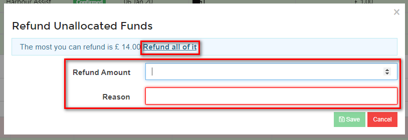
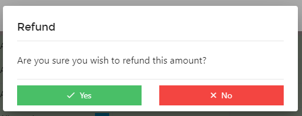
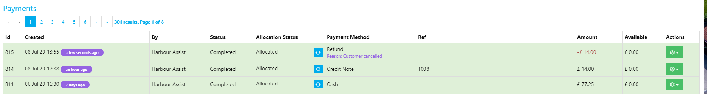

# Refunds

Although we may not like the idea, sometimes you do need to give money back to a customer!

The actual transferring of the money isn't done through Harbour Assist, but the refund does need to be recorded in the system so that the account balance is correct.

In order to record a Refund on Harbour Assist there needs to be an unallocated payment (or part unallocated) to refund against.  This could be a credit note that you have raised, or an actual payment that the customer has made.

?> More documentation on Credit Notes can be found [here](AccountsOrdersPayments/CreditNotes.md)

## Recording a Refund

From the *Orders* tab on an Account click on the green *Actions* button on the unallocated payment line and select *Refund*.

Enter the Refund Amount either manually or by clicking on *Refund all of if*, and add the reason for the Refund.  Then click *Save*.

Confirm the Refund by clicking *Yes*.

The Refund is now recorded on the customer account and the unallocated payment shows as allocated as there are now no funds left to allocate.

?> NB: You can part refund a payment ie. if the payment is for £14.00 you could refund £10 and leave £4 on the account to allocate against any outstanding orders.