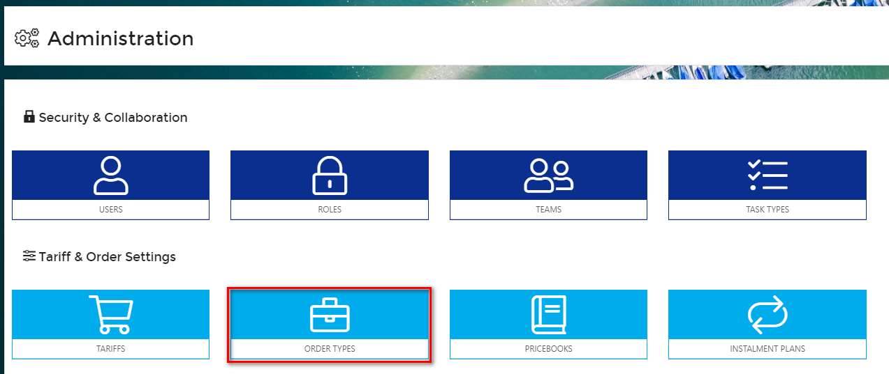
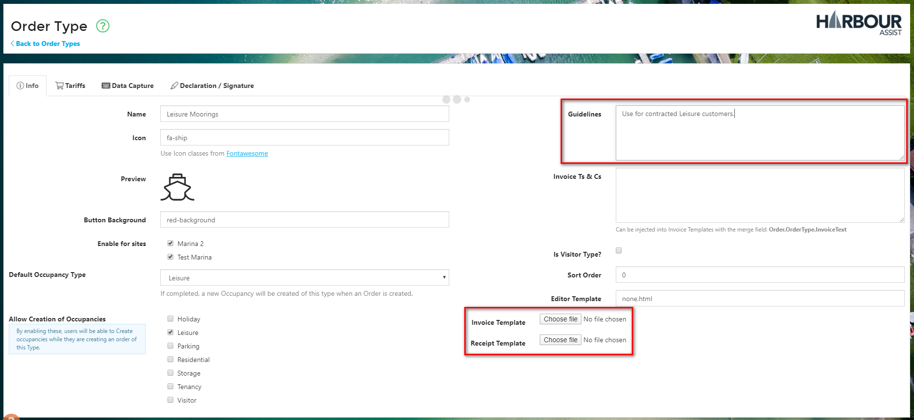
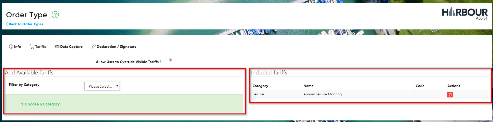
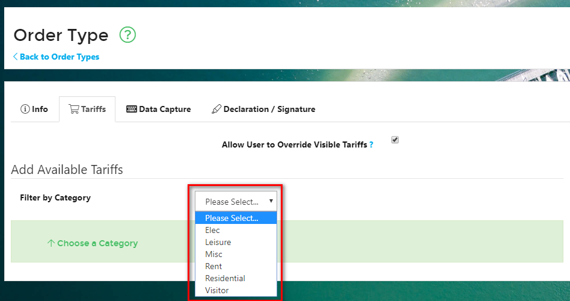
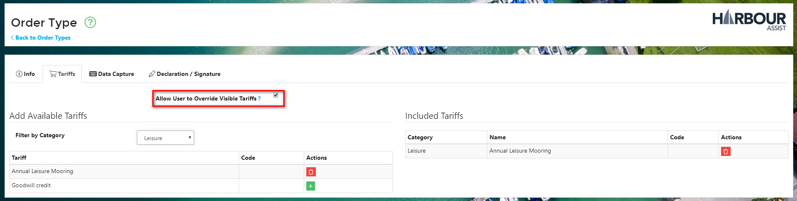
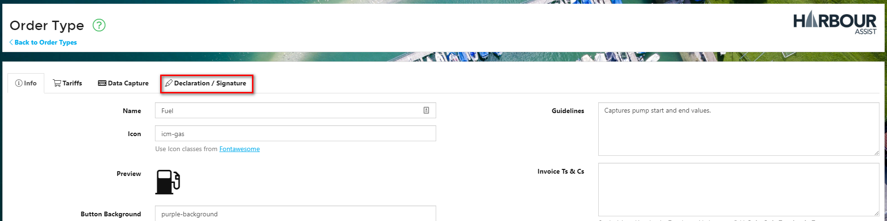
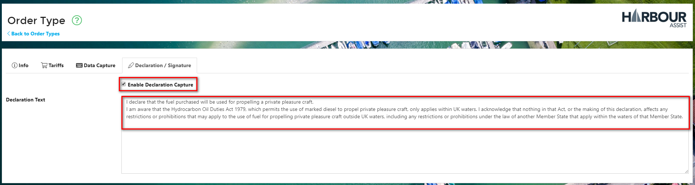

# Order Types #

## Explaining Order Types ##

**Order Types** are a description of the goods or services that are being provided and purchased.

Once an Account is created with an *Account Type* (see below for more information) an Order can be raised.   Multiple orders with different **Order Types** can be raised for an Account.

?> More documentation on Accounts can be found [here](AccountsOrdersPayments/Accounts)

Each Order is assigned a single **Order Type**, and the **Order Type** will determine:-

- The *Tariffs* available for composing the Order (see Tariffs and Pricebooks)
- The Invoice/Receipt template format
- Custom Order-level data capture.

?> More documentation on Tariffs and Pricebooks can be found [here](AccountsOrdersPayments/TariffsPricebooks)

**Order Types** are bespoke to each business using the Harbour Assist system. 

Amendments to existing **Order Types** and creation of new ones can be carried out by Users who have the relevant permissions to enable them to do so.  

## Editing Order Types

From the *Home* page, select *Administration*.

Then select *Order Types*.

Click on the name of the Order Type you wish to amend to open the details.

After the initial set up of Order Types there should be very little need to amend any of the details within the *info* tab of the Order Types.

You can add or edit the description in the *Guidelines* box - this is what users see when they are selecting the Order Type.  A detailed, accurate description in here will help users make the correct Order Type selection and avoid incorrect orders being raised.

If necessary, you can upload an invoice template or receipt that is bespoke to this particular Order Type.

## Sorting Order Types

Order Types can be sorted so that when you create a new order the most used Order Type appears at the top of the list and so on.

In the Sort column, click and hold on the icon to drag the Order Type to the desired position.

## Adding and Removing a Tariff on an Order Type ##

Each Order Type can be restricted to only show certain tariffs for selection. 

To add or remove a Tariff on an Order Type, click on the name of the Order Type to open up the details.

Now click on the *Tariffs* tab.

This will display all the Tariffs that are already Included and give you the option to add further tariffs.

Select the Category that contains the tariff you wish to add.

This will display all the Tariffs within that Category.  If the Tariff is already Included it will have a Red trash icon next to it, if it is not included it will show a Green + icon.

By clicking on these icons you can Add or Remove the Tariffs from the Included Tariffs.

Even though you only want certain Tariffs to show by default for a certain Order Type, there may be occasions when other Tariffs need to be added.  For instance, whilst raising an order for a Leisure Mooring the customer may also want to purchase a gas bottle at the same time.  To give flexibility to Users to add items such as this, ensure the *Allow User to Override Visible Tariffs* box is ticked.

## Declaration/Signature Capture

There may be some Order Types where you need to insert a declaration and capture a customer signature on the Order, Fuel for instance.

From within the Order Type click on the Declaration/Signature tab.

Add your Declaration text and tick on Enable Declaration Capture.

This will insert a Declaration and *Sign* button onto the Order when it is created.

Click on the *Sign* button to show the Declaration wording and ask the customer to sign by using the mouse or a finger on a mobile device.  Then click Save.

This will insert the signature onto the Order.

It will also show on the Order the customer if you print or email it to the customer.

