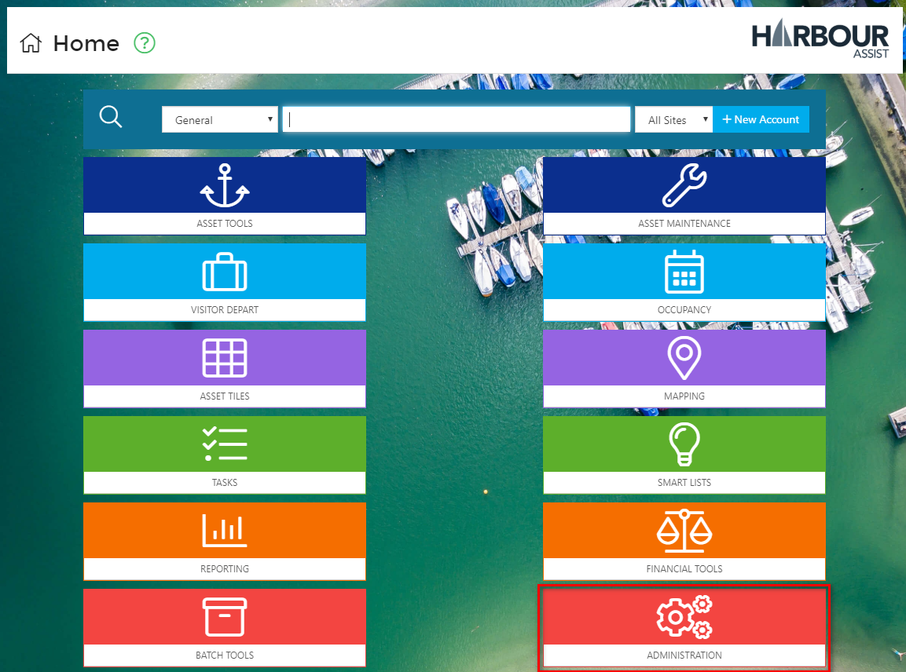
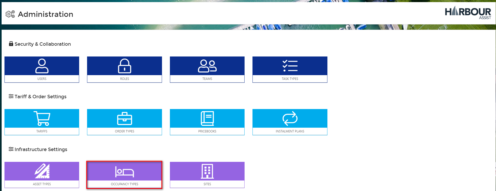
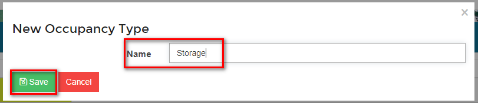

# Occupancies #

## What is an Occupancy? ##
An Occupancy is simply a record that represents an Account or a Boat occupying an Asset for a duration of time.  Each Occupancy record can be linked to each of the following:

- Account (mandatory)
- Boat (optional)
- Asset (optional, but usually completed)
- Order (optional)

The idea behind Occupancy records is to allow you to know who is where in your Marina/Harbour now and at any time in the past, report on capacity, keep track of how your assets are being used and provide accountability.

## Fields associated with an Occupancy ##
In addition to the above, we store the following information for each Occupancy:

- *Start Date:*  When the Occupancy started - for Visitors this would be their Arrival Date, for Annual Customers it would be the start of their contract.

- *Depart Date:* When they left/end date of their contract.

- *Occupancy Type:*  What is the type of Occupancy?  This will define which Assets they are allowed to be placed on.

- *Departed?:* Whether the Occupancy has actually left.  This is primarily used for Visitors.  

  ?> More documentation [here](visitors/VisitorDepart).

## Occupancy Types ##
Each Occupancy has an *Occupancy Type*, which, above providing reportability on usage, also controls:

- The default Start & End Date.
- Which assets the occupancy can be placed on.
- Visual information for the calendar such as icon and colour.

To create a new *Occupancy Type* or amend an existing one, from the Home page select *Administration*.

Then select *Occupancy Types*.

Select *New* to create a new Occupancy Type.

Give the *Occupancy Type* a name and click *Save*.

Now you can complete the set up of the *Occupancy Type* by adding all the configuration:-

