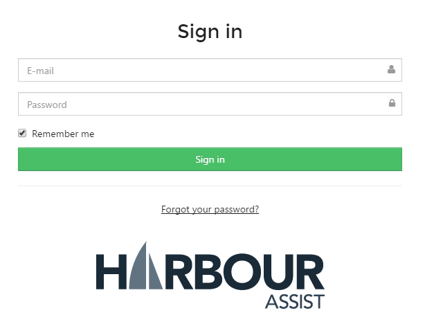
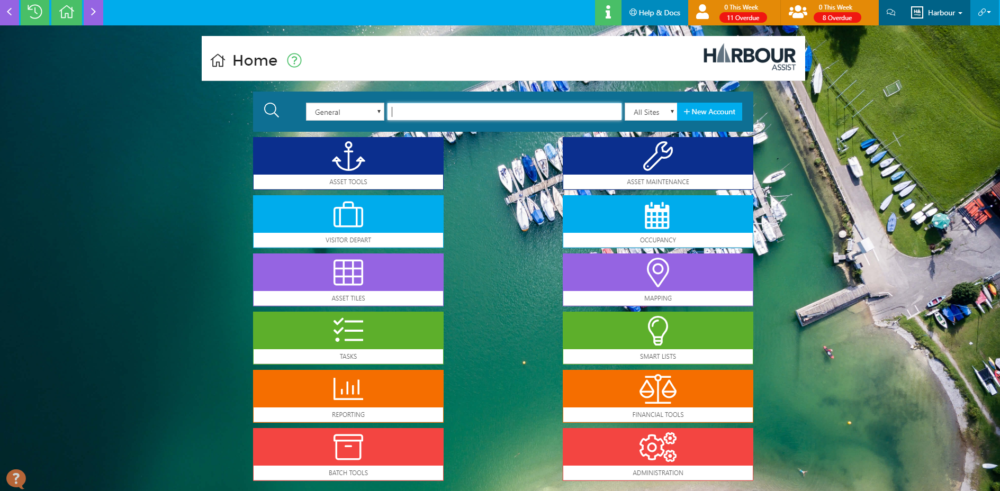

# Logging In #

To log into Harbour Assist from a laptop, desktop or Android device the web browser Chrome should be used. 

From an iPad the web browser Safari should be used.

Enter your site url address (xxxx.harbourassist.com) into the browser - this will take you to the sign in screen.

Enter your company email address and password issued to you, then click on the *Sign in* icon. 

This will take you to the *Home* screen.

?> NB: 6 consecutive failed log in attempts will result in your account being locked.  Please use the *Forgot your Password* on the Sign In screen to get an email to reset/unlock you account.

?> For more information about resetting your account click [here](GeneralNavigation/PasswordRecovery.md).