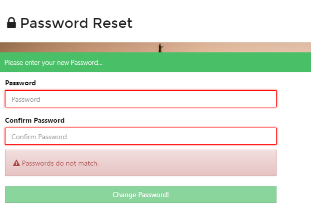

# Password Recovery #

From the *Sign In* screen select *Forgot your password*.

This will take you to the *Password Reset Request* screen.  Enter your email address and click *Submit*.

You will receive an email with the subject **Password Reset** 

Open the email and select *Change my password*.

This will take you to the *Password Reset* screen and you can set a password of your choice.  **Please make sure you use upper and lower case, a symbol and a number within the password.**

You will then be taken back to the *Sign in* screen and you can and log in using your new password.