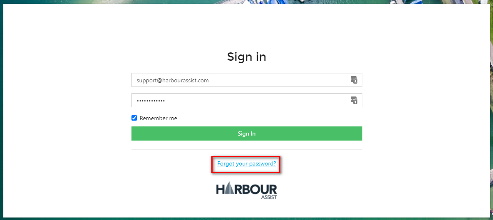
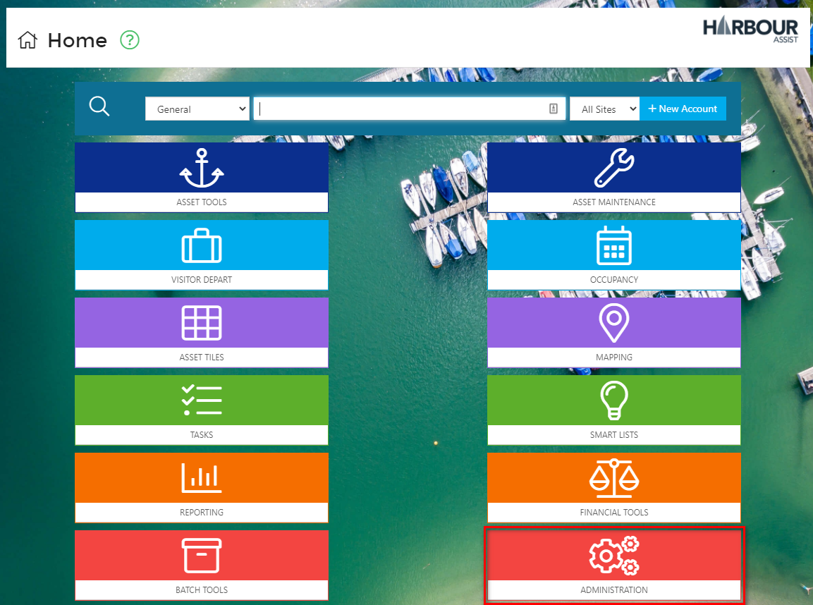

# System Security

## Sliding Session Expiration

As a security measure the system has *Sliding Session Expiration*.  This means you'll remain logged in as long as you are using the application.  After 1 hour of inactivity, you will be automatically logged out and reverted to the login page.  When you log back in, you'll go back to the page you were at. 

## User Lockout after 6 attempts

To protect against brute-force attacks, if a user uses an incorrect username/password for 6 sequential attempts, they are Locked Out.  There are 2 ways to unlock the account:

- By requesting a password reset link and updating their password.

  

  

?> For more information about resetting your password click [here](GeneralNavigation/PasswordRecovery.md).

- By a Harbour Assist user unlocking their account via their User administration page.  This can only be done by someone with the appropriate permission.  

?> NB: The Permission required is **AdministrationUsers**.

From the *Home* page select *Administration*.

Then select *Users*.

Click *Edit/View* on the relevant User line.

Then Click to unlock the *User*.

If the *User* cannot remember their password and you need to manually reset it for them, enter the new password in the *Password* cell.

?> NB: The Password must meet the criteria of at least 6 Characters, 1 Capital Letter, 1 Lowercase letter, 1 Number and 1 Special Character.

