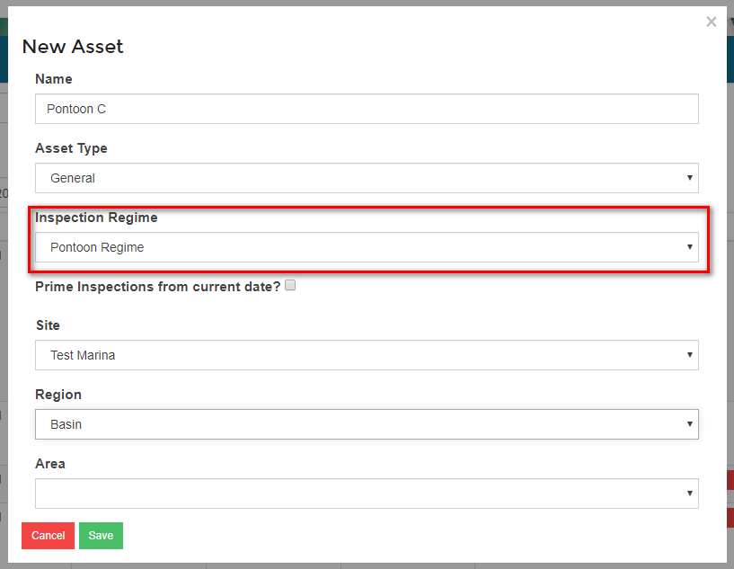
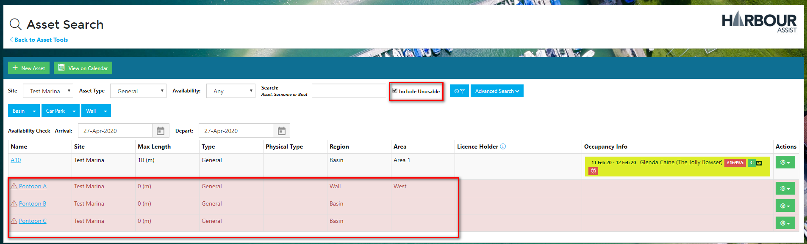

# Inspection Assets #

Any Asset can have an Inspection Regime attached to it, however there may be a number of Assets that need to be set up in Harbour Assist for the sole purpose of carrying out Inspections.

These *Inspection Assets* can be set up individually in the same way as any Asset, however if a bulk upload of *Inspections Assets* is required please contact the team at Harbour Assist by raising a Help ticket.

?> More documentation [here](AssetsOccupancy/Assets?id=creating-a-new-asset.md).

When creating the Asset you can select which Inspection Regime should be carried out on this Asset.

If the Asset is being used for inspection purposes only (it is not a sellable asset) check the Unusable box - this will turn the Asset red and it won't be counted in any occupancy figures.

?> NB: For Unusable Assets to show on your Asset Search screen, you will need to check the *Include Unusable* checkbox.  They will show highlighted in Red.

