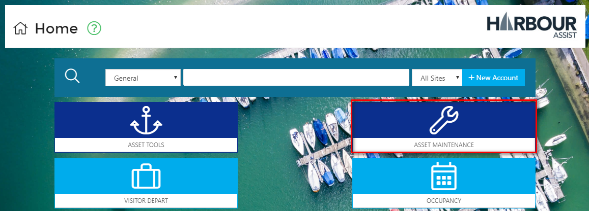
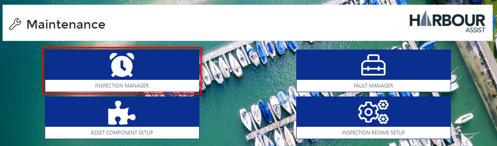
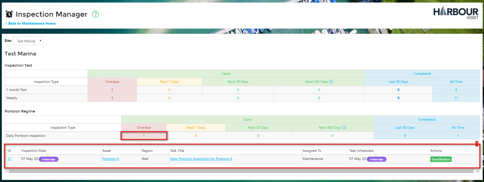

# Managing Inspections #

From the *Home* page, select *Asset Maintenance*.

Now click on *Inspection Manager*.

The *Inspection Manager* screen shows a summary of all Open and Completed Inspections for each Site, Inspection Regime and Inspection Type.

To view further details of the Inspections, click the category you wish to view - in the example below we wish to view the Overdue, Daily Pontoon Inspection for the site Test Marina.

You can go directly to perform an Inspection by clicking on *View/Perform*.

?> NB: Once you are in the cycle of recurring inspections you won't need to use the *New Inspection* feature in the Asset details.

?> More documentation [here](Maintenance/PerformingAnInspection.md).