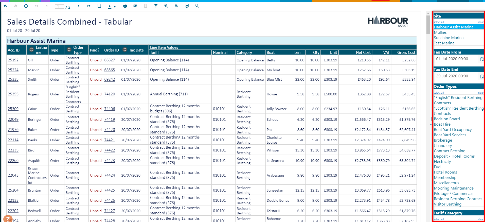

# Filtering Reports

Each report has a selection of Filters that can be set so that you can drill down to the information you require.  These are displayed on the right hand side of the screen when you load a report and will differ from report to report as appropriate.

?> NB. When selecting the dates on any report, the system will default of 00:00 for the date selected, so if you wish to include transactions for the last day of a month, make sure you select the end date of the 1st of the following month.

Once you have set your Filters, you can hide this panel by clicking on the *Filter* icon so that your report fills the whole screen.

If you need to show them again, just click on the *Filter* icon again to display them.

