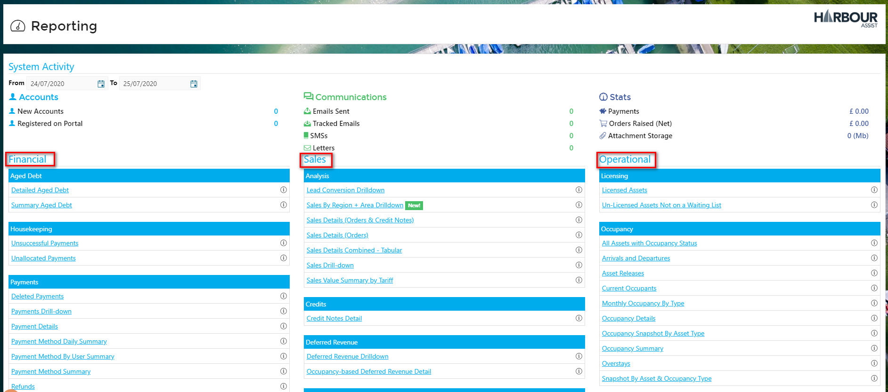
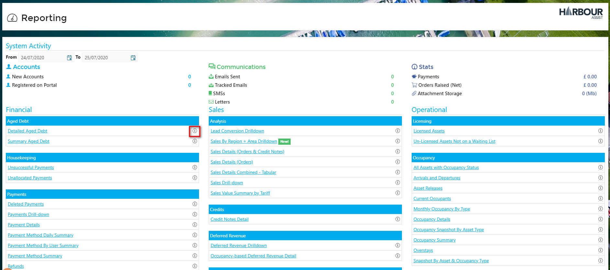

# Overview

Harbour Assist has a full library of Reports which can be found by going to *Reporting* from the Home screen.

They are divided into 3 main categories; Financial, Sales and Operational and each category is divided into sub-categories.

Each Report has an *Info* button, which if you click on will give you a description of the Report.

