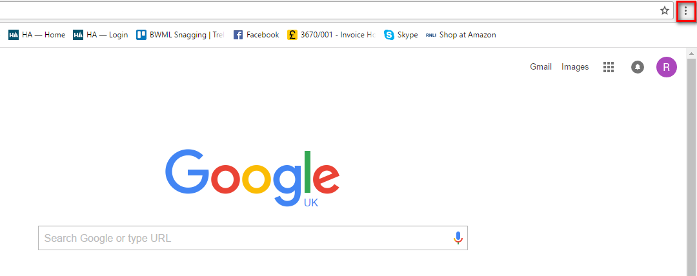
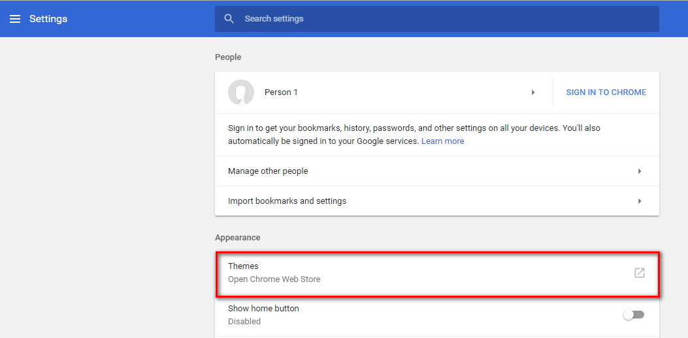
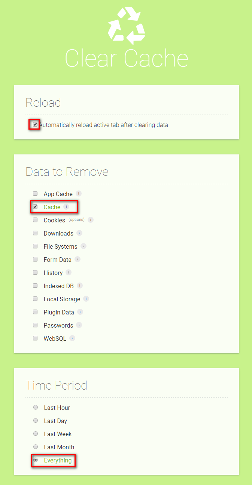
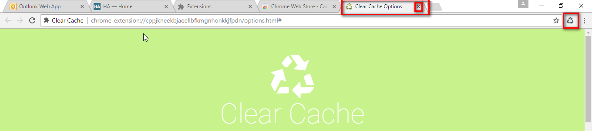

# Clear Cache Extension #

In order for the system to work effectively, particularly after a new release to the system, it may be necessary to clear the Cache in Chrome.  

By following the instructions below you can set this up so that the Cache can be cleared with a single click.

First, click on the *Customise and Control Google Chrome* button which can be found at the top of the screen when you have Chrome open.

Select *Settings*.

Select *Open Chrome Web Store*

In the search box type in *Cache*.

Find the Clear Cache extension (as shown below) and click on *Add to Chrome*.

If it doesn't show straight away, click on More Extensions.

Click on *Add Extension*.

Select the *Reload, Cache and Everything* options.

The Clear Cache *triangle* will appear at the top of your page.  You can now close down the *Clear Cache Options* tab.

The *triangle* will show at the top of your page whenever you have Chrome open and in future to clear the Cache just a single click on this symbol is required.

