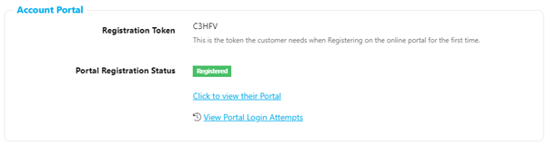

# Portal Troubleshooter

If a customer reports issues with logging into their portal please check the following:-

- Does the email address the customer is using to try to log in match the email address on their Harbour Assist account? If it doesn’t ask the customer whether they want to update their account email address.

- Type the email address into the Search on the Home page – does it bring back more than 1 account? If so, this could be the problem. The Portal Login uses the customer email address as a unique identifier – if there is more than 1 account with this email address the system will not know which accounts portal to open.

- If the email address is correct and there is only 1 account on the Account tab have a look at the Account Portal details. Here you can see whether the customer is registered or not and if they are registered you have to option to view their Portal Login Attempts.

  

- View the customers Login Attempts – this will give you information about when they have tried to login and whether their attempt was successful or not – Green tick for Successful, Red cross for Unsuccessful.

  

- If the customer has had 6 or more consecutive Unsuccessful login attempts, they will have been locked out. Advise the customer to use the Forgot your Password? Link on the Login Screen.

  
