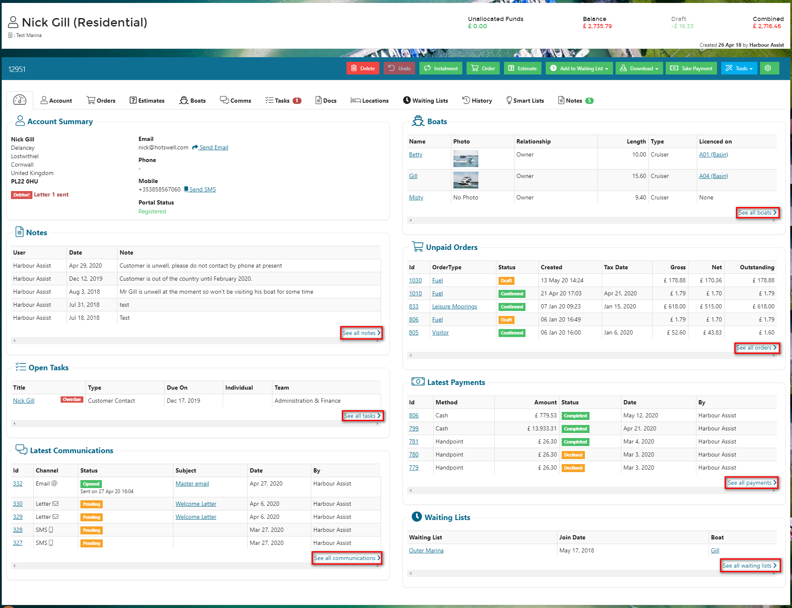
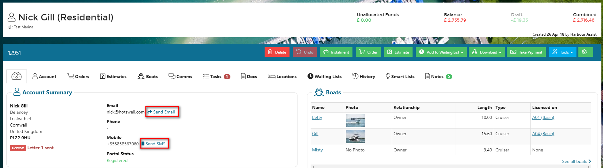
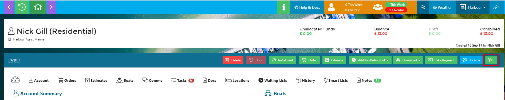
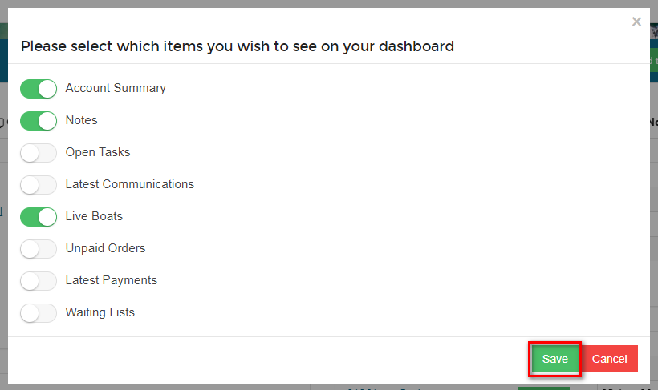
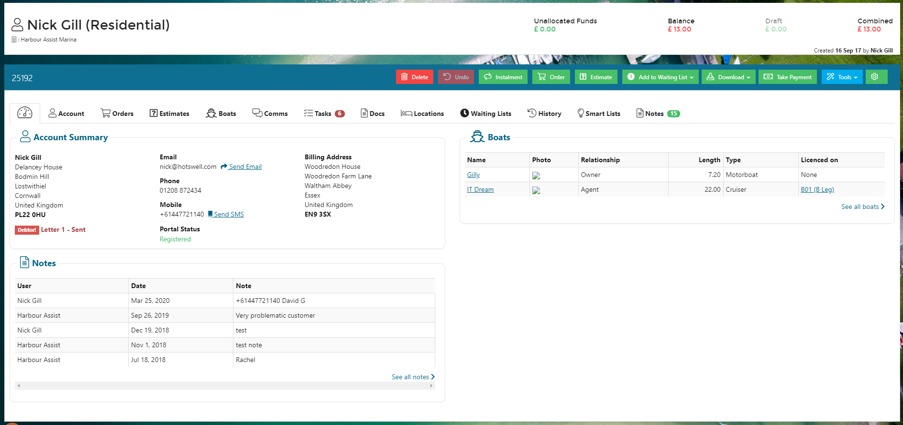

# Account Dashboard

The Account Dashboard is the first page you see when viewing an account and it gives you an overview of the information contained within each tab on the Account.

For each section you can click through to the Tab by selecting the _See all_ option.

In the _Account Summary_ section there is a quick link to send an email or SMS to the customers without having to go into the Comms tab.

?&gt; NB: You cannot update the Account contact details from the Dashboard view - to amend these details please click on the _Account_ tab.

## Dashboard Configuration

Users can configure the _Dashboard_ to only show the sections that they are interested in.

From within any Account select the _Settings_ button on the main toolbar.

Use the toggles to turn on/off each section of the Dashboard, then click on _Save_.

The Dashboard will now only display the selected sections.

?&gt; NB. The configuration will be applied to all Accounts, not just the one that you are on when you select the settings.

