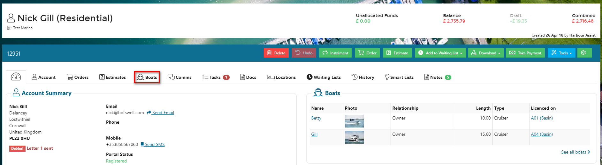
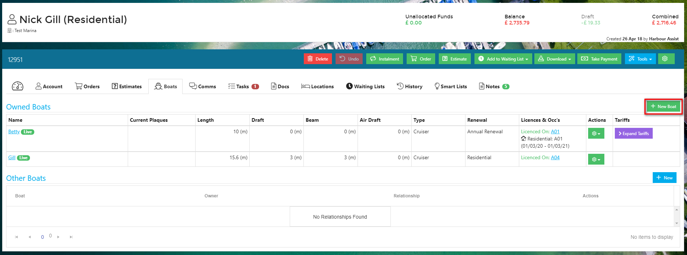
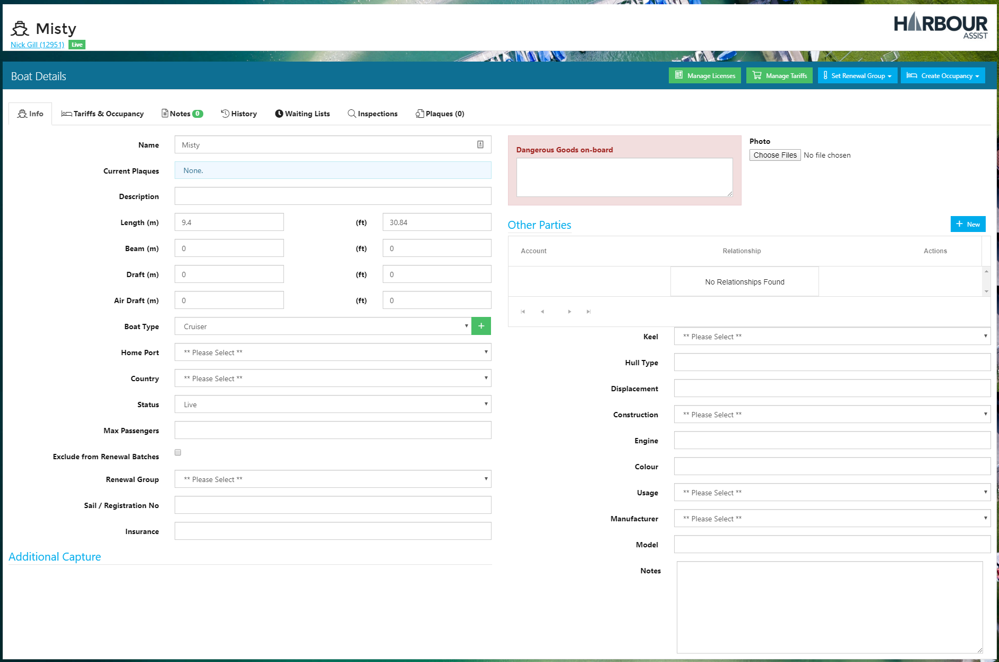
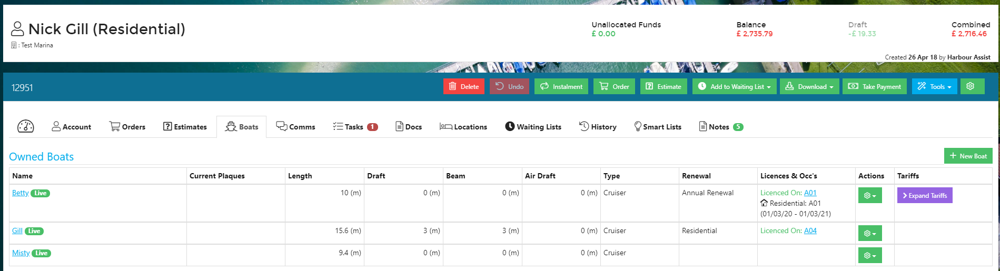
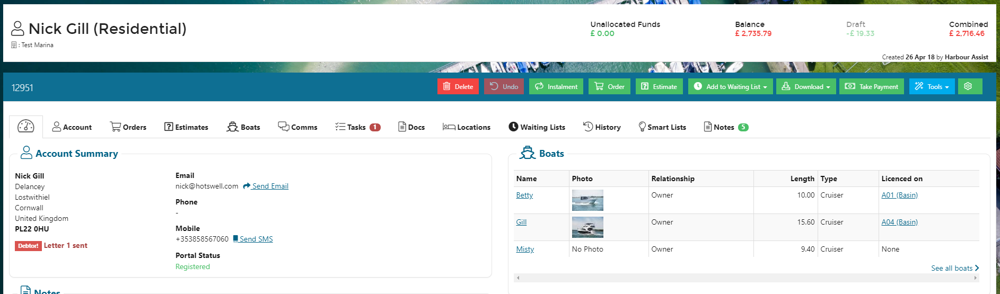

# Creating a Boat

Accounts in Harbour Assist can have multiple boats.

To add a new boat to an existing account, click on the _Boats_ tab.

Click _New Boat_.

Complete the basic boat details and click _Save_.

Now you can complete as much additional information as you have in the Boat Details page.

The boat will now show on the _Boats_ tab and on the _Dashboard_ page.

