# Credit Notes \#

There are 2 ways to raise a credit note on an Account.

## **Raising a Credit Note via an Order**

If the credit note is directly associated with a confirmed order ie. you need to credit the entire or part of the order, you can raise the credit note by clicking on the Actions button on the Order line.

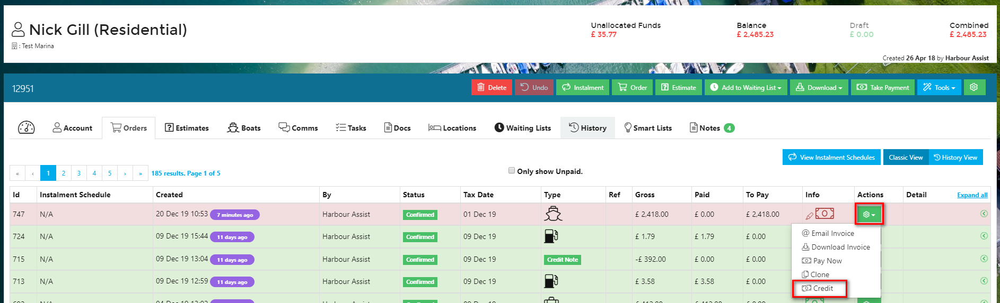

Alternatively, if you are already viewing the Order, you can click on Credit.

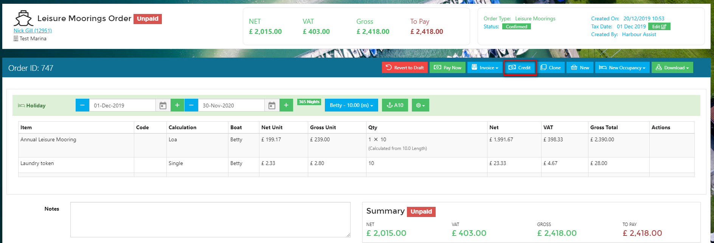

Both of these will take you to the same next screen.

Now you can choose which tariff lines to include in the Credit Note. If you want to credit out the order in full just leave the _Include_ boxes ticked on each line and click **Credit**.

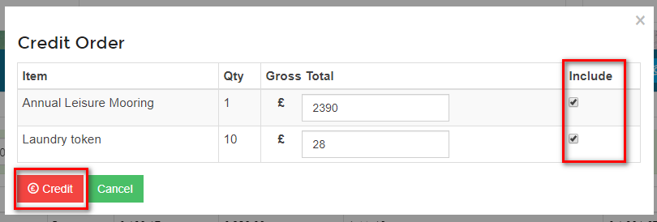

To credit out just one \(or some\) of the tariff lines uncheck the _Include_ box for any that do not require crediting, then click **Credit**. In this example I only want to credit out the Laundry tokens.

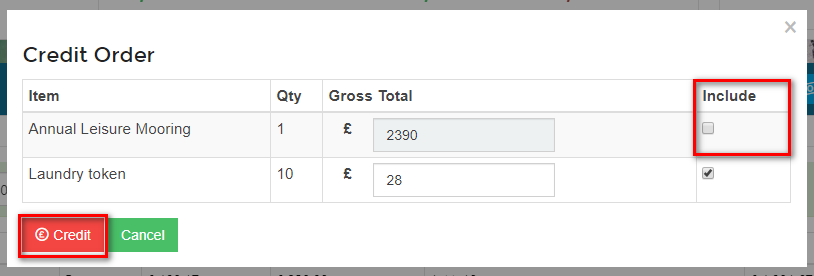

You can also part credit an amount. In the example below the customer was charged for 10 laundry tokens instead of 1 in error, I therefore want to credit out 9 of the laundry tokens \(9 x £2.80 = £25.20\). Just type the amount to be credited into the _Gross Total_ box and then click **Credit**.

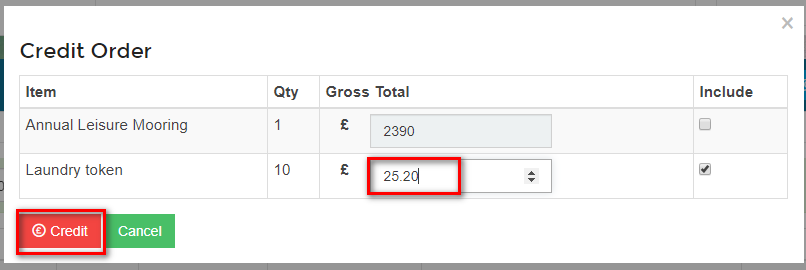

You have now created a draft Credit Note.

Enter some detail into the _Notes_ section explaining why a Credit Note is being issued. This is good practice from an audit perspective.

Once you have ensured all the detail is correct click on Commit Credit.

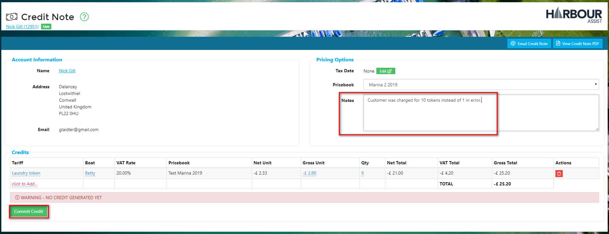

You will be prompted to confirm the Credit. Click **Yes** to confirm this.

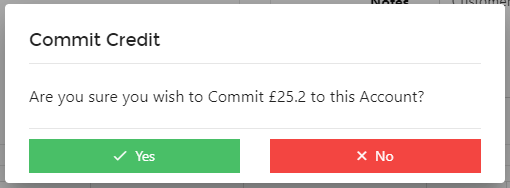

When the Credit Note is committed you will automatically be taken to the _Allocate Payments_ page.

?&gt; NB. Even though the credit note was raised via an order it will not automatically be allocated to that order - this is to give users greater flexibility.

If the Credit Note has been raised in order to create a Refund, just click on Back to Account without making any allocations.

?&gt; More documentation on Refunds can be found [here](https://github.com/glaidler/docs-1/tree/a9b2fde53025657e319d99966ea9a02a32cbd61d/AccountsOrdersPayments/AccountsOrdersPayments/Refunds.md)

## Raising a Credit Note via Tools \#\#

To raise a more general Credit Note where you can add tariffs manually it is best to use the _Tools_ button.

Click on the _Tools_ button in the toolbar at the top of the Account and select _Credit Note_.

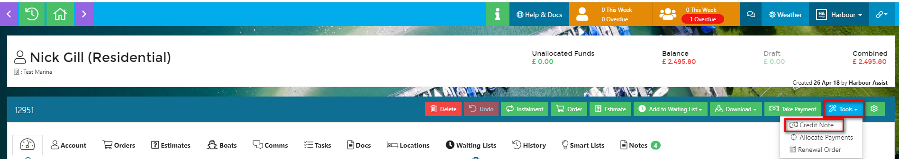

You have now created a draft Credit Note.

Enter some detail into the _Notes_ section explaining why a Credit Note is being issued. This is good practice from an audit perspective.

Then click on the _click to Add_ button.

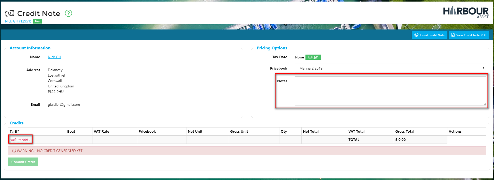

To add the Tariff that you want to use to create the credit amount, first select the tariff category and then select the tariff. Once added you can, if necesssary, edit the tariff description to accurately describe the credit.

Now you can enter the credit amount into the Gross Unit cell - there is no need to enter it as a negative value, the system will do this for you.

Check the details and then click _Commit Credit_.

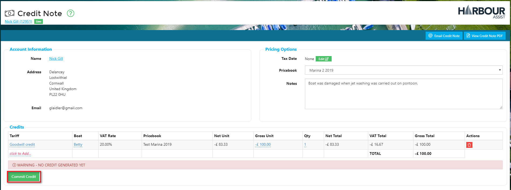

You will be prompted to confirm the Credit. Click **Yes** to confirm this.

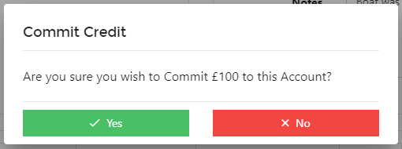

When the Credit Note is committed you will automatically be taken to the _Allocate Payments_ page.

If the Credit Note has been raised in order to create a Refund, just click on Back to Account without making any allocations.

?&gt; More documentation on Refunds can be found [here](https://github.com/glaidler/docs-1/tree/a9b2fde53025657e319d99966ea9a02a32cbd61d/AccountsOrdersPayments/AccountsOrdersPayments/Refunds.md)

## Allocating a Credit Note

To allocate the Credit Note, click anywhere on the Credit Note line to select the Credit.

You will now be able to see all outstanding Orders - select the Order you wish to allocate the Credit to by clicking on the _Allocate_ button.

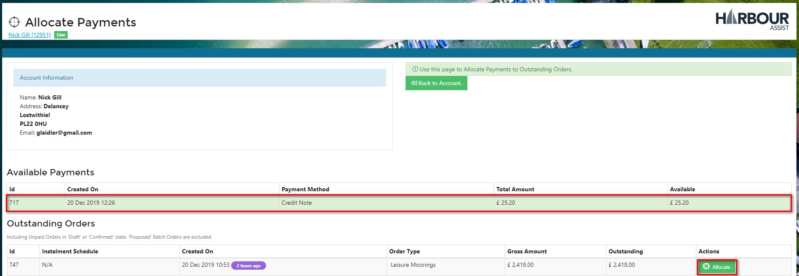

?&gt; NB. If the Credit Note amount exceeds the Order amount, the remaining Credit amount will be left on the Account and be available to allocate to other Orders. Select _Confirm_ to allocate the Credit to the Order.

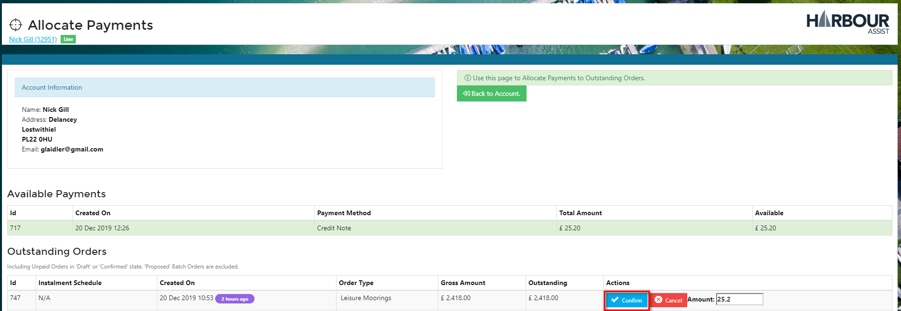

If the entire amount of the Credit Note has been allocated you will be notified there are no further funds available to allocate and should select _Back to Account_.

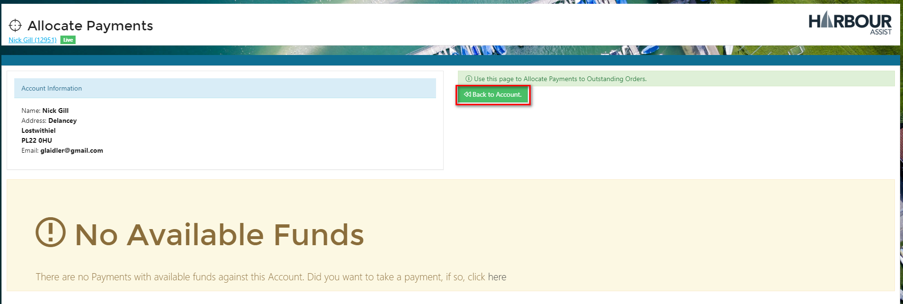

