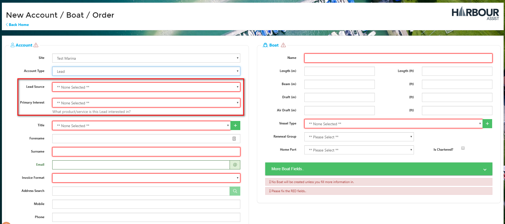
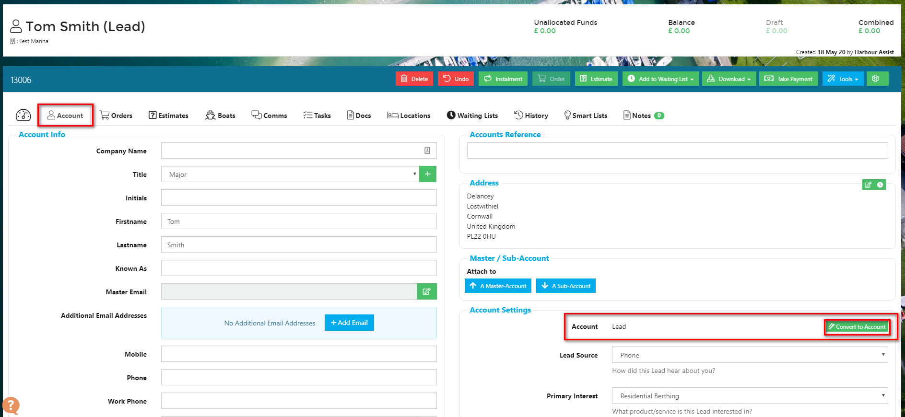
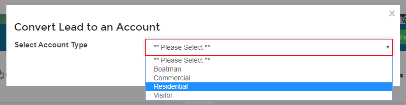
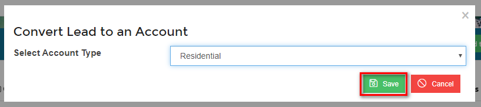
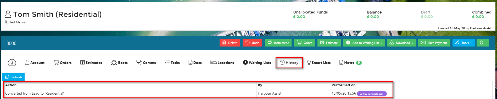
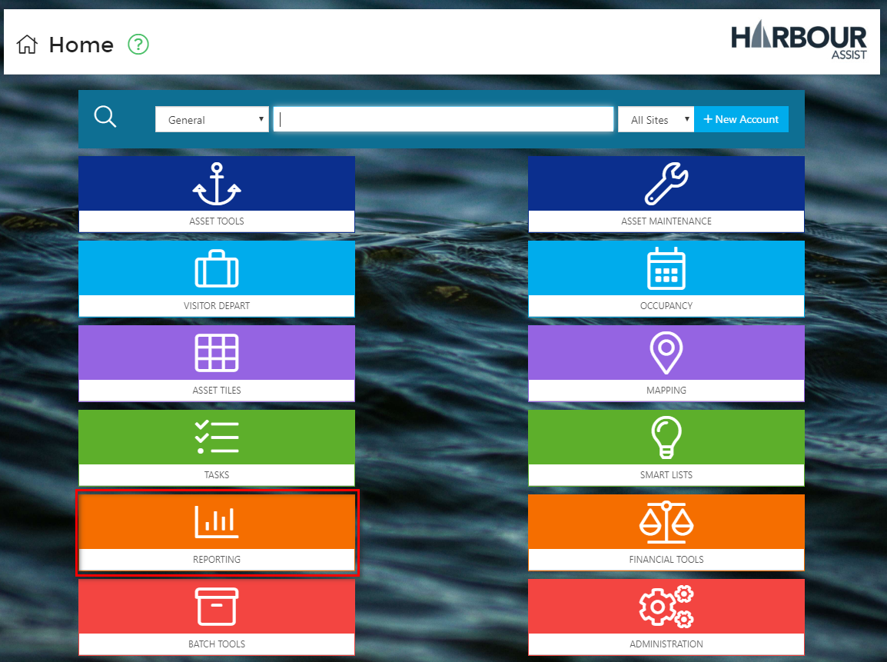
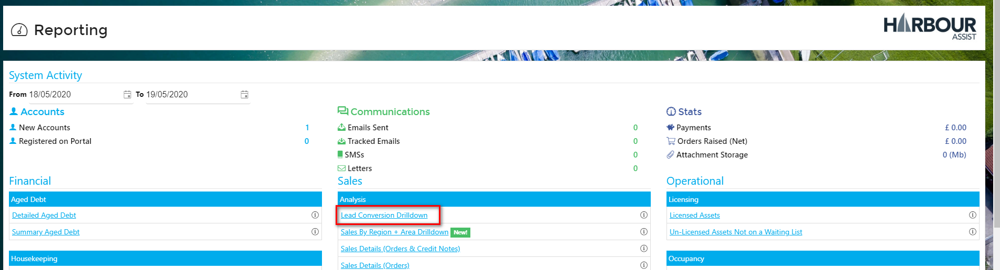
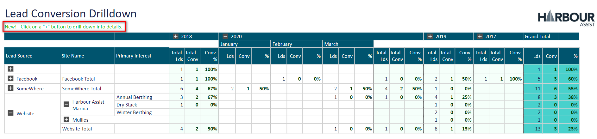

# Lead Accounts

## Overview

Lead Accounts are a way of tracking all enquiries received and conversion rates.

Lead Accounts differ slightly from any other Account Type, as you cannot raise an Order on a Lead Account. You can raise an Estimate or add the Account/Boat to any Waiting Lists.

?&gt; More documentation on Estimates can be found [here](https://github.com/glaidler/docs-1/tree/a9b2fde53025657e319d99966ea9a02a32cbd61d/AccountsOrdersPayments/AccountsOrdersPayments/Estimates.md)

?&gt; More documentation on Waiting Lists can be found [here](https://github.com/glaidler/docs-1/tree/a9b2fde53025657e319d99966ea9a02a32cbd61d/AccountsOrdersPayments/AssetsOccupancy/WaitingLists.md)

When setting up a Lead Account some additional information is required to be completed \(Lead Source and Primary Interest\), this is so that enquiry and conversation analysis can be carried out.

You can configure your own Lead Source and Primary Interest dropdown lists in Lookups. For instance if you attend an annual boat show you could set up a Lead Source of Boat Show 2020 - this would capture how many Leads were received at the show and subsequently how many of those were converted to customers.

?&gt; More documentation on Lookups can be found [here](https://github.com/glaidler/docs-1/tree/a9b2fde53025657e319d99966ea9a02a32cbd61d/AccountsOrdersPayments/Administration/Lookups.md)

## Converting a Lead Account

To convert a Lead Account, from the _Account_ tab click on _Convert to Account_.

Select the Account Type from the dropdown list.

Then click _Save_.

The conversion of the Account is logged in the _History_ tab.

## Lead Conversion Analysis

From the _Home_ page select _Reporting_.

Then select the _Lead Conversion Drilldown_ report.

Use the + buttons to drill down into the report detail.

