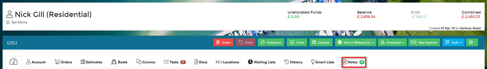
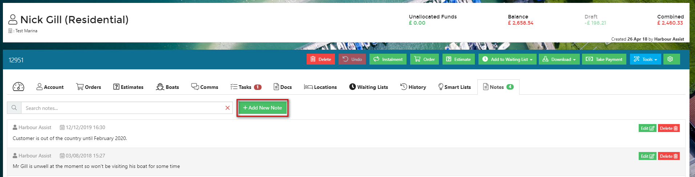
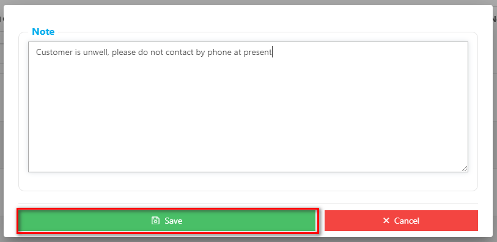
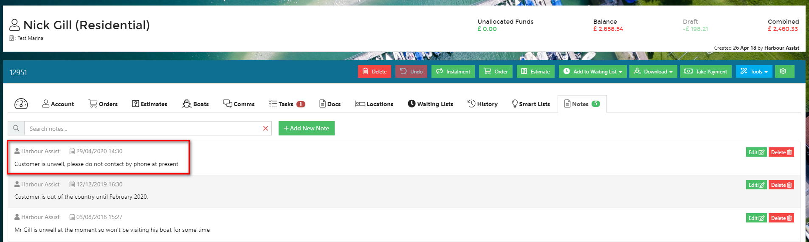
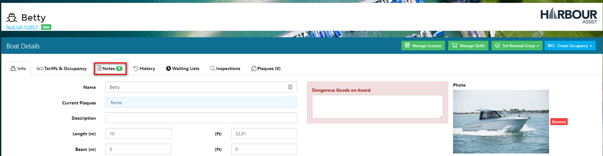

# Notes

## Adding a Note to an Account

You can add notes to a customer account for other users to see \(these are not visible to the customer in their Account Portal\). Notes could be something such as 'going out cruising for the whole of August'. To do this, click on the _Notes_ tab and then _Add New Note_.

Type your note and click _Save_.

This will 'lock' the note, showing the date if was entered and who entered the note. Once saved, Notes can only be edited or deleted by Users with the relevant permission \(normally System Managers\).

## Adding a Note to a Boat

You can also add a note to the _Boat Details_ page - this is done in exactly the same way and should be used if a note relates particularly to the boat rather than the account.

