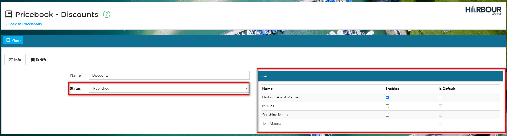

# Tariffs & Pricebooks \#

Tariffs & Pricebooks are a key element of the system and are used when creating an Order of any type.

## What is a Tariff \#\#

A Tariff is how we refer to a product or service sold. Each Tariff will have a name, price, calculation type and will be put into a category - this will help you to find the correct Tariff when creating an Order.

?&gt; More documentation [here](https://github.com/glaidler/docs-1/tree/a9b2fde53025657e319d99966ea9a02a32cbd61d/AccountsOrdersPayments/Administration/OrderTypes/README.md)

## Calculation Types \#\#

Each Tariff has a _Calculation Type_ - these are there to avoid end-users having to perform manual calculations and therefore reduce the risk of human error. There are many Calculation Types, but the most commonly used are - Single, Length Overall \(LOA\), Per Night, LOA Per Night - these are explained below.

* **Single** - This should be used for Tariffs which have a price per item i.e. Laundry tokens, gas bottles etc. or if a berth/mooring is sold at a set price and is not dependent on the length of a craft.  When raising an order the quantity should be set for the number of items being purchased i.e. if 6 laundry tokens @ £2.80 each are required, the quantity of 6 should be selected and the price will be calculated 6 x £2.80 = £16.80.  Likewise for a berth/mooring with a set price of £5,500, the quantity of 1 should be selected and the price will be calculated 1 x £5,500 = £5,500.  

?&gt; NB. Some Tariffs can have variable prices and are therefore set at £0 - for these Tariffs the _Single_ Calculation Type should be used - the quantity selected when raising an order should be 1 and this will then enable you to manually type in the total price to be charged.

* **Length Overall \(LOA\)** - This calculation is used for Tariffs that are chargeable by the length of a craft i.e. the price of an annual Leisure Mooring is £239 per metre and the craft the order is being raised for is 15.6 metres in length - when raising the order the quantity of 1 should be selected, the system will automatically calculate the price of the mooring £239 x 15.6m = £3,728.40.

  

* **Per Night** - Mainly used for visiting craft - the Tariff is a per night cost i.e. it is £30 per night for a visitor mooring. When raising an Order the dates for the period of the stay should be selected from the calendar - this will show the number of nights that will be charged for - then the quantity of 1 should be selected. The system will automatically calculate the price from the number of nights.

* **LOA Per Night** - Again this is mainly used for visiting craft, but the Tariff is calculated per night x the length of the craft.  When raising an Order the dates for the period of the stay should be selected from the calendar - this will show the number of nights that will be charged for - then the quantity of 1 should be selected.  The system will automatically calculate the price from the number of nights x the length of the craft.

## Creating a New Tariff

The ability to create a new _Tariff_ is permission based; the _Permission_ required for this is _AdministrationTariffs_.

From the _Home_ page select _Administration_.

Then select _Tariffs_.

Click on _New Tariff_.

Complete the information required; the following tips will help:-

* **Name** - give the Tariff a name that will make sense to users and customers as this will appear on their order.
* **Code** - give the Tariff a code - this can be anything you wish - it is often just an abbreviation of the tariff name.

?&gt; NB: Each Tariff Name and Code should be unique to that Tariff.

* **Category** - use the drop down list to select a Category or the + button to create a new one.
* **Decimal Places** - enter the number of decimal places, so for a tariff to appear as £1.99 the decimal places should be set to 2.
* **VAT Rate** - this should be entered as a decimal; 20% is 0.2, 5% is 0.05 etc.  Where VAT should not be charged enter 0.
* **Calculation Type** - select from the drop down list.

Completion of all the other cells is optional.

When the information has been entered, click on _Save_.

The next stage is to add the _Tariff_ to the relevant _Pricebooks_ and _Order Types_.

?&gt; For guidance about Adding a Tariff to a Pricebook click [here](https://github.com/glaidler/docs-1/tree/a9b2fde53025657e319d99966ea9a02a32cbd61d/AccountsOrdersPayments/AccountsOrdersPayments/TariffsPricebooks?id=adding-and-removing-tariffs-from-pricebooks.md).

?&gt; For more information about Order Types click [here](https://github.com/glaidler/docs-1/tree/a9b2fde53025657e319d99966ea9a02a32cbd61d/AccountsOrdersPayments/Administration/OrderTypes?id=adding-and-removing-a-tariff-on-an-order-type.md).

## Explaining Pricebooks \#\#

Pricebooks exist in order to allow different Sites to have different prices for the same Tariff i.e. the price of an annual residential mooring at one site could be £5,500, but another site could charge £6,500. By using Pricebooks the same Tariff can be used - for instance 'Residential - 1 payment' but by selecting the Pricebook for the site the order is being raised for, the correct price will be charged. This takes away the need for multiple Tariffs for the same product being created.

The Pricebook you wish to use should be selected from the Tariff Selection page when raising an Order.

Pricebooks can also be set for a period of time i.e. the Pricebook for the calendar year of 2019 should be used for Orders during that period. A new Pricebook can be created, by Cloning the existing one, for the calendar year of 2020 with revised prices - this could be an across board increase of 2% for instance. This enables annual pricing changes to be released in a controlled manner.

?&gt; For more information about Cloning a Pricebook click [here](https://github.com/glaidler/docs-1/tree/a9b2fde53025657e319d99966ea9a02a32cbd61d/AccountsOrdersPayments/AccountsOrdersPayments/TariffsPricebooks?id=cloning-a-pricebook.md).

Pricebooks for previous years can be archived, but will still be held on the system so that they can be referred to if necessary.

?&gt; For more information about Managing Pricebooks click [here](https://github.com/glaidler/docs-1/tree/a9b2fde53025657e319d99966ea9a02a32cbd61d/AccountsOrdersPayments/AccountsOrdersPayments/TariffsPricebooks?id=managing-pricebooks.md).

## Creating a New Pricebook

To create a new _Pricebook_ from the _Home_ page select _Administration_.

Then select _Pricebooks_.

Click on _New_.

Give the _Pricebook_ a name and click _Add_.

Your _Pricebook_ has now been created in _Draft_.

The next step is to add the _Tariffs_ to the _Pricebook_.

?&gt; For guidance about Adding a Tariff to a Pricebook click [here](https://github.com/glaidler/docs-1/tree/a9b2fde53025657e319d99966ea9a02a32cbd61d/AccountsOrdersPayments/AccountsOrdersPayments/TariffsPricebooks?id=adding-and-removing-tariffs-from-pricebooks.md).

Once the _Tariffs_ have been added the _Pricebook_ can be left in _Draft_ and then at the relevant time \(if the Pricebook is seasonal for instance\) you can change the _Status_ of the _Pricebook_ from draft to _Published_ and _Enable_ it for the _Site\(s\)_ where it should be available for selection.

## Cloning a Pricebook

The easiest way to create a _Pricebook_ to apply any increases year on year is to _Clone_ an existing _Pricebook_. The new _Pricebook_ can still be amended; prices adjusted, tariffs added and removed etc, before you publish it.

To clone a _Pricebook_ from the _Home_ page select _Administration_.

The click on _Pricebooks_.

Click on the _Actions_ button of the _Pricebook_ you want to clone and select _Clone_ from the dropdown list.

Give the new _Pricebook_ a name and enter the % increase that you wish to apply to the _Tariffs_.

?&gt; NB: The % increase will be applied to all tariffs, so some manual adjustment is inevitable. Enter the % increase that applies to the majority of the tariffs so that fewer adjustments are necessary. If the majority of the tariffs are staying the same enter 0.

The _Pricebook_ will be created in Draft; click on the _Draft_ button to view the _Pricebook_.

?&gt; NB: You may need to refresh your page for it to appear.

To _View/Edit_ the _Pricebook_ click on the _Name_ or use the _View/Edit_ option from the _Actions_ dropdown list.

Now you can review your Tariffs and make any necessary adjustments to the prices - sometimes companies prefer to round prices up/down to the nearest £1 for example.

Click on the _Tariffs_ tab.

Click on the Gross cost to amend.

?&gt; NB: The prices displayed are the Gross cost, so include the VAT at the rate set against the Tariff.

## Managing Pricebooks

Pricebooks can be managed so that they appear to Users for selection at the appropriate time. They can be prepared in advance and left in a Draft status, then changed to Published when they are in use and then Archived when they are no longer required.

Access your Pricebooks by clicking on _Pricebooks_ within _Administration_.

By default, this page will display just the Published Pricebooks, but you can select to see Pricebooks with a different status by clicking on the blue tiles.

?&gt; NB: The tile will show in a darker blue if selected.

You can change the status of a Pricebook by clicking on the _Actions_ button and selecting from the dropdown list.

Or you can open the Pricebook \(by clicking on its name\) to manage it in more detail. Here you can change the status and also enable/disable it for different Sites and make it the Default Pricebook for a site\(s\).

?&gt; NB: If a Pricebook is enabled for a Site it will appear for selection, but the system will always show the Default Pricebook initially, so make sure the Default one is the one that is most used \(ie. the one for the current year etc\).

You can also manage which Pricebooks are available for which Sites from within the Site details.

?&gt; For more information about Sites click [here](https://github.com/glaidler/docs-1/tree/a9b2fde53025657e319d99966ea9a02a32cbd61d/AccountsOrdersPayments/Administration/Sites.md).

## Adding and Removing Tariffs from Pricebooks \#\#

Tariffs can the added and removed from Pricebooks easily - this may be necessary if a new Tariff becomes available at a site or an existing Tariff is no longer available.

To add or remove a Tariff, from the _Home_ page select _Administration_.

Then select _Pricebooks_

On the line of the Pricebook you wish to edit, from the _Actions_ key select _View/Edit_.

Then click on the _Tariffs_ tab.

Select the appropriate Tariff category from the drop down list.

This will show all the Tariffs within that category.

If a Tariff is already included in the Pricebook it will show a red icon next to it - to remove this Tariff from the Pricebook click on this icon.

To add a new Tariff click on the green + icon.

Enter the Gross cost of the Tariff and click _Save_.

The Tariff will now show in the Included Pricebook Entries list on the right hand side of the page.

