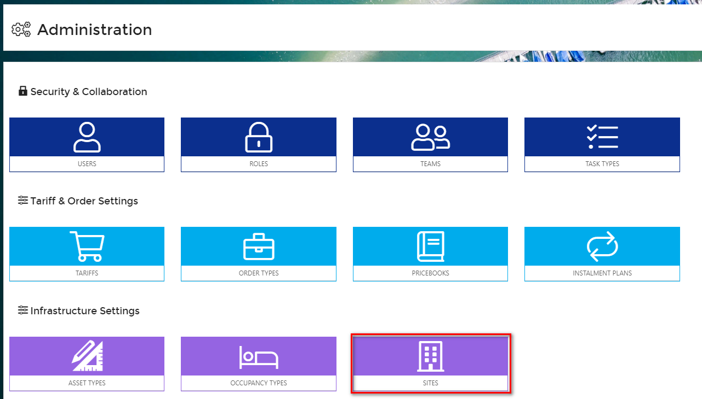
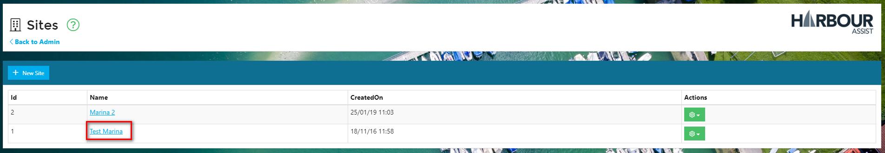
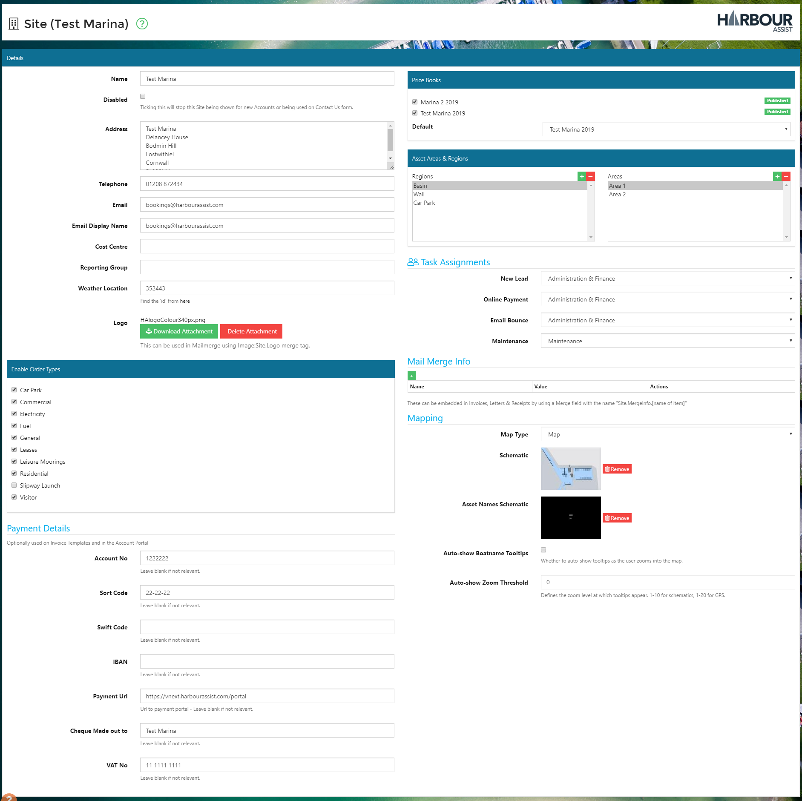

# Sites \#

The details of each site \(harbour or marina\) that is set up within Harbour Assist can be edited from the Administration tile on the _Home_ page.

Under _Infrastructure Settings_ select _Sites_.

To edit an existing site, click on the Site name to open the details.

The _Site_ screen shows all the details relating to that site.

Contact details \(address, phone number and email\) and payment details \(bank account number, sort code etc\), can be amended here. These are the details that will be used to merge onto Orders and Receipts etc, so it is important they are kept up to date.

The Order Types that can be raised for that site can also be enabled or disabled from this screen, and the Pricebook that is used for the site can be set.

