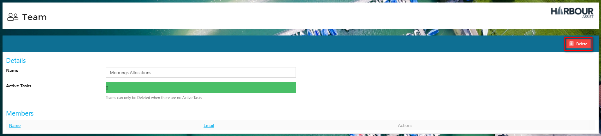

# Teams

## Overview

_Teams_ on Harbour Assist are used for the sole purpose of setting _Tasks_ and each _User_ can belong to an unlimited number of _Teams_.

_Teams_ can be added, removed and administered, and _Users_ can be added and removed from a _Team_ by users with the appropriate permissions.

?&gt; NB. Permissions required are TeamAdministration and AdministrationUsers.

## Adding a Team

From the _Home_ page select _Administration_.

Then select _Teams_.

Click on the _Add_ button.

Enter the _Team_ name and click _OK_.

## Deleting a Team

From within _Administration_, select _Teams_.

Then click on the name of the _Team_ you want to delete.

If the _Team_ has any members these will need removing before you can delete the _Team_. Just click on the _Remove_ button of each member.

?&gt; NB. You cannot delete a _Team_ if they have any Active Tasks. Please reassign any Active Tasks to another Team so that you can proceed with the deletion.

?&gt; For more information about Tasks click [here](https://github.com/glaidler/docs-1/tree/a9b2fde53025657e319d99966ea9a02a32cbd61d/Administration/ProductivityCollaboration/Tasks.md).

When the _Team_ has no members or Active Tasks you can click on the _Delete_ button.

Click _OK_ confirm.

## Adding and Removing Users from a Team

From the _Home_ page select _Administration_.

Then select _Users_.

Click on the _Edit/View_ button for the relevant _User_.

At the bottom of the _User_ profile you will see all the different _Teams_; use the check box to add or remove the _User_ from a _Team_.

Alternatively, you can remove _Users_ from a _Team_ within the _Teams_ administration page.

