# Assets \#

An Asset within Harbour Assist can be anything, not just a berth or mooring. Electricity meters, Meeting Rooms, Lockers and items of Plant etc can all be an Asset.

## Asset Types \#\#

To set up a new _Asset Type_, from the _Home_ screen select _Administration_.

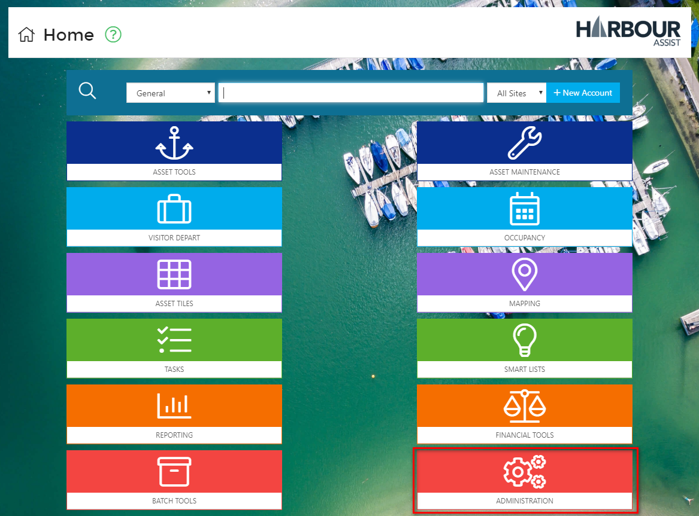

Then under _Infrastructure Settings_ select _Asset Types_

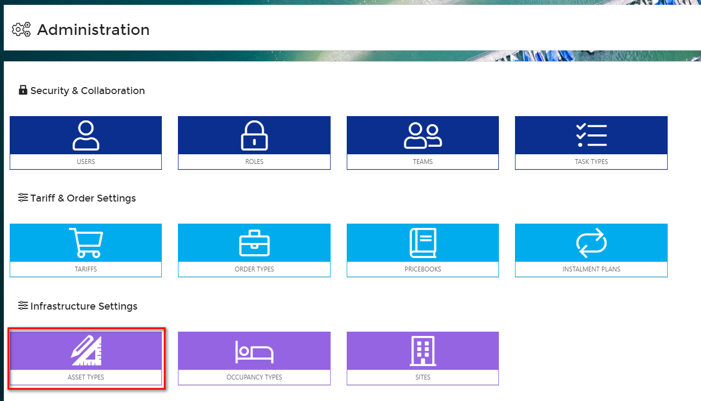

Select _New Asset Type_

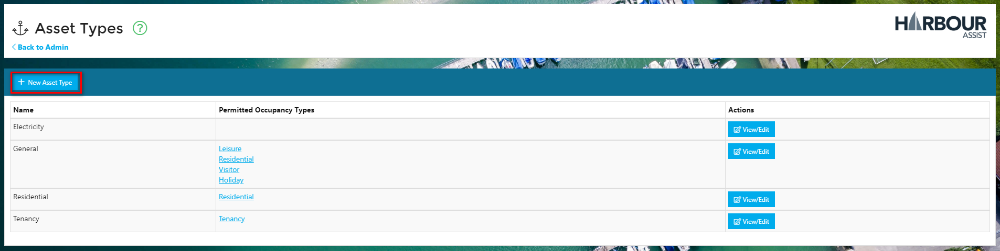

Give the new Asset Type a name.

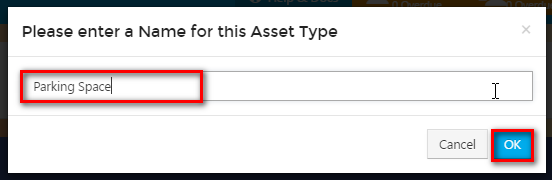

Set the _Licence Level_ and the _Permitted Occupancy Types_ - these are the types of occupancy that you will be able to put on the Asset.

?&gt; More documentation [here](https://github.com/glaidler/docs-1/tree/a9b2fde53025657e319d99966ea9a02a32cbd61d/AssetsOccupancy/AssetsOccupancy/Occupancies/README.md)

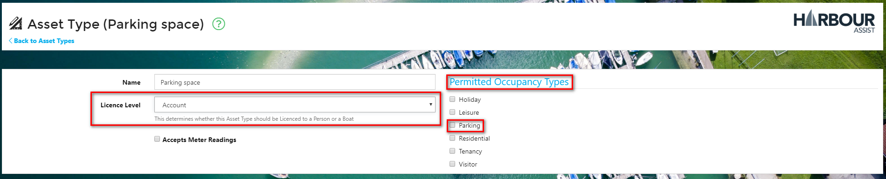

## Asset Areas & Regions \#\#

Each Asset created needs to be located within an _Area & Region_ - this will help you to find an individual Asset from the Occupancy, Asset Tiles and Asset Tools screens. Each Region within a Site can have multiple Areas. Each Region represents a blue button at the top of these screens, and each Area is a drop-down entry when you click on the "down arrow" against these buttons.

To set us a new _Area or Region_, from the _Home_ page select _Administration_.

Then select _Sites_.

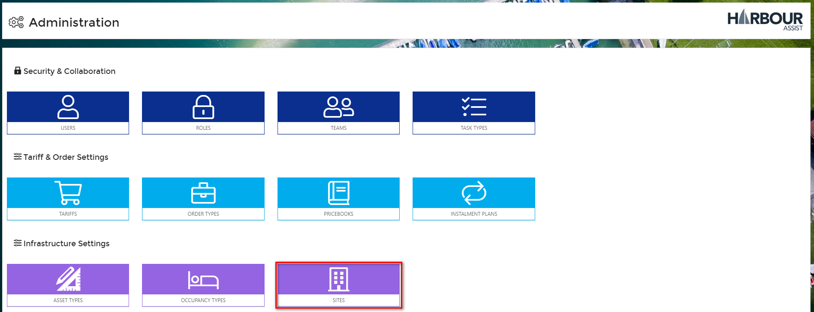

Select the Site that you want to create the new Area or Region for by clicking on the site name.

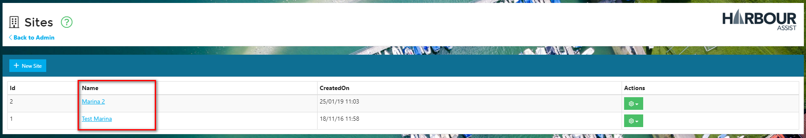

Within the _Site_ screen you will find _Asset Areas & Regions_.

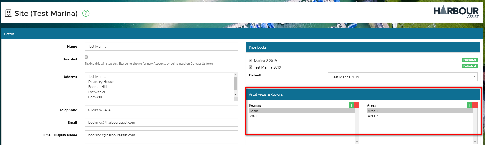

To add a new _Region_, click on the + icon.

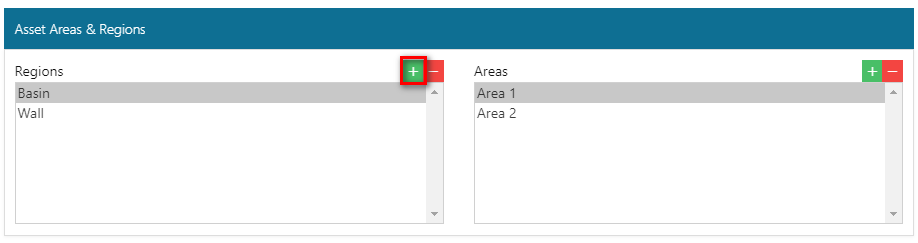

Give the _Region_ a name and click OK.

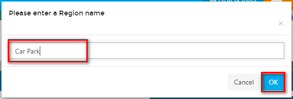

Now you can set the _Areas_ within the _Region_. First ensure you have selected the _Region_ that you are setting an _Area_ for, then click on the + icon.

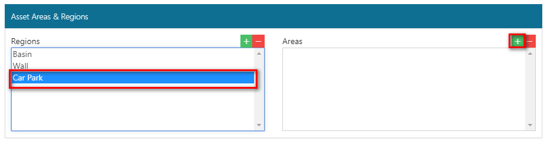

Give the _Area_ a name and click OK.

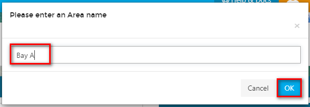

You can add as many _Areas_ to a _Region_ as you wish.

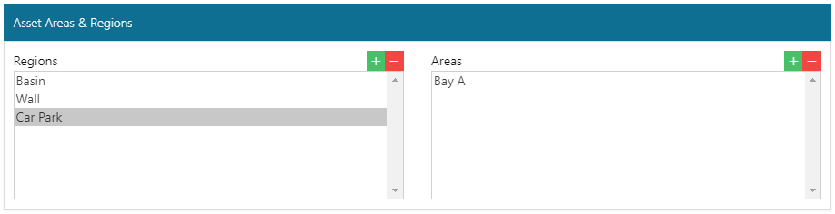

The new _Region_ will show in the blue tiles on the Occupancy, Asset Tiles, Asset Tools and Mapping screens and any _Areas_ will show in the drop down options.

?&gt; NB: You may need to sign out and back into Harbour Assist for the new Region/Area to show.

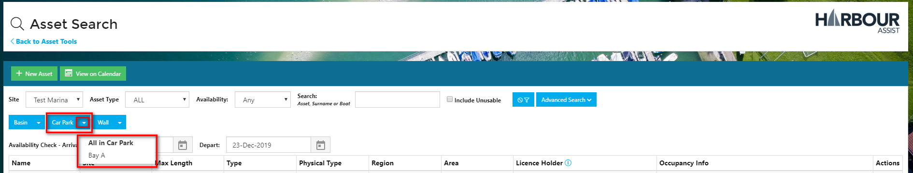

## Creating a New Asset \#\#

Once your Asset Types, Areas and Regions are set up you can create a new Asset.

From the _Home_ page, select _Asset Tools_.

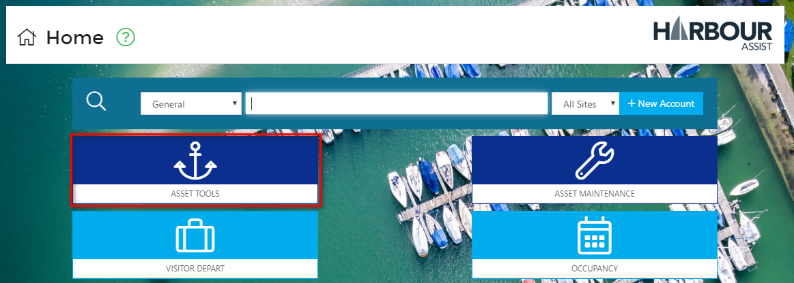

Then click on _Asset List_.

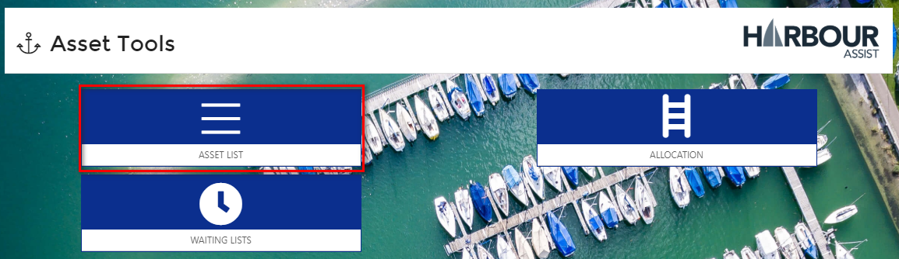

Click on _New Asset_.

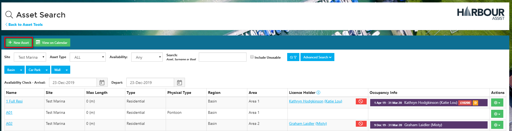

Give the Asset a name and complete the rest of the screen by using the drop down options. When you have finished click on _Save_.

?&gt; NB: Inspection Regime is not a mandatory field and only needs to be populated if you want to carry out routine inspections on the asset.

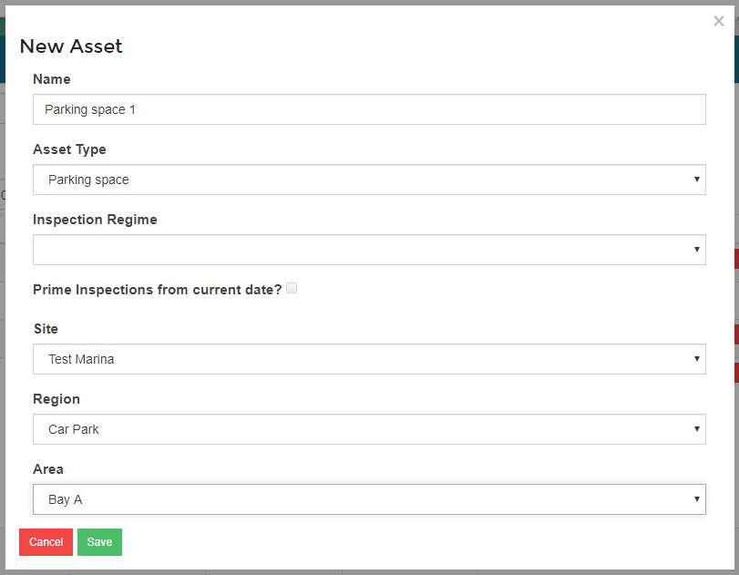

In the _Asset Details_ screen you can add more detailed information, such as maximum sizes and any notes.

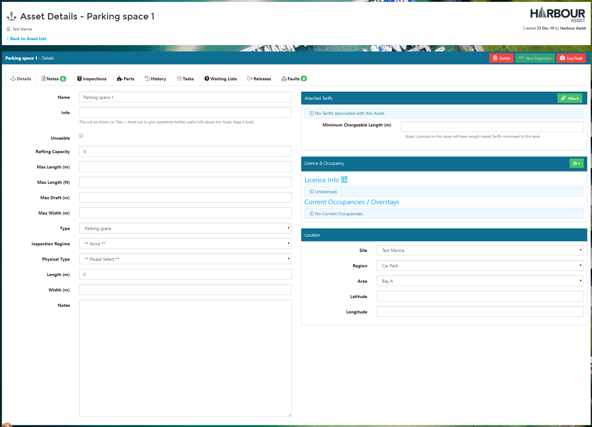

Your new Asset will now be visible in the Occupancy, Asset Tiles and Asset Tools screens.

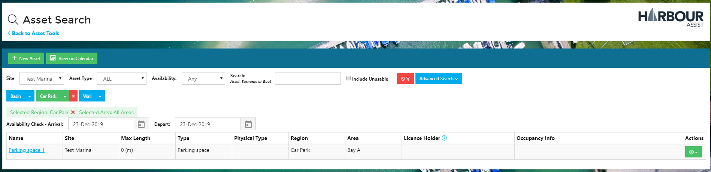

