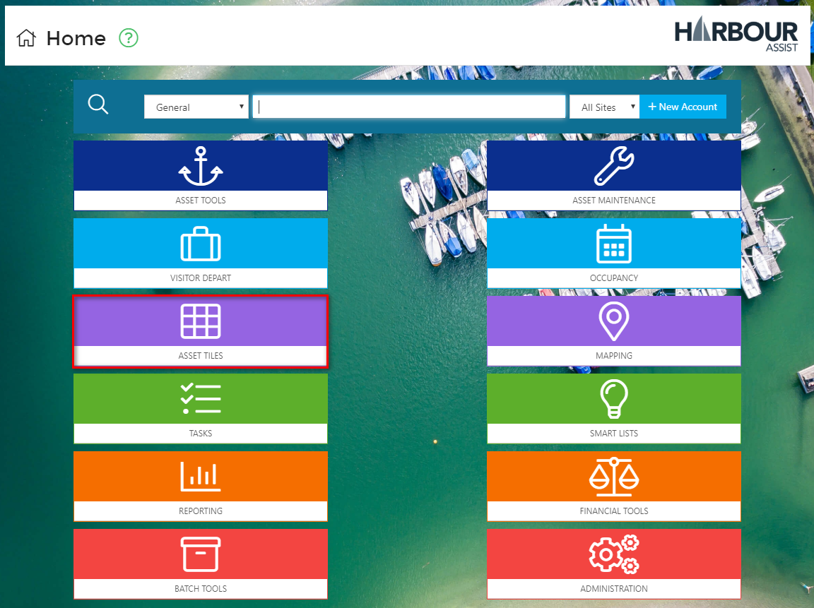
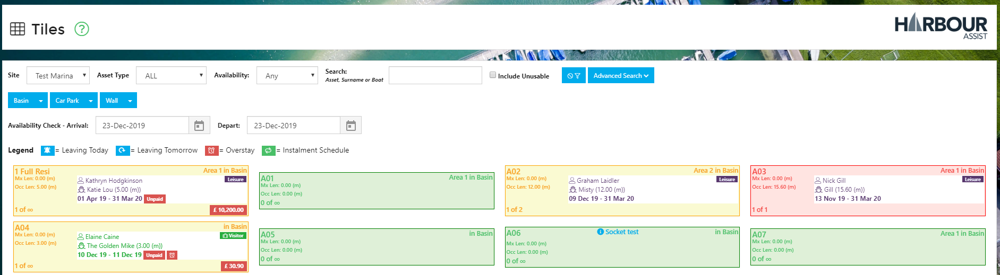
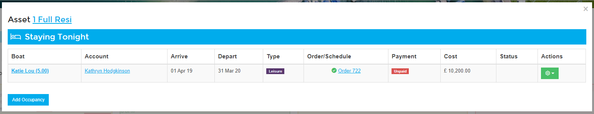
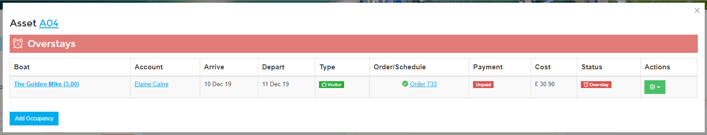

# Asset Tiles \#

The _Asset Tile_ view is a snapshot view of the current days occupancy.

From the _Home_ page, select _Asset Tiles_.

You can filter the tiles shown by using the blue buttons & options at the top of the screen.

The _Asset Tiles_ will appear in Red, Yellow or Green, this is controlled by the rafting capacity that has been set on the Asset. If no rafting capacity has been set the asset will never appear in Red.

* Red - the asset is occupied and has reached its capacity,
* Yellow - the asset is occupied but has not reached its capacity,
* Green - the asset is empty.

They _Asset Tiles_ will also show information about who is currently on that Asset, when they are due to depart and if any money is owed.

By clicking on a tile shown in red or yellow you will be shown all the information relating the the occupancy or occupancies on that asset.

* Boats leaving today and boats staying tonight, 
* Arrival and departure dates of the occupancy, 
* Whether an order has been raised against the occupancy,
* The payment status of the order,
* The cost of the order.

By clicking on the Boat or Account you can go directly to the Boat Details or Account Details page for this Account.

