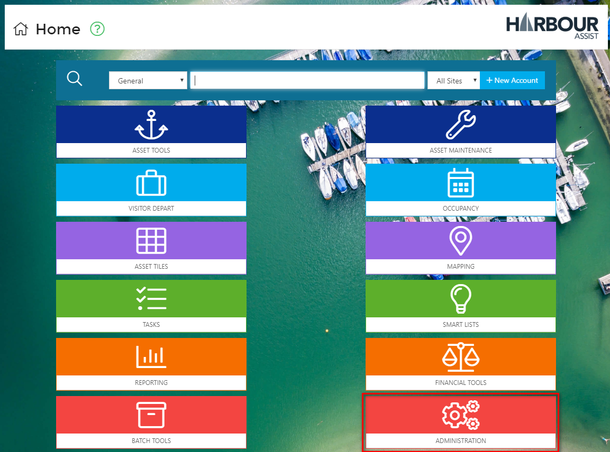
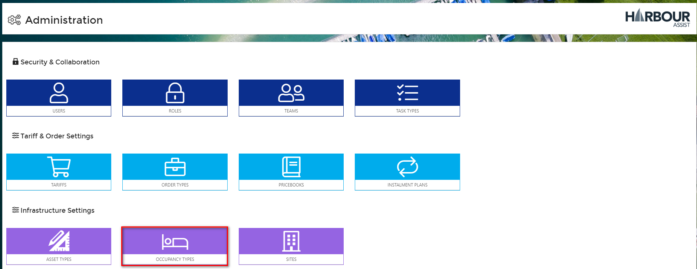
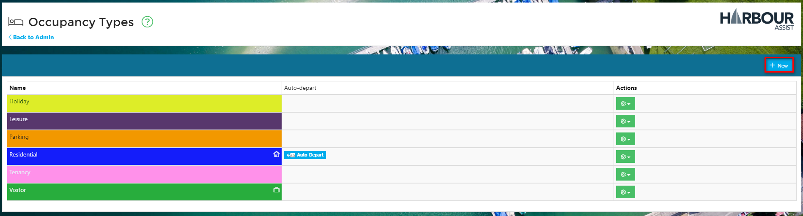
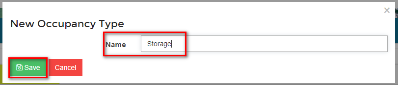
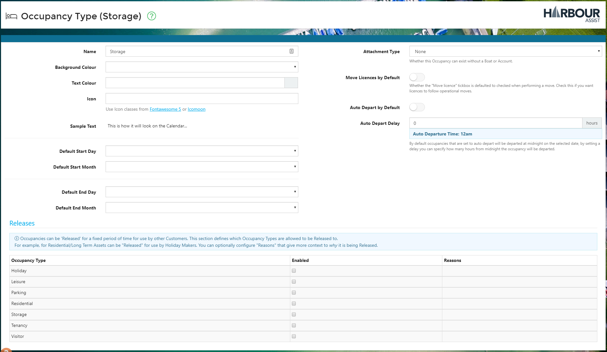

# Occupancies \#

## What is an Occupancy? \#\#

An Occupancy is simply a record that represents an Account or a Boat occupying an Asset for a duration of time. Each Occupancy record can be linked to each of the following:

* Account \(mandatory\)
* Boat \(optional\)
* Asset \(optional, but usually completed\)
* Order \(optional\)

The idea behind Occupancy records is to allow you to know who is where in your Marina/Harbour now and at any time in the past, report on capacity, keep track of how your assets are being used and provide accountability.

## Fields associated with an Occupancy \#\#

In addition to the above, we store the following information for each Occupancy:

* _Start Date:_ When the Occupancy started - for Visitors this would be their Arrival Date, for Annual Customers it would be the start of their contract.
* _Depart Date:_ When they left/end date of their contract.
* _Occupancy Type:_ What is the type of Occupancy? This will define which Assets they are allowed to be placed on.
* _Departed?:_ Whether the Occupancy has actually left. This is primarily used for Visitors.

  ?&gt; More documentation [here](https://github.com/glaidler/docs-1/tree/a9b2fde53025657e319d99966ea9a02a32cbd61d/AssetsOccupancy/visitors/VisitorDepart/README.md).

## Occupancy Types \#\#

Each Occupancy has an _Occupancy Type_, which, above providing reportability on usage, also controls:

* The default Start & End Date.
* Which assets the occupancy can be placed on.
* Visual information for the calendar such as icon and colour.

To create a new _Occupancy Type_ or amend an existing one, from the Home page select _Administration_.

Then select _Occupancy Types_.

Select _New_ to create a new Occupancy Type.

Give the _Occupancy Type_ a name and click _Save_.

Now you can complete the set up of the _Occupancy Type_ by adding all the configuration:-

