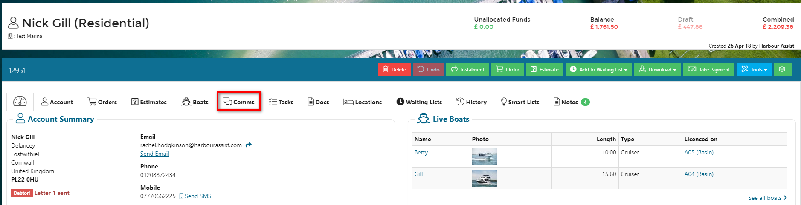
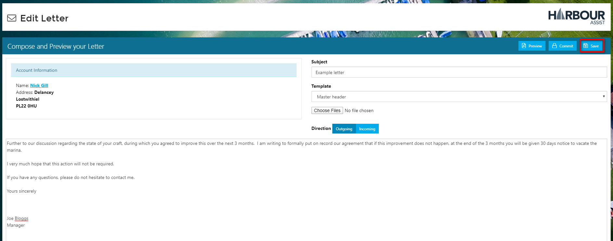
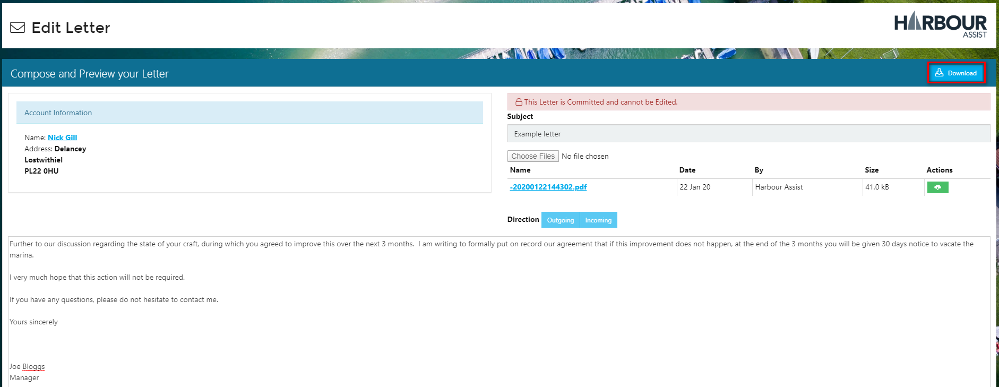
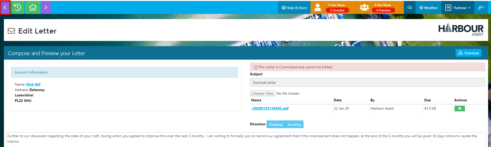
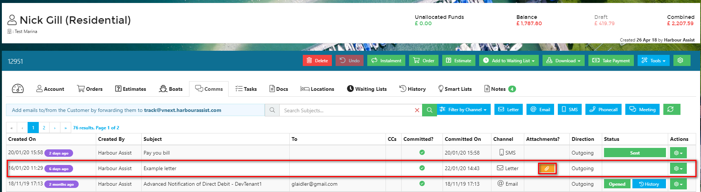

Creating a Letter
===

To create a one-off letter to an individual customer directly from Harbour Assist - from the customer account select the *Comms* tab.

Select *Letter*.

You can now select the template that you wish to use from the drop down list of templates - this could be a 'Master Header' template if you are sending a bespoke letter, or an already created template such as for debt chasing which would produce a standard letter.

?> More documentation [here](communications/LetterTemplates.md).

Give your letter a *subject* title - this title will appear in the *Comms* summary so be as clear as possible so that other colleagues looking at the communications have a good idea what the letter was about without having to open it.

Depending on which template you use, some details may be populated automatically for you - you can review your letter at any time by clicking on the Preview button which will show you your letter, the layout and any pre-populated information.

In this example you can see the name, address, date and greeting have all bee populated automatically for me.  

?> Your Preview letter will show with the Preview watermark until you Commit it.

The Preview letter will open in a new tab on your device.  To go back to the letter you are creating just click back onto your Harbour Assist tab.

You now need to add your text to the letter - this is done in exactly the same way as when you are typing a letter in Word.

At any point during the letter writing process you can save your letter (it is advised to do so every few minutes) - this will save it as a draft which is still fully editable.

When you have finished your text you can *Preview* the letter again to see what the final version looks like.

Make any necessary amendments and then once you are happy with you letter, its appearance and content select *Commit*.  Once you have done this the letter is *locked* and no further changes can be made - so make sure you are happy before committing the letter.

You can now Download the letter and print.

As the letter is no longer a draft, the preview watermark has been removed.

When you have printed the letter, close the download - this will take you back to the letter screen.

To exit this screen, click on the *back* arrow and you will taken back to the *Comms* tab.

Going back to the *Comms* tab, you will see the letter is now shown in the list of communications for that account.  

In future if you want to view or reprint the letter, you can click on the attachment icon and this will open up the committed letter.

