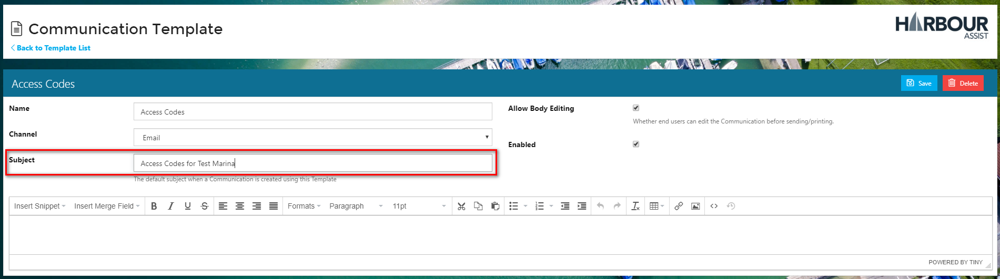
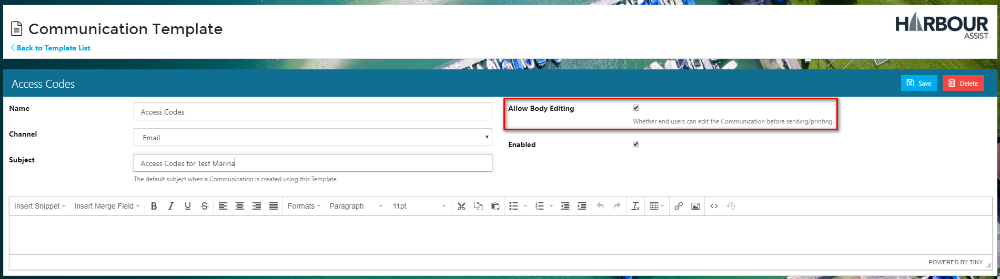
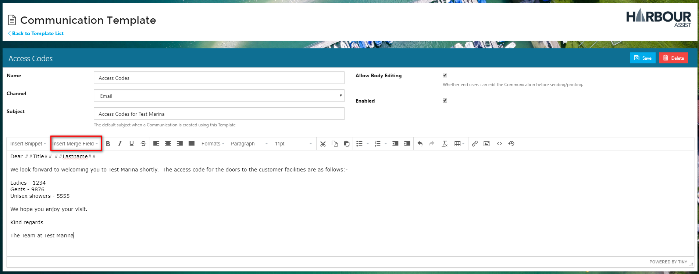
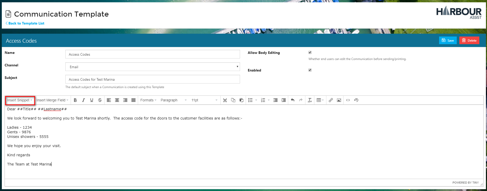
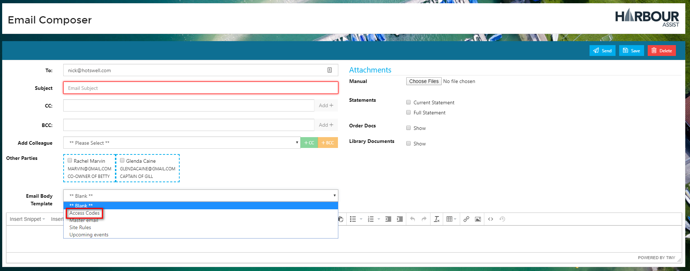

# Creating Email Templates #

In many instances communications with Account holders are repetitive - for instance, the sending out of a standard form which requires a covering email.  In cases like this it is beneficial to have a template email which can just be selected and then edited if necessary to suit each individual communication.  This also ensures a consistent standard of communication to Account holders.

To create an Email template, first select the *Administration* tile on the *Home* page.

Now select *Email/SMS/Letter Templates* which is found in *Communication & Document Tools*.

Select *New Template*.

Give your template a name - this should be as descriptive as possible so that it is easy for all members of staff to select the correct template - then select the *Channel* of Email.

Now put a title in the subject box - this is the default subject that the Account holders will see when the email is sent.

If you want the end user to be able to edit the email tick the *Allow Body Editing* box - however, if you do not want the template to be able to be edited in any way, ensure this box is unchecked.

You can now write the body of your email, inserting the merge fields by using the *Insert Merge Field* dropdown where you want information to populate the email automatically.  

When you have finished, click *Save*.

As well as standard merge fields for insertion, we also offer *Snippets* - these are selection of information or links that can be automatically populated into an email template.  Take a look to see what's on offer.

When you have finished, click *Save*.  

Your Template will not appear in the drop down list of email templates until you check the *Enabled* box.  This function enables you to work on a template over a period of time without it being available for use, or you could prepare templates in advance and then enable them at the appropriate time. 

If you want to your template to be available for use straight away make sure it is *Enabled* -  and then select *Back to Templates List*.

Once your template is enabled it will appear in the drop down list of email templates and when used the merge fields will be populated for the individual customer.

To send a **Bulk Email Communication** please see the instructions in the Smart Lists section. 

?> More documentation [here](smartlists/bulkemail.md).

