# Creating Letter Templates #

Most businesses have a set of standard letters that are used for communicating with Account holders - whether it be chasing for debt, or inviting them to renew their mooring contract. 

These templates can be held in Harbour Assist for all users to access and use.

The first stage of creating a letter template is to create a 'Letterhead' Word document.  This template can then be used as a basis for most other templates.

## Creating a Word Template ##

Using Headers and Footers in Word create a document that fits with your company brand.  

Insert a table into the Header and within the table add the merge fields so that your relevant site information is merged into the Header and in the position that fits with your brand.

?> NB: When inserting merge fields you are best to display them in their 'raw' format - to see this when creating your template in Word press Alt + F9.

Ensure when adding the company Logo that you place this within a text box in the table - this will mean you can control the size that your logo appears on the template

Outside of the table (but within the header) insert the merge fields of TableStart:Accounts and TableEnd:Accounts.

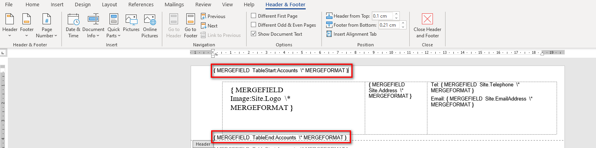

Design the Footer (if required) in the same way, ensuring that if your are inserting any merge fields, rather than just text, you use the TableStart:Accounts and TableEnd:Accounts to 'surround' them.

Now you can insert the merge fields in the body of the template so that the standard information required for every letter to a customer is automatically populated in the letter.

Again you need to use the TableStart:Accounts merge field at the beginning and TableEnd:Accounts at the end for detail such as *Name, Address, Account Number and Date* to be shown in the template.

 

This is how the above template will ultimately look when created in Harbour Assist.

 

Now you can save your template in Harbour Assist.

From the *Home* page select *Administration*.  

Now select *Document Library* which is found in *Communication & Document Tools*.

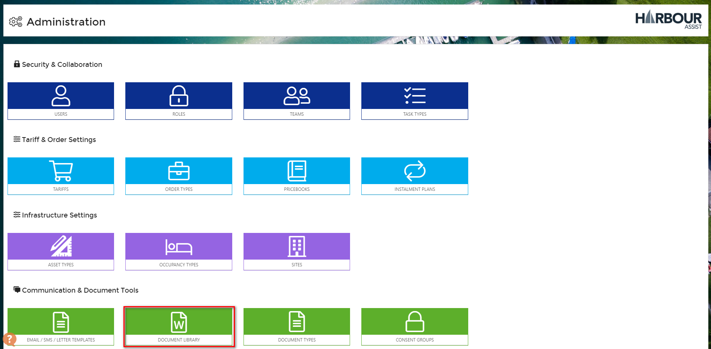

Click on *New Word Template*

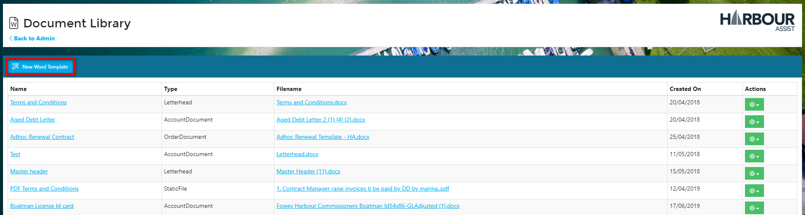

Complete the information required on the lift hand side of the screen, giving your template a name, setting the Template Type (please see explanations under each type) and selecting what data to include.  

For a standard Letterhead Template you would select the Template Type of Letterhead.

The data to include for a standard letter would be *AccountWithBoats*, for more complex templates you would use other data, ie. for a Statement or Debt Letter you would use *OutstandingConfirmedOrders*.

Then click *Save*.

You can now upload your word template by clicking on *Choose Files*.

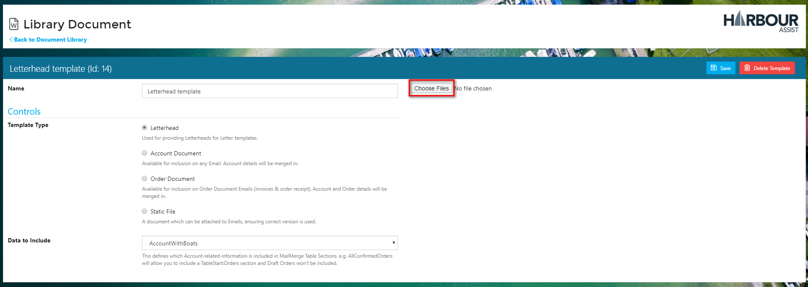

Select the file that you created in Word and click *Open*.

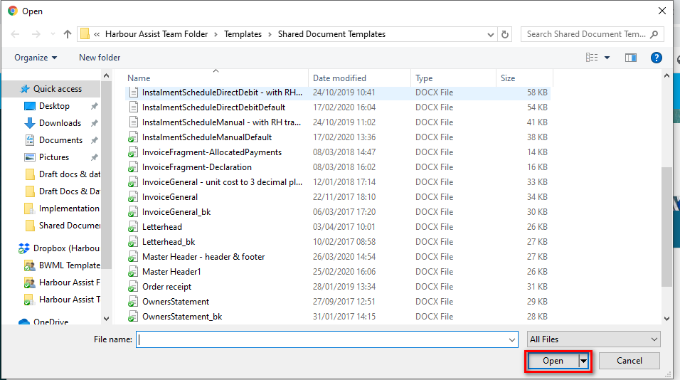

Your file has now been uploaded as a Template.

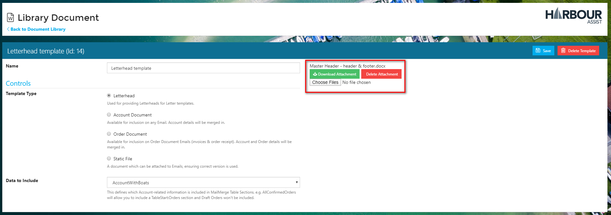

## Creating a Template ##

From the *Home* page select *Administration*.  

Now select *Email/SMS/Letter Templates* which is found in *Communication & Document Tools*.

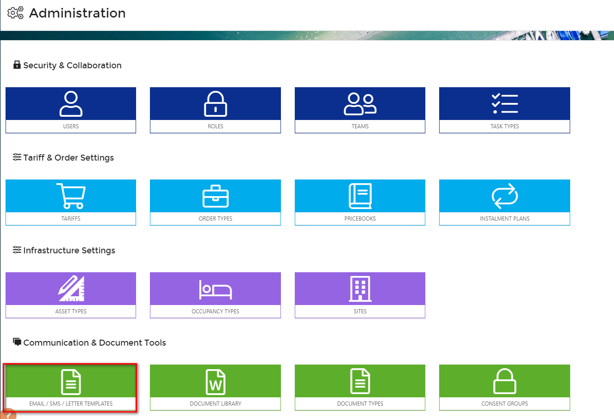

Click on *New Template*.

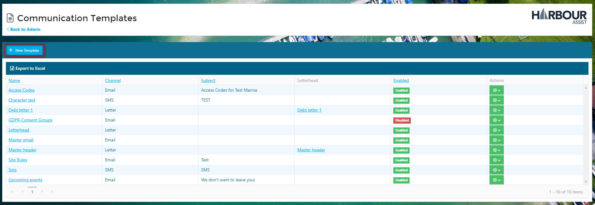

Give your template a name and select *Letter* in the Channel drop down box.  

Give your template a Subject name - this will appear in the Account Comms tab, so it needs to be something that will help users identify what the letter was about without having to open the letter to see.

Then select which Word Template you want to use.

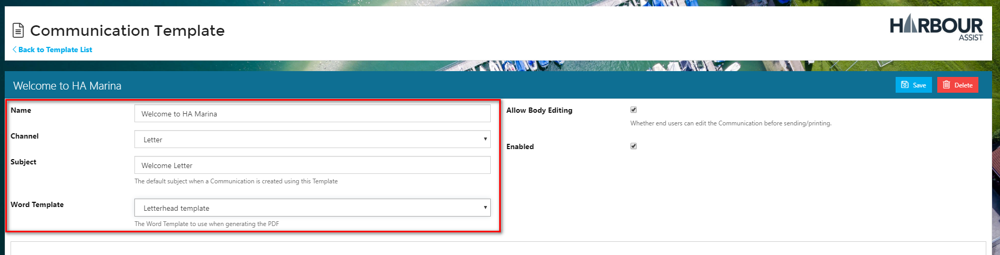

If you do not want your Template to be available for use straight away, remember to uncheck the *Enabled* box.  For templates that you do not want other users to be able to edit you can also uncheck the Allow Body Editing box, however this should only be done if you are certain end users will not need to edit the letter in any way.

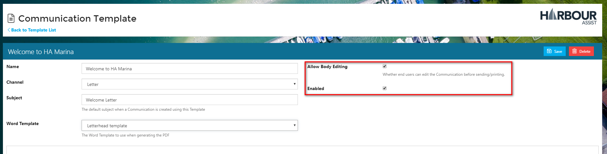

You can now add any standard text that you wish to appear in the letter - for a Standard Letter Template this will normally be instruction to add text, however for other templates you can write the full body of the letter.

When you have done this, click *Save*.

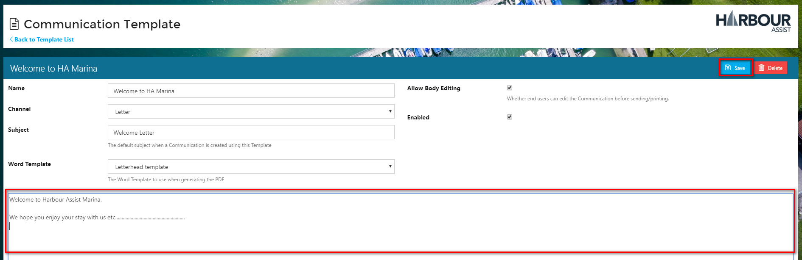

The template is now ready for use through the Comms tab on the Account page.

You will note that you do not see the Word template in this screen, just the detail you added to the Communication template.  When you have added your text (if it is a blank template) or made any edits to the template wording you can preview the letter.

Now you can see what the letter will look like when you print it.

## Templates Suitable for Mail Merge ##

If you are planning on using a Template for a mail merge you will want a signature to automatically appear on the letter - the last thing you want to be doing is manually signing a large amount of letters!

Signatures need to be added to the Word Template as you are not able to add them to a Communication Template.

Create a Word Template by following the instructions in *Creating a Word Template*, ensuring you add a signature at the bottom of the template.

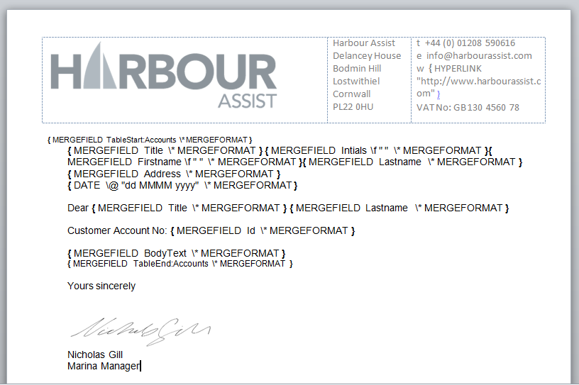

Now use this Template to create a Communication Template by following the instructions in *Creating a Template*.  Ensure you give the template a name that indicates it contains a particular persons signature ie. *Letter template with NG signature*.

