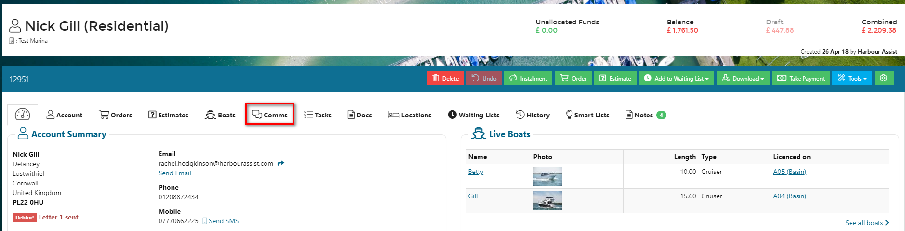
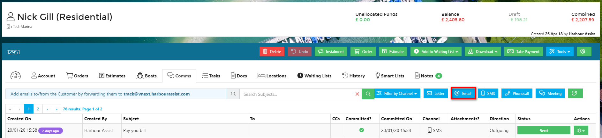
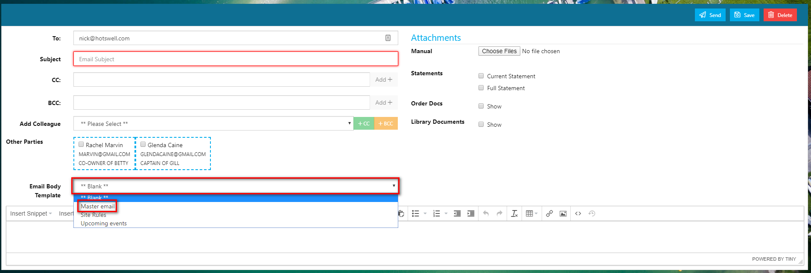
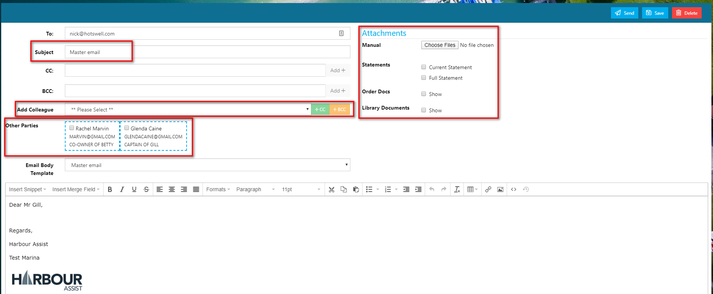
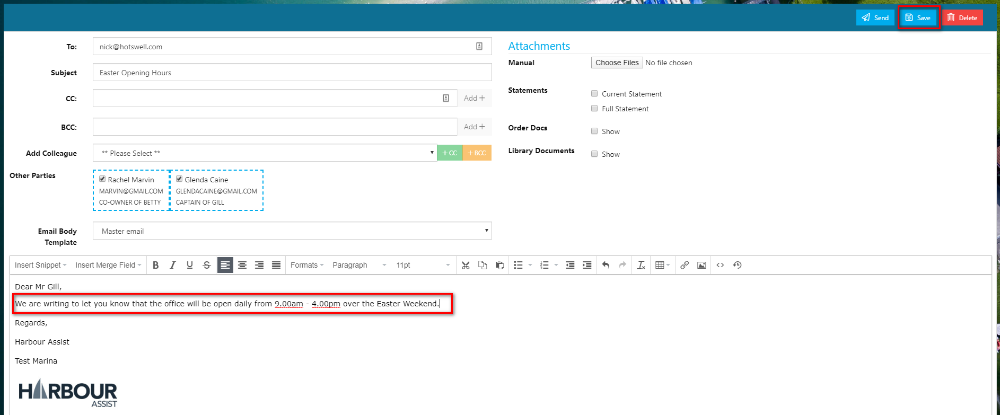
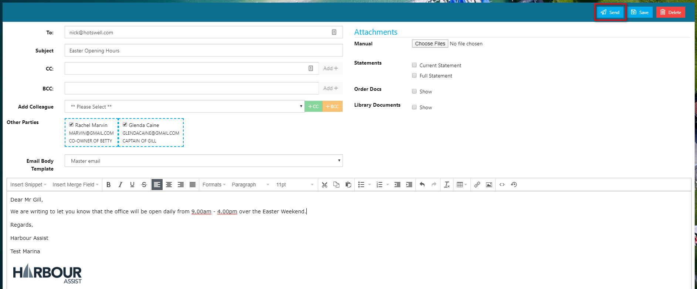
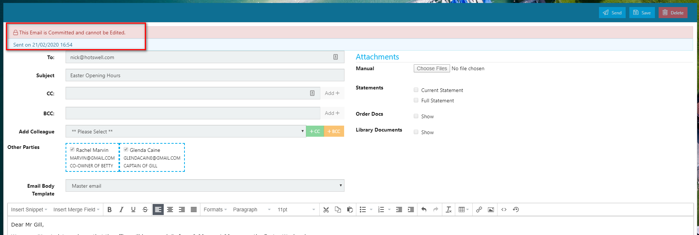
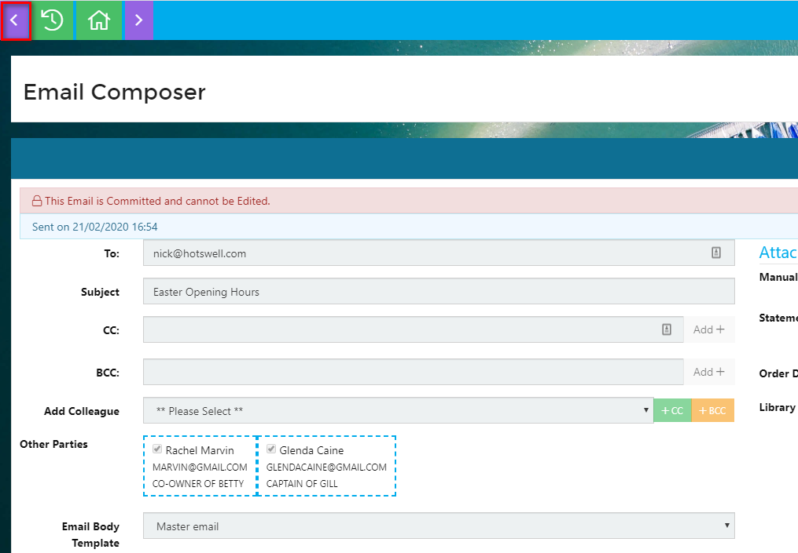
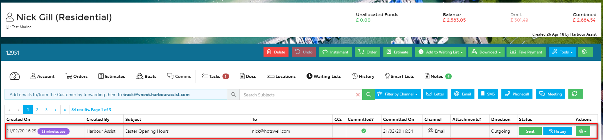
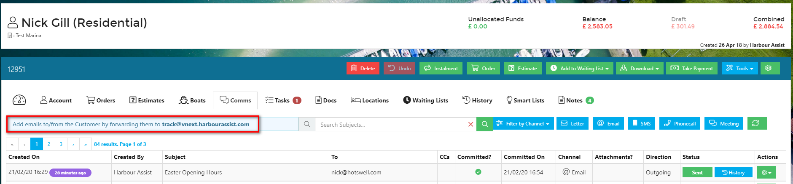

# Email Communications

Individual email communications with customers can be done either directly through Harbour Assist or via your normal email system such as Outlook or Gmail and _'Tracked'_ to Harbour Assist.

## Sending an Email from Harbour Assist \#\#

From the customer Account select the _Comms_ tab.

Select Email.

You can now select the template that you wish to use from the drop down list of templates.

?&gt; More documentation [here](https://github.com/glaidler/docs-1/tree/a9b2fde53025657e319d99966ea9a02a32cbd61d/communications/communications/EmailTemplates.md).

Give your email a _subject_ - this will default to the template name, so be sure to change this so that it makes sense to the recipient. This subject also appears in the _Communications_ summary so be as clear as possible so that other colleagues looking at the communications have a good idea what the email was about without having to view it.

You will see that the email has been automatically populated with the account holders email address.

Now you can add any other recipients -

* You can manually enter email addresses to receive a CC or BCC
* Add a Colleague ie. another user of Harbour Assist - choose their name from the drop down list and then click on CC or BCC \(the green and yellow buttons\) to add them.
* Other parties - if the account has a boat that has a relationship with another account ie. there is a co-owner, these will show as Other Parties - just check any that require a CC of the email.

You can also add any attachment to the email -

* Manual - to upload a saved files
* Statements - check the box if you want to send the customer a statement of their account
* Order Docs - send the customer a copy of an order\(s\) by selecting from the list
* Library Documents - add any files that have been uploaded to Harbour Assist - your Terms & Conditions for example.

?&gt; For more information about Library Documents click [here](https://github.com/glaidler/docs-1/tree/a9b2fde53025657e319d99966ea9a02a32cbd61d/communications/communications/StaticFiles.md).

You now need to add your text to the email.

At any point during the email writing process you can save your email - this will save it as a draft which is still fully editable.

Once you are happy with you email, its appearance and content select _Send_.

This will send the email to the recipient\(s\) and it can no longer be edited.

To exit this screen, click on the _back_ arrow.

Going back to the _Comms_ tab, you will see the email is now shown in the list of communications for that account.

## Track Mailbox \#\#

To help you include important emails in an Account's Communication history, Harbour Assist provides a _Track_ mailbox that allows you to forward emails from anywhere.

This _Track_ address will show at the top of any Comms page.

**As long as the email address stored in Harbour Assist is somewhere in the message, the email will be picked up and attached as a Communication against the Account.**

This can be used when:

* You have received an email from a Customer directly into your inbox and you think it's worthwhile appearing Account's Communication history.  For example if they have made a complaint.
* Emails you send from Outlook that you want to appear in Harbour Assist.

### Sending from your Email Account \#\#\#

If sending the email from your company email system \(e.g. Outlook\), the _Track_ address should be entered in the Bcc address field of the email.

By doing this, the email will automatically be attached to the account as long as the email address on the account matches the email address you are using to send the email.

As described above, replies received from account holders can be logged on their Harbour Assist account by forwarding the response to the _Track_ email address. Again the email address in the Account needs to match the one contained in the email.

