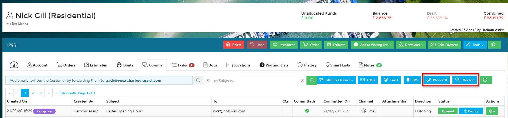
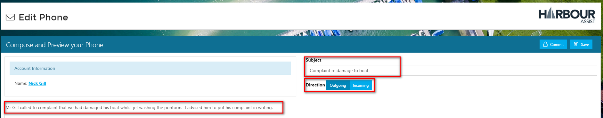
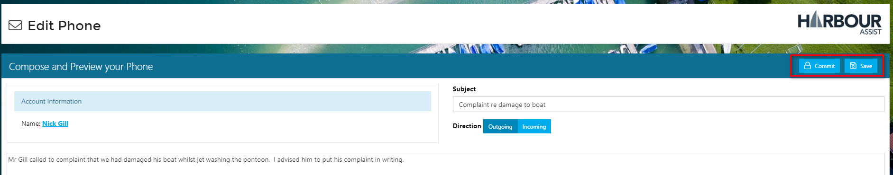
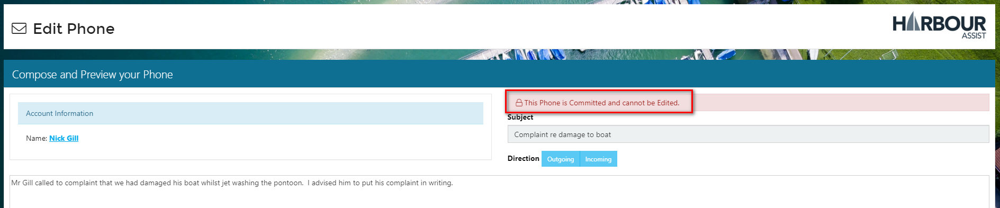
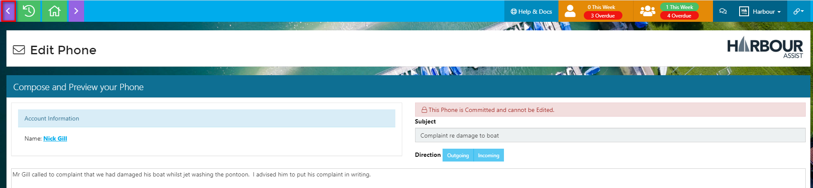
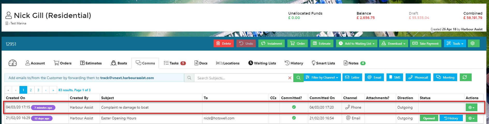

# Logging Phone Calls & Meetings

The logging of a phone call or a meeting both work in exactly the same way, so in this example we will just cover a phone call.

From the _Account_ screen select the _Comms_ tab.

Select _Phone Call_ \(or _Meeting_\).

Give your phone call a _subject_ title - this title will appear in the _Comms_ summary so be as clear as possible so that other colleagues looking at the communications have a good idea what the call was about without having to view it.

Select _Outgoing or Incoming_ - again this will be logged in the _Comms_ summary - and then give the pertinent details of the call.

At any point during the logging of a phone call process you can save your note - this will save it as a draft which is still fully editable.

Once you have finished making the notes, select _Commit_

This will log the phone call and it can no longer be edited.

To exit this screen, click on the _back_ arrow.

Going back to the _Comms_ tab, you will see the phone call is now shown in the list of communications for that account.

