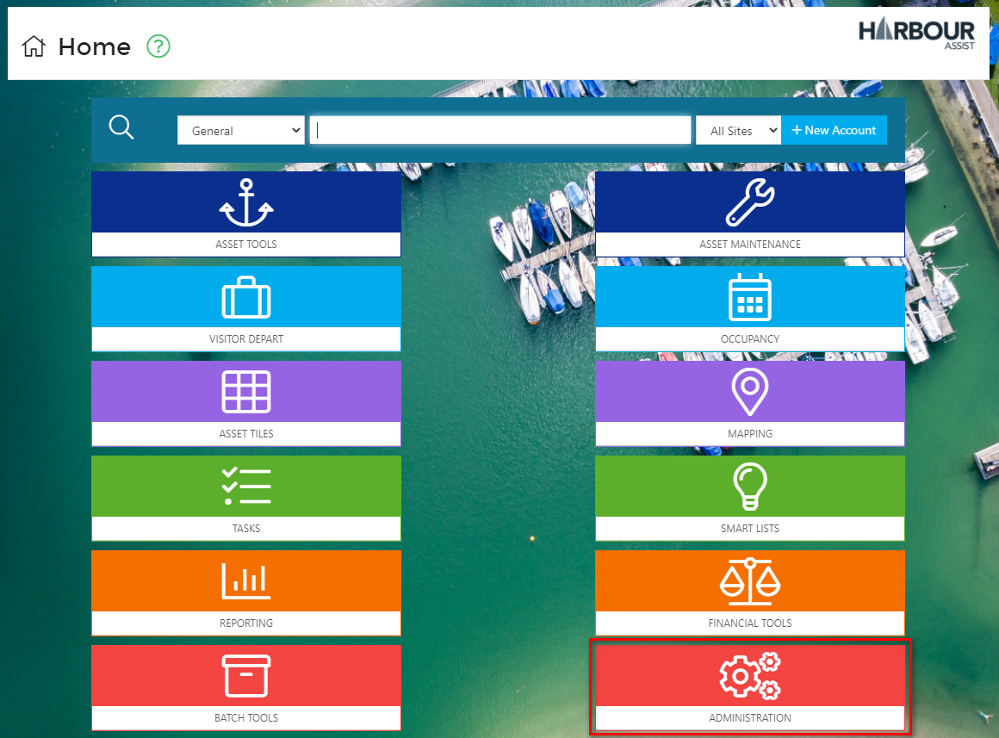
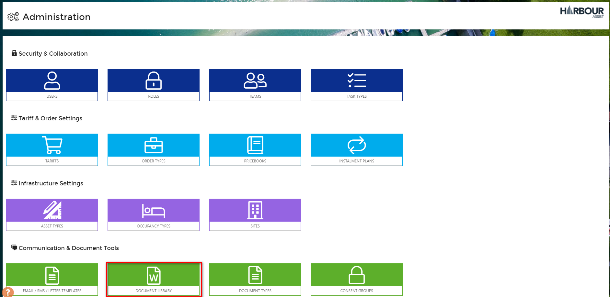
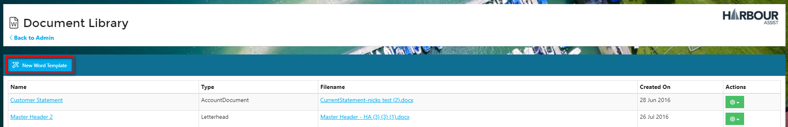
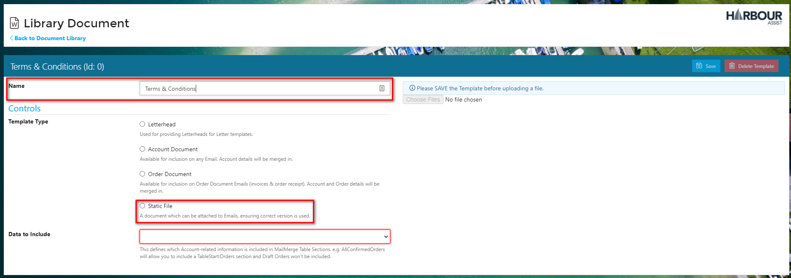
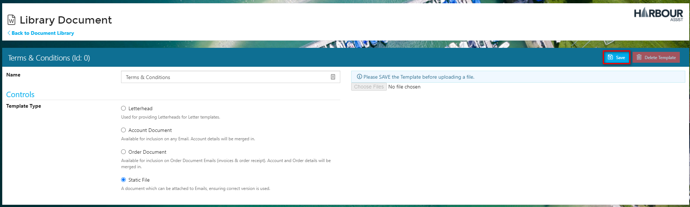
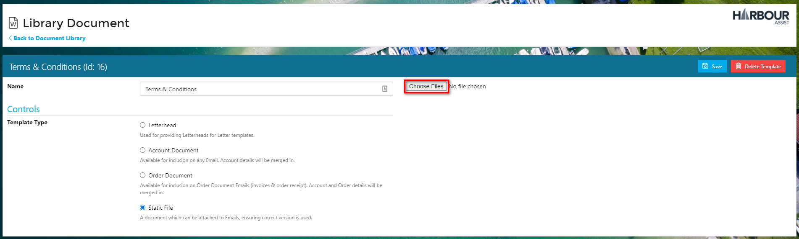
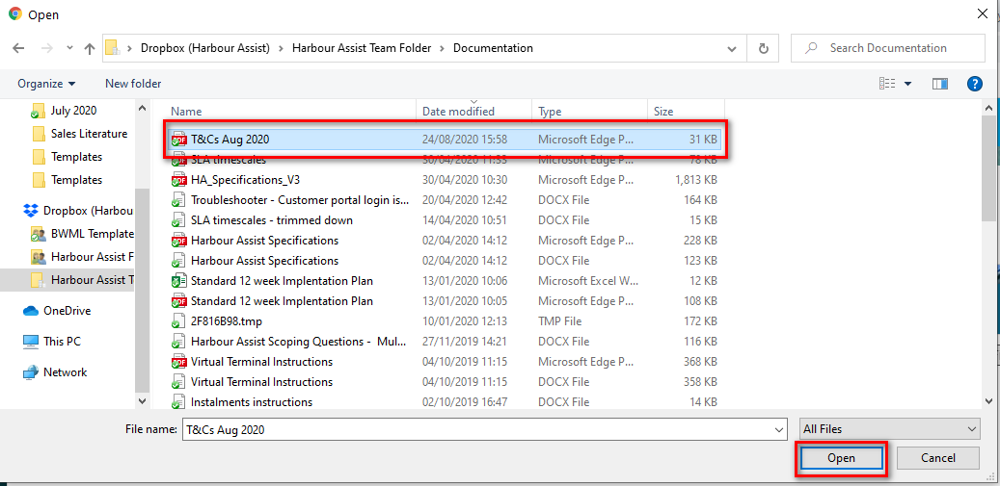
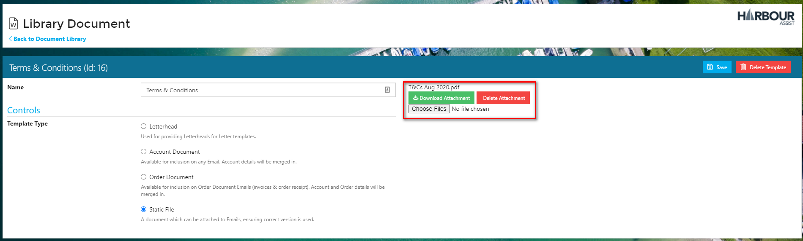
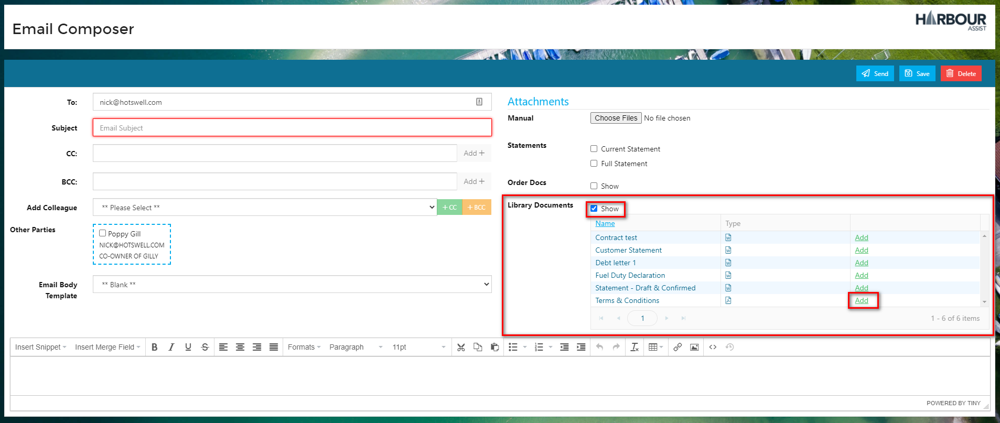

# Adding a Static File

Sometimes it's useful to attach a document like a marina/harbour map, blank form, your Terms & Conditions to an email - these are known as static files.

A static file is a document that doesn't change, so has no customer or boat information merged into it ie. the content is Static rather than Dynamic.

Static files can be uploaded into Harbour Assist so that they can easily be attached to an email to a customer. The benefit of uploading static files into Harbour Assist is that they can be easily maintained and updated in one place, rather than multiple users having the same document saved on their desktop or in files etc where there is a risk that old versions may be attached to emails.

?&gt; NB: The uploading of Static Files is permission based; the Permission required is **AdministrationTemplates**.

To upload a Static File; from the _Home_ page select _Administration_.

Then select _Document Library_.

Click on _New Word Template_.

Give the Template a name and then click on the Template Type of _Static File_.

?&gt; NB: As this is a _Static File_ no data will be merged into it, so you will note once you select _Static File_ the _Data to Include_ cell disappears.

Click on _Save_.

Now you can upload the file - click on _Choose File_.

Select your file and then click on _Open_ to upload it.

You will see the file uploaded against the Template.

The Template will appear for selection when creating an ad hoc or bulk email under _Library Documents_.

