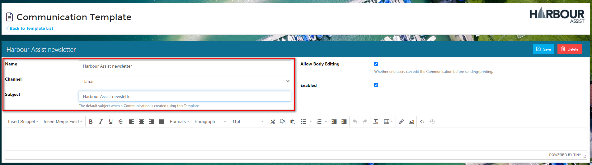

# Uploading a HTML Document to Harbour Assist

If you wish to send a highly formatted email to customers \(a newsletter for example that contains lots of pictures\), this can be designed outside of Harbour Assist in a another programme \(such as Mailchimp\) and then uploaded into Harbour Assist for sending.

In order to upload the document to Harbour Assist the HTML needs to be in its raw format.

Most programmes have instructions on how to do this - just Google _Export HTML Template from xxxxx \(insert programme name\)_.

Once you have the document in its raw format it can be copied and pasted into a new email template by using the Source Code function.

From the _Home_ page select _Administration_.

Now select _Email/SMS/Letter Templates_ which is found in _Communication & Document Tools_.

Select _New Template_.

Give your template a name - this should be as descriptive as possible so that it is easy for all members of staff to select the correct template - then select the _Channel_ of Email.

Now put a title in the subject box - this is the default subject that the Account holders will see when the email is sent.

Click on the _Source Code_ button \(&lt; &gt;\).

Paste your raw code into the Source Code pop-up and click _Ok_.

Your template will display in its formatted state, so you can review and make any necessary changes.

Once you are happy, click _Save_.

To send a **Bulk Email Communication** please see the instructions in the Smart Lists section.

?&gt; More documentation [here](https://github.com/glaidler/docs-1/tree/a9b2fde53025657e319d99966ea9a02a32cbd61d/communications/smartlists/bulkemail.md).

