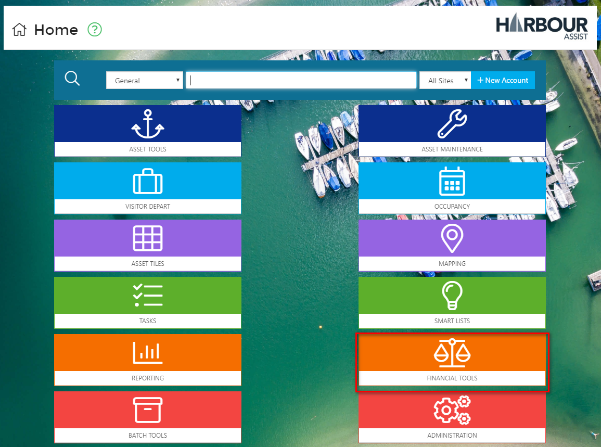
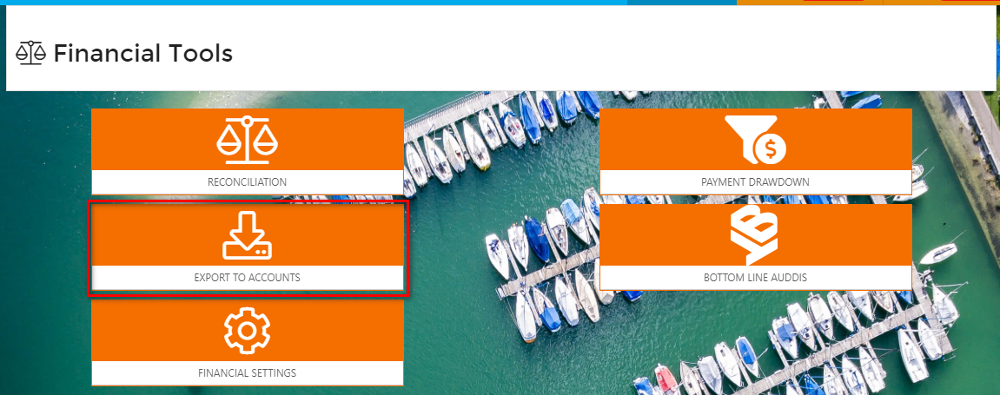
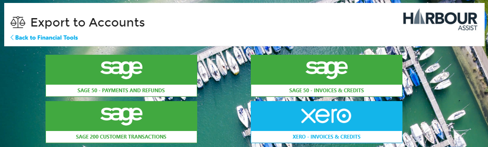
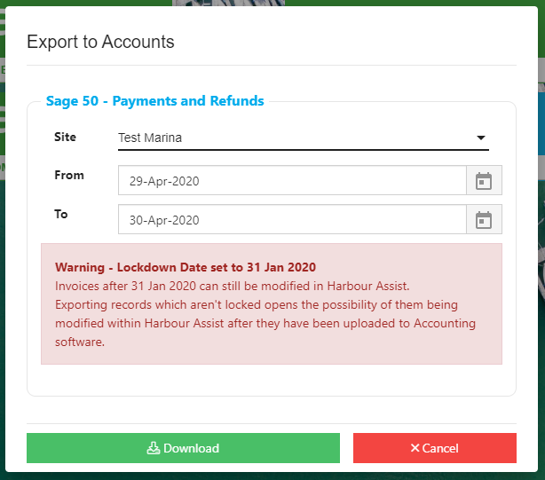

# Exporting Data to Accounts systems

Whilst we don't \(yet\) support direct integration with Accounts software, you can export records in file formats compatible with popular Accounting packages.

Currently supported:-

**Sage 50** - Invoices and Credit notes. Payments and Refunds.

**Sage 200** - Customer Transactions

**Xero** - Invoices and Credit notes.

To export data, from the _Home_ screen select _Financial Tools_.

Then select _Export to Accounts_.

Now select the appropriate account package.

Select the Site and From/To dates.

A warning will show if you are selecting dates after the last Lockdown Date or if a Lockdown Date hasn't been set.

?&gt; More documentation on Lockdown Dates can be found [here](https://github.com/glaidler/docs-1/tree/a9b2fde53025657e319d99966ea9a02a32cbd61d/Financial/AccountsOrdersPayments/AccountingExports/LockdownDate/README.md)

Click _Download_

This will create and download an Excel document that you can open at the bottom of your screen.

