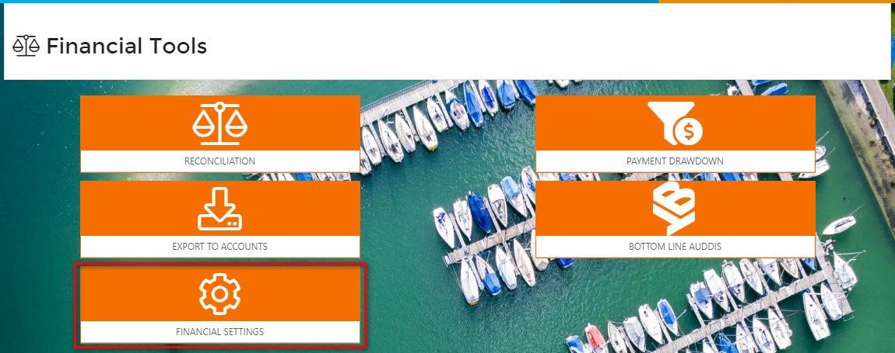
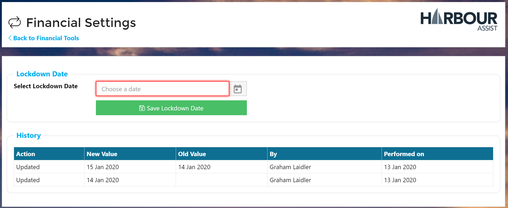

# Accounting Lockdown Date

As our accounting exports are based on a date range, we have introduced the ability to set a Lockdown Date, which effectively blocks all financial modifications \(for all Users irrespective of Permissions\) before the set date. This includes blocking:

* Back-dating a Tax Point date for an Order to prior.
* Any editing of Tax Point dates prior
* Any editing of Payments prior.
* Reverting an Order to Draft if it has a Tax point date prior.

## Modifying the Lockdown Date

From the _Home_ page select _Financial Tools_.

The select _Financial Settings_.

Here you can use the date picker to set a new Lockdown Date. A history of previous values \(and who modified them\) can be seen underneath.

?&gt; You will need to have the **LockdownDateAdministation** Permission to modify this.

