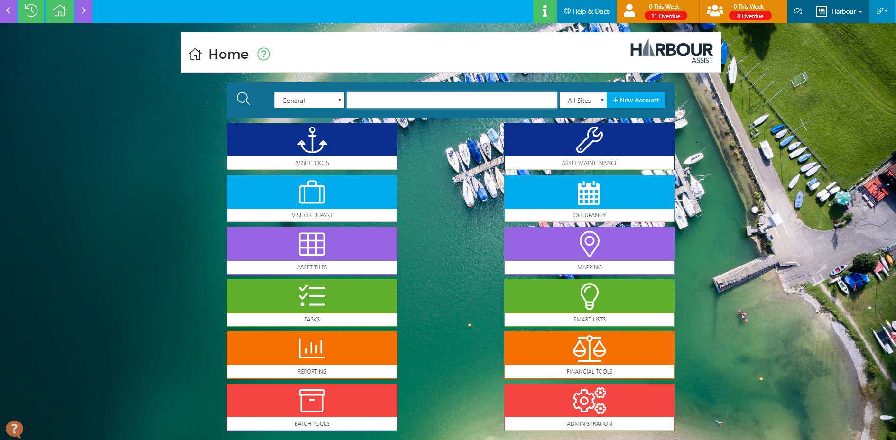

# Home Page Layout \#

The _Home_ Page is the main navigation tool for the whole system - this is the place to find and add customers, view and amend assets, view occupancy, find reports etc.

## Finding a Customer \#\#

To find an existing customer or to check if someone already has an account \(live or archived\) - from the _Home_ page, enter a significant word in the _Enter search term_ box - this would normally be a surname, but could also be a first name, boat name, email address or postcode. You can also search by Account ID or Order ID.

All the customers that match your search will be shown, giving details of their name, boat, account number, address - this will enable you to confidently select the correct customer. Archived accounts will show in RED and archived boats that are on live accounts will show the boat name in RED.

Move your cursor to the customer you wish to select - it will highlight the customer in blue - and click. This will take you to the customer dashboard.

?&gt; NB: The search is set to default to a General search, but to narrow the results you can use the drop down key to change this to a more specific search. Different search types will show different details in the results - for instance the search type of Boat will show the boat dimensions and a picture of the boat \(if one has been uploaded\) in the results.

## Setting your Default Search \#\#

If you wish to customise your default search this can be done by going to Your Profile.

Set the default search using the drop down options and then click Save.

Once this is set, the Home page will always default to this search type, however you can still change this by selecting the search type from the drop down list.

## Account Tracker \#\#

We track the last 20 Accounts you have viewed so you can go back to an account quickly without re-searching. Just click on the Account Tracker button and select the correct Account.

