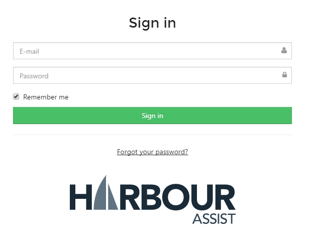
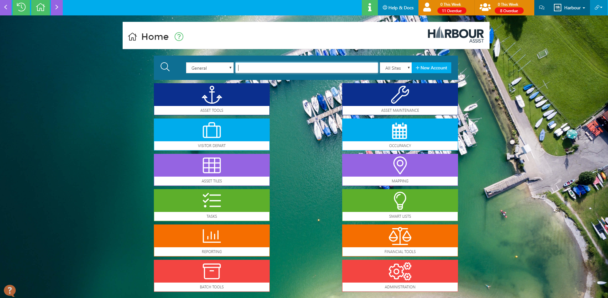

# Logging In \#

To log into Harbour Assist from a laptop, desktop or Android device the web browser Chrome should be used.

From an iPad the web browser Safari should be used.

Enter your site url address \(xxxx.harbourassist.com\) into the browser - this will take you to the sign in screen.

Enter your company email address and password issued to you, then click on the _Sign in_ icon.

This will take you to the _Home_ screen.

?&gt; NB: 6 consecutive failed log in attempts will result in your account being locked. Please use the _Forgot your Password_ on the Sign In screen to get an email to reset/unlock you account.

?&gt; For more information about resetting your account click [here](https://github.com/glaidler/docs-1/tree/a9b2fde53025657e319d99966ea9a02a32cbd61d/GeneralNavigation/GeneralNavigation/PasswordRecovery.md).

