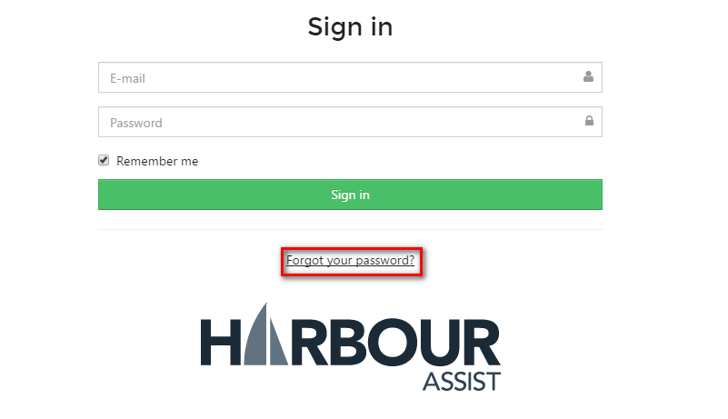
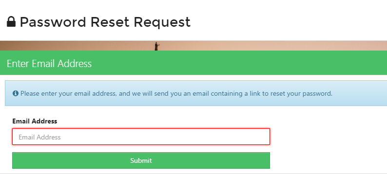
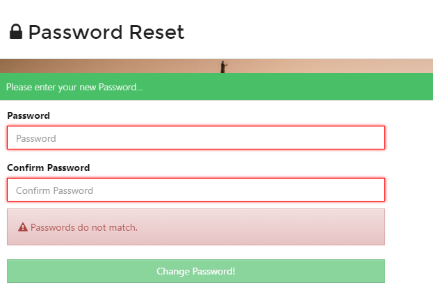

# Password Recovery \#

From the _Sign In_ screen select _Forgot your password_.

This will take you to the _Password Reset Request_ screen. Enter your email address and click _Submit_.

You will receive an email with the subject **Password Reset**

Open the email and select _Change my password_.

This will take you to the _Password Reset_ screen and you can set a password of your choice. **Please make sure you use upper and lower case, a symbol and a number within the password.**

You will then be taken back to the _Sign in_ screen and you can and log in using your new password.

