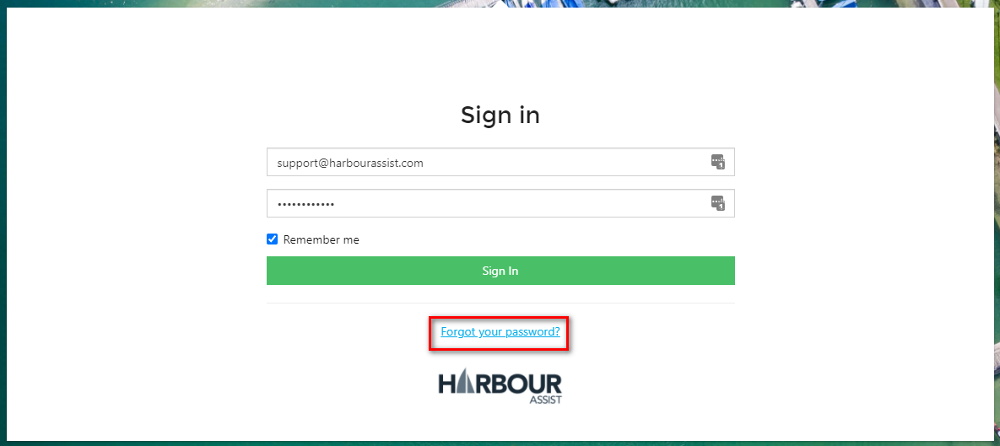
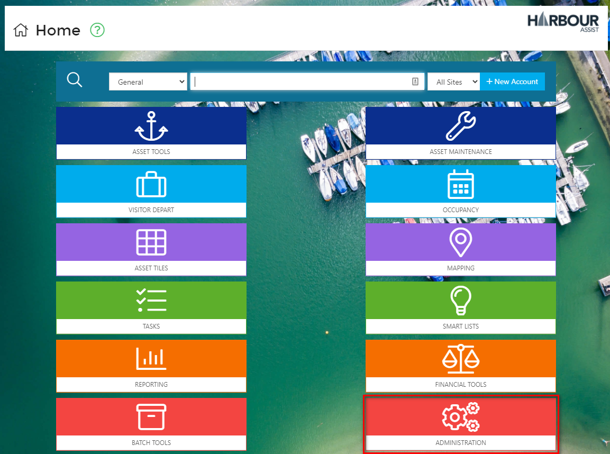
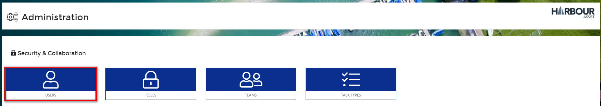
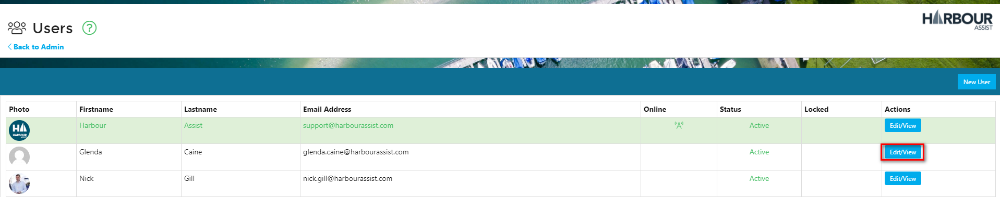
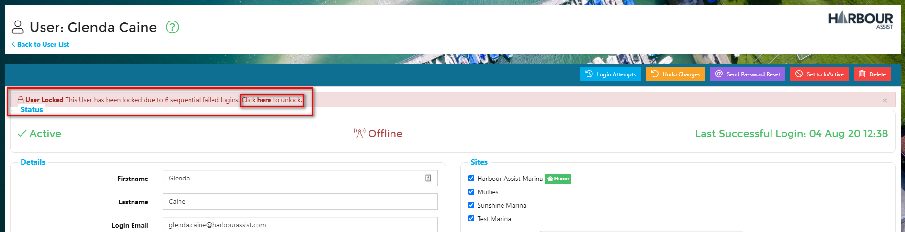
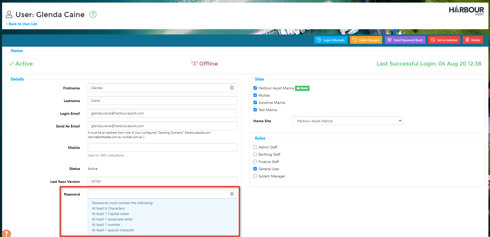

# System Security

## Sliding Session Expiration

As a security measure the system has _Sliding Session Expiration_. This means you'll remain logged in as long as you are using the application. After 1 hour of inactivity, you will be automatically logged out and reverted to the login page. When you log back in, you'll go back to the page you were at.

## User Lockout after 6 attempts

To protect against brute-force attacks, if a user uses an incorrect username/password for 6 sequential attempts, they are Locked Out. There are 2 ways to unlock the account:

* By requesting a password reset link and updating their password.

  

?&gt; For more information about resetting your password click [here](https://github.com/glaidler/docs-1/tree/a9b2fde53025657e319d99966ea9a02a32cbd61d/GeneralNavigation/GeneralNavigation/PasswordRecovery.md).

* By a Harbour Assist user unlocking their account via their User administration page.  This can only be done by someone with the appropriate permission.  

?&gt; NB: The Permission required is **AdministrationUsers**.

From the _Home_ page select _Administration_.

Then select _Users_.

Click _Edit/View_ on the relevant User line.

Then Click to unlock the _User_.

If the _User_ cannot remember their password and you need to manually reset it for them, enter the new password in the _Password_ cell.

?&gt; NB: The Password must meet the criteria of at least 6 Characters, 1 Capital Letter, 1 Lowercase letter, 1 Number and 1 Special Character.

