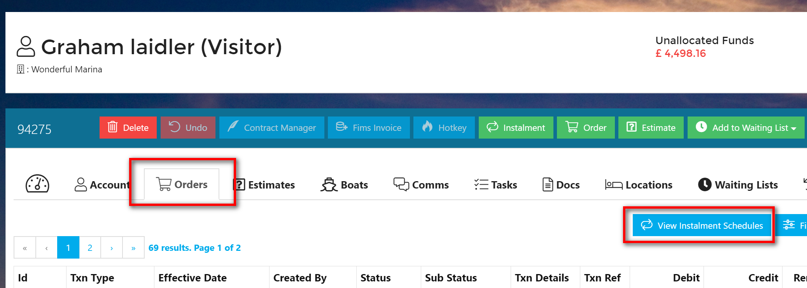
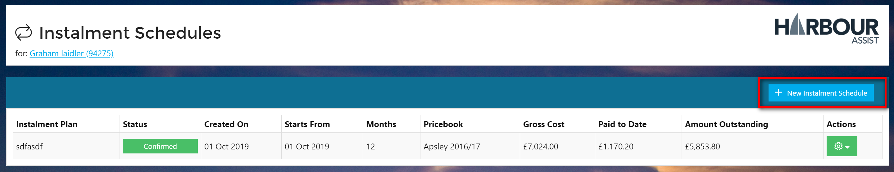
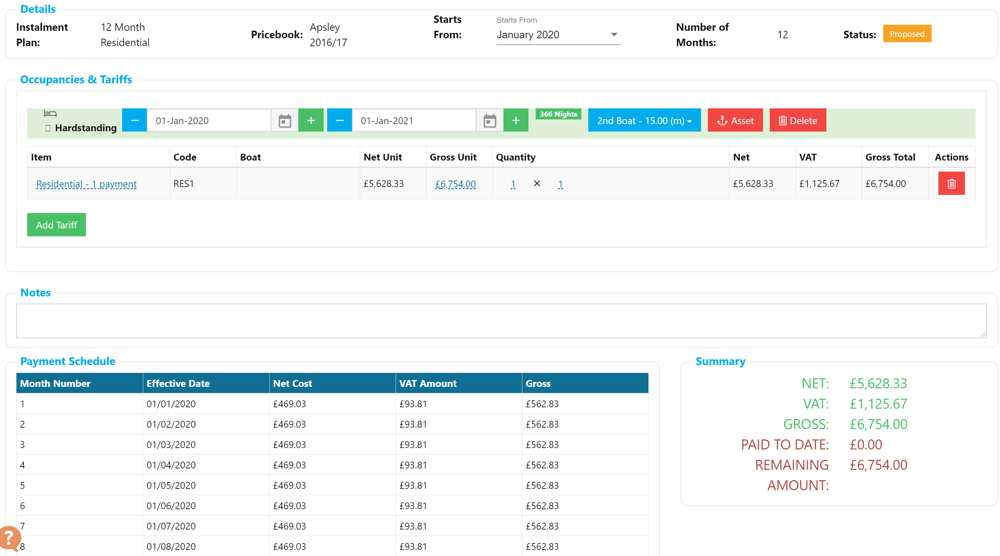

# Creating an Instalment Schedule \#

* Navigate to the Account you'd like to create the Instalment Schedule for.
* Click on the _Orders_ Tab.
* Click on the _View Instalment Schedules_ button.

* You will be shown the list of existing Schedules.  Here you can click on _New Instalment Schedule_ button.

You will be prompted with the following:

* Whether to create a Custom Schedule.

?&gt; This requires the "InstalmentCustomSchedules" permission. If you don't have this permission you won't see this option.

* Which Instalment Plan to use when generating the Schedule. This will determine the number of months over which the value is split.
* The Pricebook to use. This will determine the value of Schedule.
* Which month to start the Schedule from.

When you have completed this, click on _Next_. You will be taken to the page where you can add Tariffs and see how the Value is calculated.

* Click on _Add Tariff_.  A pop-up will appear allowing you to choose the Tariffs.

?&gt; NB: Only Tariffs configured to be availble to the chosen Instalment Plan will be availble. Tariffs which aren't available in the selected Pricebook will be shown crossed-out.

* Add the appropriate Tariffs.
* Click on _Done_.

The Schedule screen will show the total value of the Schedule and how this breaks down on a per-month basis. At this point, the Schedule isn't saved, it's in a "Proposed" State. Whilst in this State, Tariffs can be added, Occupancy dates modified etc. Once you are happy with the payment schedule, click on _Commit_.

?&gt; Once _Committed_ an Instalment Schedule cannot be edited, it would need to be Credited out, so please be sure the schedule is correct.

