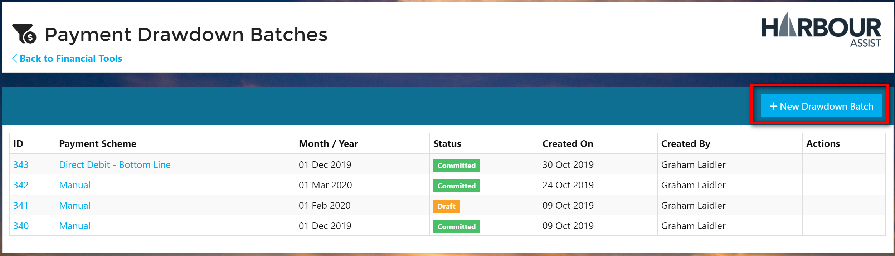
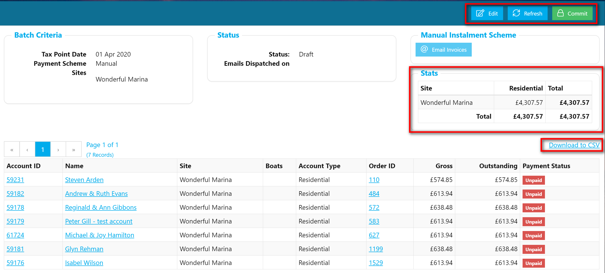

# Drawdown Batches

Each month, you will want to collect the monies due for the Instalments due on that Month. To do this, you create a _Drawdown Batch_ which allows you to perform bulk actions depending on what Payment Scheme you select.

* **Manual** - Bulk email all Accounts with their Invoice, so they either pay online or pay via some other mechanism.
* **Direct Debit** - Generate the DD file for submission.

## Create new Drawdown Batch

?&gt; You require the **InstalmentDrawdownBatchAdministration** Permission in order to do this.

* Navigate to _Financial Tools &gt; Payment Drawdown_
* You will be shown previous batches if they exist.
* Click on _New Drawdown Batch_

* You will be shown a popup where you choose:
  * Payment Scheme
  * The Month which you wish to process
  * The Site\(s\) you wish to process.
* Click on _Save_.

The engine will gather all unprocessed Instalment Orders for the selected Month based on the Accounts' _Payment Scheme_ and _Site_.

These will then be displayed in a grid along with a summary of how much the Batch is worth, grouped by _Account Type_ and _Site_.

You can download the Grid to a CSV so you can inspect the data in Excel.

Once happy with the contents of the Batch you can then hit the _Commit_ button. Once the Batch has been Committed, you can then perform the appropriate action based on the selected Payment scheme:

* **Manual** - Bulk email all Accounts with their Invoice, so they either pay online or pay via some other mechanism.
* **Direct Debit** - Generate the DD file for submission and Mark all as Paid.

