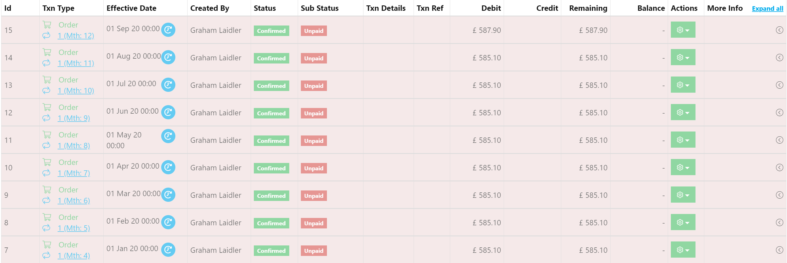

# Instalment Orders \#

Instalment Schedules in Harbour Assist are just Orders with a Tax-Point Date set to the date at which the Order becomes due. These appear alongside other Orders in the Account &gt; Orders Tab.

Instalment Orders appear slightly differently to standard Orders.

* They are slightly "Greyed out".
* If they are not yet due, they have an icon next to their "Effective Date" indicating they are due in the future.

In addition, as they are part of a broaded _Instalment Schedule_, they have slightly different behaviour:

* They cannot be "Reverted to draft" regardless of your Permissions.
* If they are paid early, their Tax Point Date moves back to the date of the payment to keep reporting accurate.

