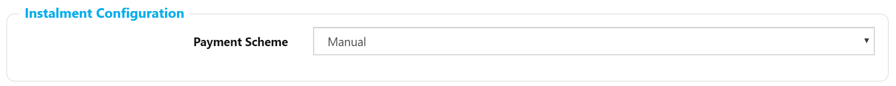
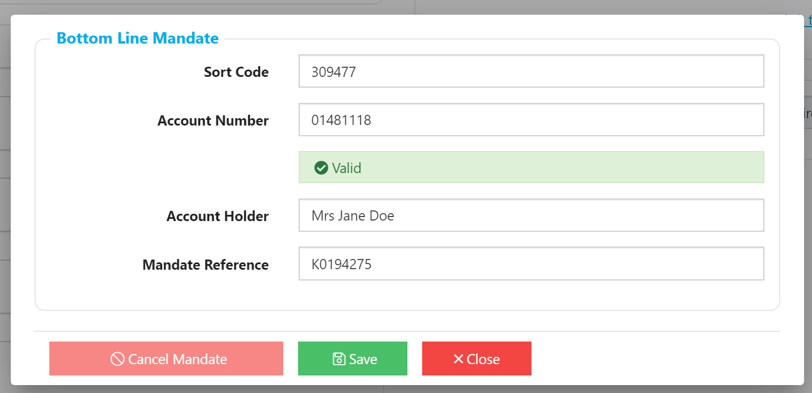
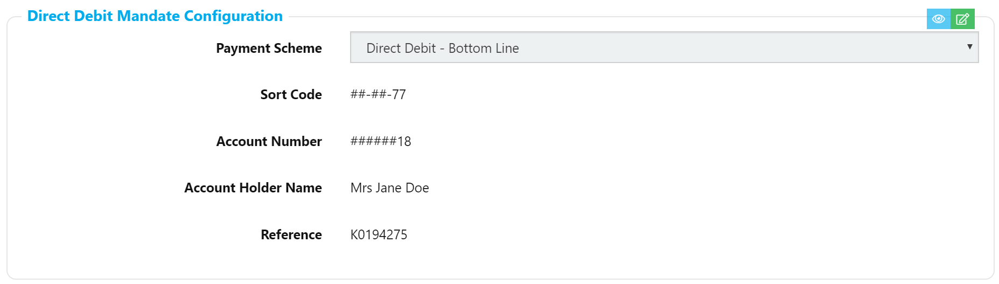

# Payment Schemes

The 2 currently supported Payment Schemes are:

* **Manual** - The customers debt is managed via the usual debt management processes, with the instalments becoming debt at the right time.  We provide the ability to bulk-dispatch invoices.
* **Direct Debit** - This currently supported in the UK via Bottom Line Technologies.  Please let us know if you'd like to find out more.  _NB: Using the Bottom Line adapter incurs an additional monthly charge._

You can configure the Payment Scheme at the bottom of the Account's "Account" tab. Accounts will start out with the default "Manual" Payment Schemes.

?&gt; This action requires the "AccountPaymentSchemeEdit" Permission

## Direct Debit - New Mandate

When you select "Direct Debit - Bottom Line" Payment Scheme you are prompted to fill in enough information for the Bank to accept a Mandate. This information is exported to the bank set up a Direct Debit.

* **Sort Code** - 6 digit number - no hyphens or additional characters.
* **Account Number 7**- 8-10 digit number 
* **Account Holder** - The name of the Account holder as known by the Bank.
* **Mandate Reference** - A unique identifier of the Mandate - defaults to their Account ID and the Site.CostCentre if one is defined.  Please leave this.

The Bank Account and Sort code are "Modulus Checked" to reduce typos; this doesn't guarantee that the Bank Account exists, but will check the 2 numbers against each other - it's unlikely an account number and sort code with a wrong digit will pass this check. More information [here](https://cleardirectdebit.co.uk/modulus-checking-what-why-and-how/).

Once you hit "Save" on the popup, the Mandate will be visible on the Account:

## Viewing an existing Mandate

* The Account Number and Sort Code are masked to limit sensitive data leakage.
* The 2 buttons at the top right allow you to either Edit the Mandate, or view the Bank account number.

?&gt; Viewing the Bank Account number and sort code requires the "AccountBankDetailsView" Permission

