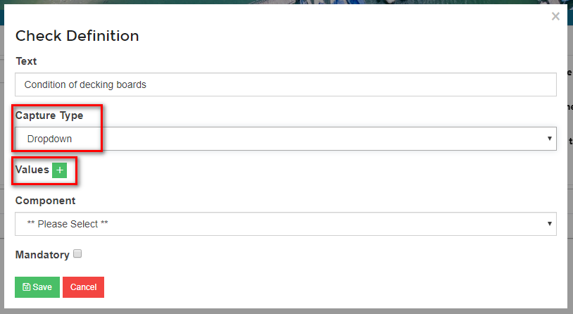

# Creating an Inspection Regime \#

Most companies have routine inspections that need to be carried out on a regular basis, whether it be on assets, buildings, equipment or plant. These inspections can be recorded in Harbour Assist so that there is a full inspection record.

The first stage to setting up Inspections in Harbour Assist is to create an Inspection Regime. This Regime can then be attached to an asset, building, piece of equipment or plant.

From the _Home_ page, select _Asset Maintenance_.

Then select _Inspection Regime Setup_.

Click on _New Inspection Regime_.

Give your regime a name, then click _Create_.

Most Regimes will have more than one type of Inspection - for instance, large items of Plant may require a _Daily Inspection_ before each use, however this is likely to be a brief inspection comprising of only a few checks; a more comprehensive _Monthly Inspection_ could also be required, this will be more in depth and have different aspects to it; there could then also be an _Annual Inspection_ which is a thorough inspection, possibly carried out by a different person/team. Each of these are known as _Inspection Types_.

To set up a new Inspection Type, select _New Inspection Type_.

Now you need to set the parameters of the Inspection:-

* Give it a Name
* Set the Recurrence
* Set the Schedule Type
* Finally, assign the inspection to Team - a task will be sent to alert them when an inspection is due.

When complete click on _Create_.

The details entered will show in the Schedule. You should now write a briefing for the Inspection ie. some basic instructions on how the Inspection should be carried out.

The next stage is to set the specific _Checks_ that need to be carried out. A _Check_ is data that needs to be captured during an Inspection.

Click the _Add_ button.

Enter some text - a brief description, then select the _Capture Type_ - this is the way you want to capture the information. There are 4 options:-

* Checkbox - a tick box which is a confirmation you have carried out the check.
* Number - when the response must be in a number format.
* Dropdown - a selection list of possible answers - **see below for instruction on how to do this**.
* Text - a text box for the user to write their response to the check.

If you wish to make the check _Mandatory_, check the box - this means the user will not be able to skip the check.

Then click _Save_.

You can now set your next check by clicking on the _Add_ button again.

## Creating a Capture Type Dropdown List \#\#

When you select the Capture Type of _Dropdown_, this will bring up an additional cell so that you can set the _Values_. To add the _Values_ click on the green + button.

Set each Value by typing the description in the cell and then clicking on the Green tick. You can add as many as you wish and if you change your mind you can remove them by clicking on the Red trash icon.

When you have finished your dropdown list, click on _Save_.

Each _Check_ and the set up of it will show under _Checks_, you can change any of the details by selecting the Green _Action_ button and selecting Edit.

Once complete the Inspection you have set up will show in the _Inspection Regime_.

