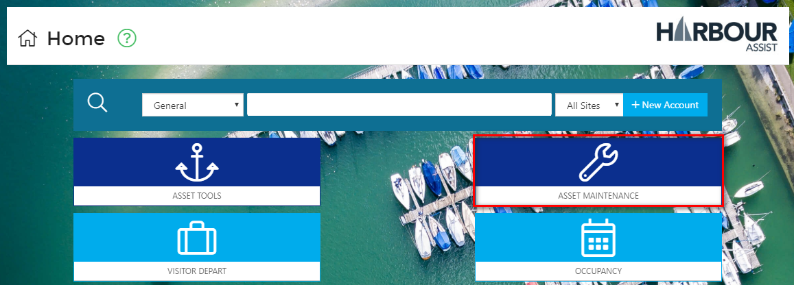
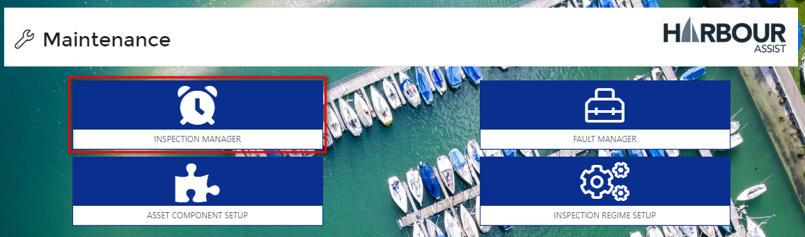
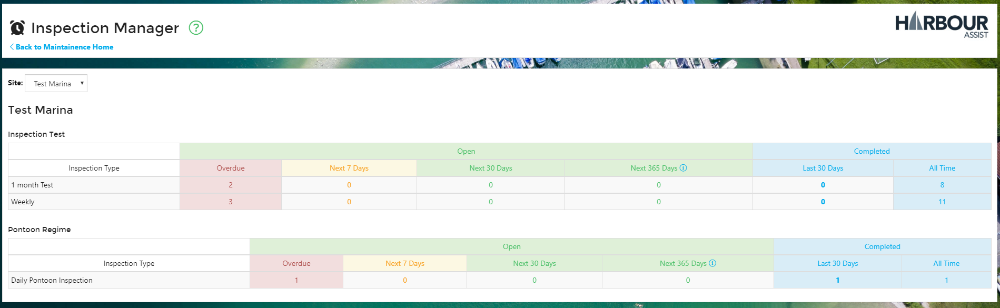
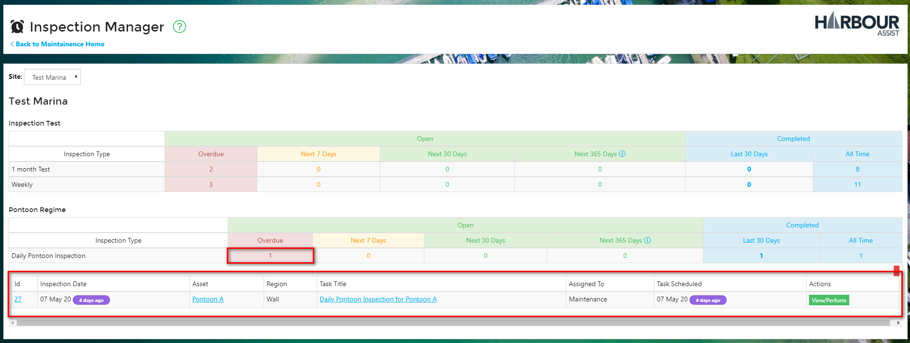
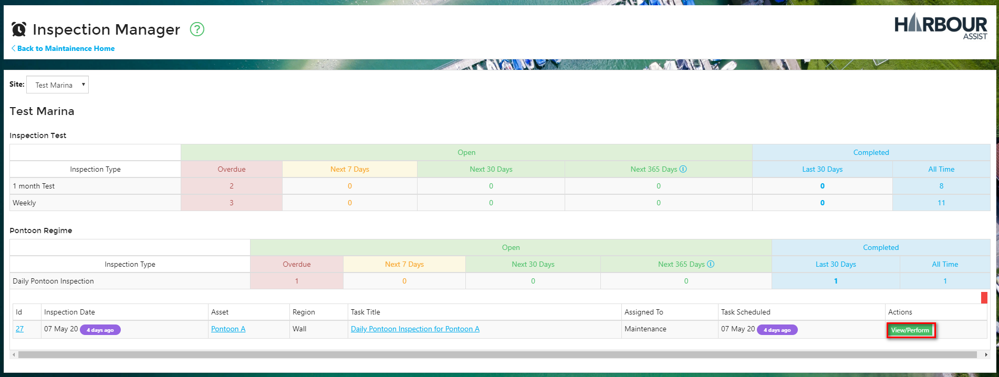

# Managing Inspections \#

From the _Home_ page, select _Asset Maintenance_.

Now click on _Inspection Manager_.

The _Inspection Manager_ screen shows a summary of all Open and Completed Inspections for each Site, Inspection Regime and Inspection Type.

To view further details of the Inspections, click the category you wish to view - in the example below we wish to view the Overdue, Daily Pontoon Inspection for the site Test Marina.

You can go directly to perform an Inspection by clicking on _View/Perform_.

?&gt; NB: Once you are in the cycle of recurring inspections you won't need to use the _New Inspection_ feature in the Asset details.

?&gt; More documentation [here](https://github.com/glaidler/docs-1/tree/a9b2fde53025657e319d99966ea9a02a32cbd61d/Maintenance/Maintenance/PerformingAnInspection.md).

